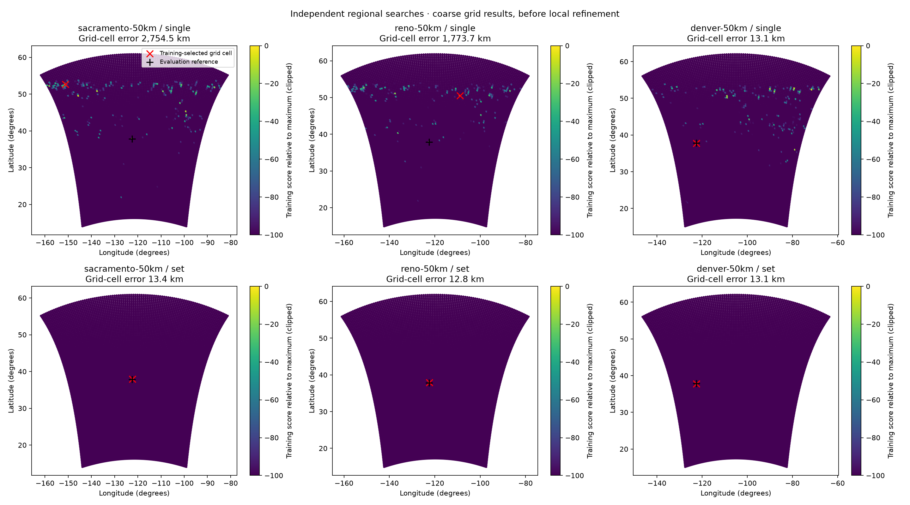
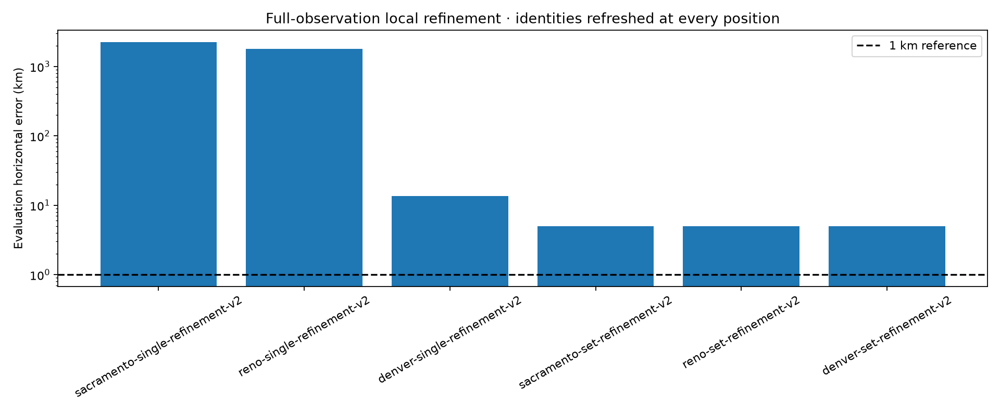
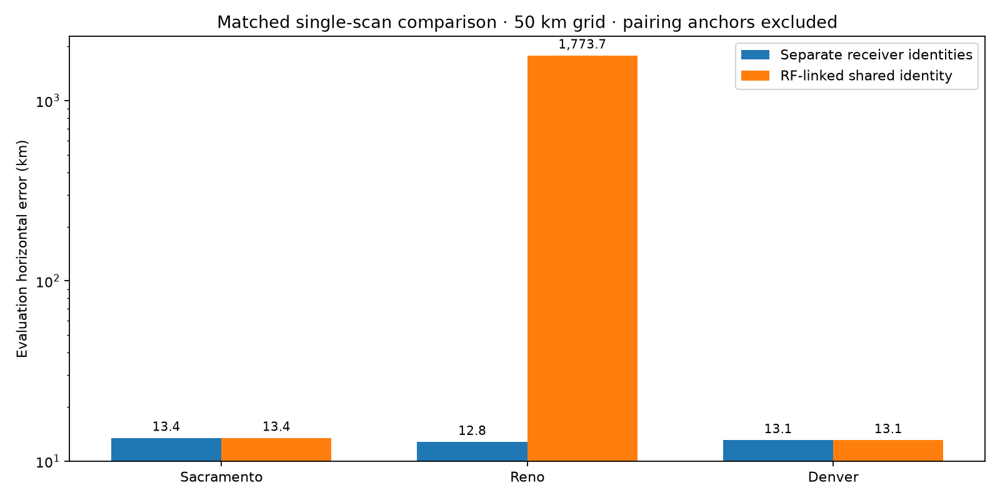

# Joint blind position and satellite association with paired receivers

## Status and objective

The independent-path existing-recording comparison and paired-path ablation are
complete. This is not a qualified precision-positioning result.
The target is joint receiver location and satellite association for one
300-second adaptive scan and a set of scans. The receiver location is unknown
to inference. Separate searches start from Sacramento, Reno and Denver.

The preceding [shared-orbit experiment](../2026_09_22_blind_shared_orbit/README.md)
implemented a joint fit but selected a geographic mode almost 8,000 km from the
evaluation coordinate. Lower training residuals did not improve held-out
prediction. It did not establish the requested blind localization capability.

## Results of the independent-path joint fit

All three broad starting regions converge to essentially the same multi-scan
location: approximately **37.83655, -122.43109**, **4.99 km** from the evaluation
reference. This recovers the correct geographic neighborhood without using that
reference for association or fitting. It does **not** achieve sub-kilometre
accuracy. The single 300-second scan remains ambiguous and depends strongly on
the search region.

| Independent start | Single-scan error | Five-scan error | Five-scan composite held-out score |
| --- | ---: | ---: | ---: |
| Sacramento | 2,258.69 km | 4.9883 km | 4,805.038 |
| Reno | 1,781.97 km | 4.9883 km | 4,805.039 |
| Denver | 13.51 km | 4.9892 km | 4,805.040 |

These are full-observation, identity-refreshing local fits, after the independent
50 km global searches. All eighteen local optimizations converge. The six
selected outputs are sealed before the evaluator reads the reference coordinate.
The three starts reuse the same observations; they are search repeatability
checks, not independent accuracy trials.
The held-out score is a sum of track-balanced composite predictive scores;
higher is better under this model, but its scale is not calibrated confidence.





The five-scan fits choose the same highest-weight NORAD candidate on all 165
tracks across all three starts. In each fit, 137 tracks have a top candidate
weight above 0.5, 91 exceed 0.9, and four have unassigned weight above 0.5.
This establishes model stability, not independently verified satellite identity.
Complete candidate weights and unassigned/omitted mass are retained in the six
refinement JSON artifacts.

Deleting any one complete scan leaves the preferred **50 km grid cell** unchanged
in each regional search. The score gap to the best sampled cell at least 100 km
away is approximately 517, 491 and 496 for Sacramento, Reno and Denver. Those
large composite-score gaps do not justify a narrow accuracy claim: the refined
answer still misses by almost 5 km, and the deletion check cannot resolve motion
within a grid cell.

The single-scan fits demonstrate why a smooth best-fit track and a sharp local
optimizer result are insufficient. Three converged searches can select widely
different locations. For this cohort, accumulating observations from several
scans resolves the broad ambiguity much more effectively than trusting a
single-scan winner. The remaining multi-scan error is not explained by optimizer
start sensitivity; this experiment does not yet distinguish orbit error,
receiver-frequency behavior, and trajectory/model bias as its cause.

## Declared comparison

Each start uses a 5,000 by 5,000 km square in the existing spherical
azimuthal-equidistant map, with WGS84 receiver coordinates in the Doppler model.
The centers are Sacramento (38.5816, -121.4944), Reno (39.5296, -119.8138),
and Denver (39.7392, -104.9903). Centers define search bounds; they are not
measurements or preferred optimizer seeds. No solution transfers between starts.

Whole-region sampling is required before local refinement. The earlier
[regional experiment](../2026_09_07_blind_regional_doppler_positioning.md)
missed the useful mode at 250 and 125 km spacing, but recovered it with a
50 km whole-region grid. A locally dense patch around a coarse winner does
not establish adequate global coverage. Runtime benchmarks and incomplete
searches must remain visible in the accounting.

Comparison arms use identical saved RF observations, causal orbit catalogues,
training/held-out partitions and search bounds wherever possible:

1. Doppler-only joint location and unknown identity, with explicit unassigned
   support. A conservative geographic prefilter limits propagation to
   region-compatible candidates while retaining the full eligible catalogue
   population in the prior denominator.
2. Paired-receiver constraints, retaining independent receiver frequency offsets
   and accounting for simultaneous observations of a common signal.
3. Geometry evidence only where its installation and measurement uncertainties
   are represented; uncalibrated beam response remains a diagnostic.

Within-track partitions are chronological. Training chooses location, identity,
receiver nuisance parameters and refinements. Later samples test prediction.
RF trajectories are retrospectively extracted, so this is not an end-to-end
prospective detection test. All usable exported tracks are inventoried; numerical
thinning for acquisition must be disclosed separately from restored local fits.

## Geometry and information limits

The released LT3D-001A holder specifies 80 mm between neck axes, with each axis
10 degrees outward from the centerline. The STL does not establish electromagnetic
phase centers, installed absolute heading/tilt, cable mapping, independent LNB
oscillator phase or a calibrated beam pattern. These quantities cannot silently
be treated as known angle or absolute-phase observations.

Positive paired-signal evidence can constrain a shared satellite identity.
Time overlap alone cannot establish that identity. Missing detections, beam
mismatch or first-detection order cannot veto an identity without a justified
exposure and obstruction model. Simultaneous receiver copies are not independent
satellite passes. Site-trained response models and site-selected candidate lists
from earlier reports are excluded from blind inference.

## Validation and reporting requirements

- Synthetic known-location/identity recovery, nuisance-offset handling, and
  invariance of fitted parameters to held-out-value changes.
- Existing-recording single-scan and multiple-scan results for all three starts,
  including competing modes and insufficient or failed runs.
- Receiver-pair and geometry ablations with matching observations, and controls
  that preserve temporal correlation where relevant.
- Exact orbit replay checks for any interpolation or orbit correction.
- Separate training fit, held-out prediction, identity stability, and geographic
  error; none is interchangeable with the others.
- Inference outputs sealed before the evaluation-only reference is read.
  The reference is already known to the human-facing task, so this is
  algorithmically truth-isolated retrospective research, not personal blinding.
- Machine-readable evidence and plots with source provenance. Candidate weights
  and local curvature ellipses are not calibrated success probabilities.

No new RF acquisition or production deployment is part of this experiment.

## Frozen recorded-data cohort

The five existing dual-RX 2.5 MS/s scans span approximately 3.2 hours on
2026-09-22. This is a bounded recent-data cohort, not the complete twelve-hour
corpus. Selection uses recording availability and exported RF support, not
known-site NORAD reviews or positioning error. The single-scan arm uses
`scan-fw-1d05092feaa8f7d5`, which has the most exported observations among these
five scans.

| Scan | First exported support (UTC) | Tracks | Observations |
| --- | --- | ---: | ---: |
| `scan-fw-1d05092feaa8f7d5` | 12:50:03 | 39 | 1,415 |
| `scan-fw-e3bc0741ecf02704` | 13:00:03 | 33 | 1,150 |
| `scan-fw-3bee6be6e987a34f` | 14:10:03 | 19 | 549 |
| `scan-fw-64e06d86f4746e55` | 15:10:29 | 42 | 1,365 |
| `scan-fw-e201d79ba3234e2e` | 16:00:06 | 32 | 953 |
| Total | | 165 | 5,432 |

Acquisition retains up to six chronological training and six later evaluation
points per track. Local refinement restores every exported observation. The
exporter reconstructs RF trajectories and rejects duplicate or ambiguous graph
ownership; these counts do not mean every raw detector candidate is fitted.

## Implementation

The new adapter prepares the recent RF-only exports for the existing regional
scorer. Three independent full-region 50 km grids use the same finite unassigned
alternative and full causal catalogue prior. The single-scan score is its own
per-track map sum; reusing those computations from the set run does not transfer
the set's location or identity choices to the single-scan result.

`tools/research/refine_recent_joint_position.py` starts from three training-ranked
grid modes separated by at least 200 km. Each local objective evaluation
refreshes the entire region-compatible identity mixture. It does not freeze a
track's initial NORAD label. The region prefilter preserves the full causal
catalogue denominator. Nominal satellite states are propagated exactly at all
observation times and cached; there is no fitted orbit correction or orbit-state
interpolation in this arm. Receiver/source constant offsets are fitted on
training observations only. Held-out values do not choose the local solution.

The selected solution reports the top eight conditional identity weights per
track, the unassigned weight, and omitted identity mass. These are weights under
the declared composite model, not calibrated correctness probabilities. The
local fit uses the existing effective count of six per track; restoring raw
samples does not multiply effective evidence by their count.

`regional_mode_stability.py` deletes one whole scan at a time and recomputes the
preferred cell on the same saved training grid. It reports geographic movement
and competing-mode score gaps. This can expose dependence on one scan, but cannot
detect an unsampled mode or establish absolute accuracy.

The new `paired_receiver_geometry.py` factor requires explicit shared-source
pairing authority, profiles separate receiver offsets, and gives simultaneous
receiver copies a total visit weight of one. Synthetic tests check receiver-label
swaps, held-out isolation, and the distinction between duplicated support and
additional temporal information. The current GLRT export contains no confirmed
cross-receiver episodes; its receiver-local source identifiers must not be
misinterpreted as pair authority. A separate
[saved-IQ-derived GLRT audit](../2026_09_22_recent_paired_source_authority.md)
has now identified 10 RF-supported receiver-track links in the strongest scan:
215 mutually unique held-out timing/CFO matches and zero matches in a 17-visit
shifted control. These support repeated common pilot observations, not confirmed NORAD
identities. Pair-conditioned positioning is a separate ablation; it does not
retroactively turn the independent-path baseline into a paired analysis.

## Matched paired-receiver ablation

Nine of the ten RF-supported links retain enough training and evaluation support
after removing the pairing-anchor observations. The excluded link stays unchanged
in both arms. Shared visits cannot cross the training/evaluation boundary between
receivers. Separate identities receive three effective observations per receiver;
a shared identity receives six per pair, preserving the total evidence cap.

| Start | Separate-identity error | Shared-identity error | Held-out score change |
| --- | ---: | ---: | ---: |
| Sacramento | 13.44 km | 13.44 km | +7.74 |
| Reno | 12.77 km | 1,773.73 km | -294.29 |
| Denver | 13.07 km | 13.07 km | +6.48 |



These are matched single-scan **50 km grid** results without local refinement.
They use different support from the original single-scan experiment: pairing
anchors are removed, linked observations are restored, and evidence is balanced
between receivers. Compare the two arms here; differences from the earlier table
cannot be attributed to pairing alone.

The shared-identity constraint does not reliably resolve geographic ambiguity.
Sacramento and Denver retain their cells with modest predictive gains; Reno
selects a distant training winner that predicts substantially worse. This does
not establish that the RF links are wrong, but it rules out promoting this hard
pair constraint as a demonstrated positioning improvement. A future comparison
should retain uncertainty in the links instead of forcing every accepted link to
share an identity. Unresolved pilot aliasing and conditional pairing selection
remain limitations. The nominal holder geometry supplies no calibrated angle or
absolute phase measurement in this experiment.

The [paired-source report](../2026_09_22_recent_paired_source_authority.md) includes
controls, exact executed sources, execution receipts and machine-readable outputs.
The [comparison summary](artifacts/paired-comparison/summary.json) adds geographic
errors only after verifying and sealing the inference outputs.

## Reproduction and validation

The [input archive](evidence/recent-inputs.tar.gz) contains all five RF track
exports and the three causal TLE files needed by the positioning runs. Its SHA-256
is `b523ebe8606a287bb6e653c065d6a4adef91f934b07361ea9695caa9427e75d5`.
The [global acquisition package](evidence/global-acquisitions/manifest.json)
binds the exact executed source files, input digests, configurations, completed
results, histories, and acquisition seals. Large per-track grid arrays are
reproducible from those inputs rather than committed; compact per-scan maps are
included under `artifacts/` for inspection and deletion diagnostics.

Run from this repository revision in fresh directories. This example reproduces
Sacramento; use the centers in the declared-comparison table for Reno and Denver.

```bash
mkdir -p /tmp/joint-blind-reproduction
tar -xzf reports/2026_09_22_joint_blind_geometry/evidence/recent-inputs.tar.gz \
  -C /tmp/joint-blind-reproduction

PYTHONPATH=src OPENBLAS_NUM_THREADS=1 OMP_NUM_THREADS=1 MKL_NUM_THREADS=1 \
  .venv/bin/python tools/replay_regional_doppler.py \
  --evidence /tmp/joint-blind-reproduction/recent-regional-evidence-v1 \
  --output /tmp/joint-blind-reproduction/sacramento-50km \
  --center-lat 38.5816 --center-lon=-121.4944 \
  --region-size-km 5000 --spacing-km 50 --max-per-partition 6

.venv/bin/python tools/research/seal_regional_acquisition.py \
  /tmp/joint-blind-reproduction/sacramento-50km

PYTHONPATH=src .venv/bin/python tools/research/refine_recent_joint_position.py \
  --run /tmp/joint-blind-reproduction/sacramento-50km \
  --evidence /tmp/joint-blind-reproduction/recent-regional-evidence-v1 \
  --output /tmp/joint-blind-reproduction/sacramento-set-refinement
```

Repeat refinement with a fresh output directory and
`--single-session scan-fw-1d05092feaa8f7d5` for the single-scan arm. The wrapper
sets BLAS thread limits before numerical imports, checks a 1.8 GB RSS bound and
15-minute default runtime budget, and checkpoints each objective evaluation.
It verifies the acquisition content seal before selecting seeds, and fails
closed on unsupported nonzero clock/altitude settings. Propagation exclusions,
evaluated candidate counts and candidate-set digests are recorded per track.

Finally, run `render_validation.py --runs ... --refinements ... --single-session
scan-fw-1d05092feaa8f7d5 --truth evaluation-reference.json --output <fresh-path>`
using full paths relative to this report for the renderer and reference. This
validates and seals completed inputs before opening the evaluation reference.
Runtime fields and consequently file hashes change on a fresh execution; the
new run must create its own content seals.
Absolute `/tmp` paths in the published inference seal identify the original
execution locations, not required installation paths. The copied refinement
JSONs retain their original `result.json` hashes. The
[baseline publication manifest](evidence/baseline-publication-manifest.json) uses
relative paths and crosslinks the archived RF/TLE inputs, executed sources and
copied results. It explicitly excludes this narrative and the separate paired
experiment, so its scope remains clear in a fresh checkout.

Each whole-region search took 372–386 seconds on one CPU, peaking near 224 MiB
RSS. Full-observation five-scan refinements took 39–43 seconds and about 1 GiB
RSS. Single-scan refinements took about nine seconds.

Component checks cover synthetic multimodal refinement, refreshed identity
weights versus the acquisition model, full-catalogue prior mass, unassigned
support, held-out poisoning invariance, acquisition-file tampering, unsupported
clock/altitude settings, evidence grouping, and sealing before truth reveal.
The renderer PNGs were visually inspected. This validation supports the
implementation and the reported experiment; it does not promote the model to
a calibrated precision-positioning service.

Final combined verification: **71 tests passed** across the shared-orbit,
identity-mixture, formal-orbit, mode-stability, paired-receiver, input preparation,
refinement, pairing audit, grid comparison, sealing and report-rendering tests.
Ruff passed for all new active Python sources and their tests. Executed-source
archives remain byte-for-byte copies rather than reformatted code.

## Remaining accuracy work

The broad search and identity-refreshing joint objective now agree on a useful
multi-scan location. They do not explain the remaining approximately 5 km bias.
The next controlled comparison should keep this inferred region and the full
catalogue/null authority, then compare a matched robust-noise nominal model
against shared per-satellite orbit corrections. The existing formal-orbit state
interpolator and irregular-time correlated-noise model are reusable, but its
fixed-identity fitter must not silently replace the blind identity mixture.

Use the previously declared priors and exact-orbit validation threshold, with
training owning all nuisance estimates and candidate support. Expand corrected
candidate support rather than assuming a nominal top-eight list remains valid.
Every fitted correction must pass exact propagation checks; orbit phase and
receiver clock are distinct parameters with different Earth-rotation handling.
An added clock arm needs an independent timing prior and an explicit gauge.
Choose models using prediction and integrity tests, not by tuning toward the
revealed coordinate. A larger recent multi-scan cohort is also needed before
claiming repeatable accuracy beyond these five recordings.
