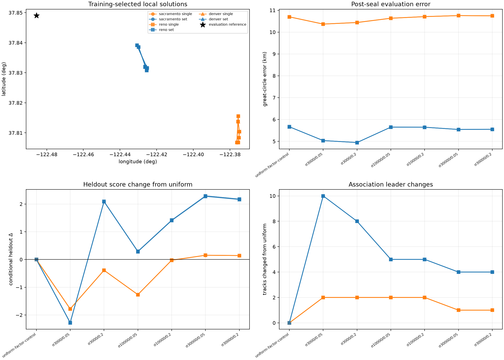

# Joint position, identity, and receiver-offset sensitivity

The completed local fits remain several kilometres from the evaluation
reference. All 42 fits converged without hitting their local bounds, and the
three regional starts agree on all 39 single-scan and 165 five-scan leading
assignments within each model. This consistency does not establish correct
satellite identities or sub-kilometre accuracy.

The table reports ranges across Sacramento, Reno, and Denver. Scores evaluate
held-out interpolation at each model's training-selected position; positive
changes favor the offset model over its matched uniform control.

| Offset width / outlier fraction | Single error (km) | Single heldout change | Five-scan error (km) | Five-scan heldout change |
|---|---:|---:|---:|---:|
| Uniform control | 10.696–10.700 | 0 | 5.665–5.667 | 0 |
| 3 kHz / 0.05 | 10.366–10.368 | −1.783 to −1.780 | 5.034–5.036 | −2.285 to −2.272 |
| 3 kHz / 0.20 | 10.437–10.441 | −0.390 to −0.386 | 4.944–4.946 | +2.085 to +2.095 |
| 10 kHz / 0.05 | 10.632–10.635 | −1.268 to −1.264 | 5.650–5.651 | +0.281 to +0.292 |
| 10 kHz / 0.20 | 10.706–10.709 | −0.027 to −0.025 | 5.645–5.647 | +1.403 to +1.418 |
| 30 kHz / 0.05 | 10.755–10.756 | +0.152 to +0.154 | 5.542–5.545 | +2.274 to +2.294 |
| 30 kHz / 0.20 | 10.745–10.746 | +0.142 to +0.143 | 5.551–5.553 | +2.161 to +2.179 |

No model was selected by geographic error. The smallest five-scan error occurs
with the 3 kHz / 0.20 model, but the largest held-out gain occurs with the
30 kHz / 0.05 model, whose error remains about 5.54 km. For one scan, the models
with positive held-out changes slightly worsen geographic error. Shared offset
structure therefore does not remove the positioning bias.

The six offset models change one or two single-scan leading assignments and
four to ten five-scan assignments relative to the uniform model. Counts include
changes between a candidate and the null state. These are model sensitivity,
not independently verified identity corrections.



[Machine-readable comparison](evaluation/summary.json) includes every model,
null weights, group/channel composition, resources, parity checks and status.
The [inference bindings](evaluation/inference-bindings.json) were written before
the evaluation helper opened the reference coordinate. The completed
[soft receiver-pair diagnostic](../2026_09_22_soft_receiver_pairs/README.md)
also found no held-out gain at the frozen finalist positions.

This experiment extends the [five-block blind position comparison](../2026_09_22_five_block_position/README.md)
with a shared circular frequency-offset coordinate for each receiver and pilot
edge. At every trial position, all region-compatible satellite candidates are
rescored. Neither a satellite identity nor an offset is fixed using the reference
site. The one-scan cohort contains 39 trajectories and 1,415 observations; the
five-scan cohort contains 165 trajectories and 5,432 observations.

The declared sensitivity arms use offset widths of 3, 10, and 30 kHz, each with
outlier probabilities 0.05 and 0.2, plus the matched uniform-offset control.
Every arm is reported. Widths are exploratory model choices, not independently
calibrated receiver specifications. The offset is in native recorded Hz, modulo
the 1/4.4 microsecond pilot ambiguity period. One offset is shared per receiver
and pilot edge across channels and, for the combined cohort, across roughly
3.2 hours. This assumes an absolute-Hz relationship, not fractional-frequency
drift or a measured LNB calibration.

## Inference and evaluation

The original Sacramento, Reno, and Denver searches each cover a 5,000 km square.
This experiment locally refines their previously training-selected best basins
within a square extending 100 km in each east/north direction. It does not repeat a wide
search under the new offset model. Each cohort uses its own sealed baseline;
the single-scan initialization is not taken from the five-scan fit.

Training uses chronological index blocks 0, 2, and 4 of each trajectory. Blocks
1 and 3 evaluate interpolation within that trajectory. The shared offset is
integrated jointly over all training trajectories in its group. Predictive
scores integrate the same identities and offset against their training evidence;
held-out observations do not select the reported position. Candidate means used
to remove a constant frequency offset are fitted on training rows only.

These predictive scores differ from the earlier whole-track conditional
offset-prediction diagnostic. Tracks and receivers can remain dependent, and
the composite scores are not calibrated satellite probabilities or position
confidence regions. Agreement between regional starts is numerical consistency,
not accuracy against an independent reference.

The mechanical 80 mm holder baseline is not being used as kilometre-scale
triangulation. This circular-offset experiment is separate from the RF-authorized
soft paired-receiver identity experiment. No geometric phase inference is made.

## Numerical checks and execution history

An independent dense likelihood oracle tests all six offset arms and synthetic
position recovery. Before optimization, every run must reproduce the sealed
uniform-control training and held-out scores within 1e-6 and match the exact
cohort observation inventory.

The [saved-data quadrature check](evidence/quadrature/grid-check.json) evaluates
all six arms at each cohort's sealed Sacramento baseline point. Across these
12 cases, changing 1,024 integration points to 2,048 changes the training score
by at most 9.10e-13 and held-out score by at most 2.73e-12. This checks those
points, not every trial point of the optimizer. Its archived numerical source
predates the small-tail summation correction described below; its exact hash is
recorded with the results.

The first Sacramento and Reno single-scan runs completed. The first Sacramento
five-scan run stopped at a pruning-certification check after 182 logged
evaluations; it did not produce a completed result. The triggering evaluation
was not logged, so the exact failing candidate vector has not been recovered.
Inspection identified a cancellation-sensitive operation: subtracting retained
mass from a total near one to estimate an omitted tail around 1e-13. A regression
case exercises this numerical failure class. The corrected implementation sums
the omitted tail directly, keeps additional candidates when needed, and falls
back to the dense calculation if certification fails. It does not relax the
declared likelihood-error bound. Both failed and completed first-generation
runs must remain distinguished from the corrected runs.

All six corrected runs use source digest
`893ccea5b629ea7189d877b2f7d6fa3ae7bb40673fb233daad24a8ff5f3eec65`.
Their uniform-baseline discrepancies are below 1e-10, and their maximum declared
aggregate pruning bound is 3.72e-10, below the 1e-8 budget. Corrected single-scan
runs reproduce the original completed Sacramento/Reno positions and scores
exactly. Single runs took 86–92 seconds; set runs took 355–380 seconds, each with
one numerical thread. Peak RSS was at most 1,086,980 KiB. These are numerical
and provenance checks, not calibration of the scientific model.

The [execution receipt](evidence/execution-receipt.json) retains all completed
and failed execution generations. Corrected results and checkpoints are under
`evidence/corrected-runs`; original outputs are under `evidence/initial-runs`.
The source snapshots distinguish the original and corrected implementations.

## Reproduction

The original sealed five-block input directories, RF shards and causal TLE
inputs are required. This package preserves resulting fits and source hashes;
it is not a standalone archive of all upstream acquisition arrays. See the
linked baseline report for its input archives and explicit repacking limits.

For each of `sacramento`, `reno`, and `denver`, and each cohort `single`/`set`,
use its own sealed baseline refinement and a fresh output directory. For example:

```bash
.venv/bin/python tools/research/refine_joint_circular_position.py \
  --refinement /tmp/recent-five-block-regional-v1/sacramento-set-refinement-v2/result.json \
  --evidence /tmp/five-block-input-check-v1/recent-regional-evidence-v1 \
  --rf-shards /tmp/joint-circular-rf-shards-v1 \
  --rf-shard-manifest /tmp/recent-circular-offset-ablation-1024.json \
  --output /tmp/joint-circular-reproduction-sacramento-set \
  --seed-index 0 --radius-km 100 --max-evaluations 140 \
  --budget-seconds 600 --grid-size 1024 --all-arms
```

Seed zero is the highest-training-score sealed seed in all six supplied input
refinements. This is verified for this experiment, not assumed for arbitrary
future refinements. After all six outputs are sealed, run
`reports/summarize_joint_circular_position.py` with six explicit
`--input CENTER:COHORT:RESULT_JSON` arguments, `--reference` pointing to
`reports/2026_09_22_joint_blind_geometry/evaluation-reference.json`, and a fresh
`--output`. Never use the reference in the fit commands.

Focused tests cover the independent dense oracle, synthetic position recovery,
tiny-tail regression, and evaluation-input validation:

```bash
.venv/bin/python -m pytest -q \
  tests/tools/test_joint_circular_oracle.py \
  tests/tools/test_refine_joint_circular_position.py \
  tests/tools/test_summarize_joint_circular_position.py
```

No production deployment or new RF collection was performed. The next measured
limitation to investigate is upstream frequency ambiguity: the persisted GLRT
products retain alternative CFO candidates that the current position input
reduces to one selected value. Retaining those alternatives requires a tested
measurement model, including duplicate handling and uncertainty; detector
margins must not be treated as calibrated probabilities by assumption.
