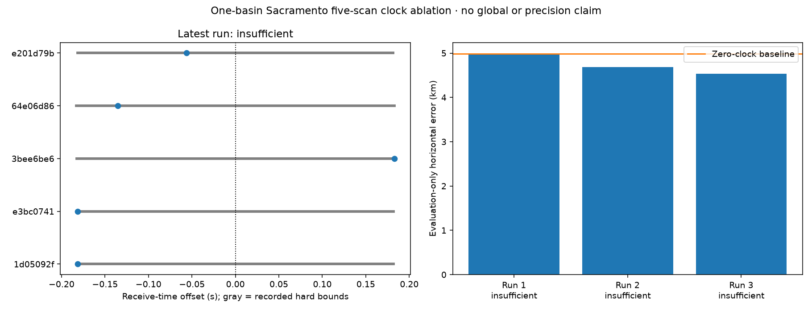

# Joint blind position, identity and receive-time offsets

Status: bounded one-basin timing experiment complete; all three attempts remain
insufficient because their optimizers reached the evaluation limits.

## Motivation

The [preceding residual audit](2026_09_22_blind_residual_diagnostics.md) established
that exported sample timestamps inherit a common uncertain origin per scan.
The qualified timing contracts bound that origin within approximately ±0.182 s
of its midpoint. The regional position model previously fixed it to the midpoint.
The source frequency uncertainty mixes a 400 Hz floor with this common timing
allowance; inflating every independent observation's noise by the combined value
would misrepresent the timing correlation.

This is not the first recording-clock experiment in the repository. The
[September 20 independent wide-position study](2026_09_20_recent_independent_wide_position.md)
already tested recording-specific clocks on 211 earlier scans and retained a
3.80–4.80 km error floor, with many clock estimates reaching their bounds. The
present ablation tests the newer five-scan cohort while refreshing the full
regional identity mixture during refinement. Prior results argue against
assuming that clock fitting alone will solve the accuracy problem.

## Frozen comparison

Use the same five saved 300-second scans, 165 trajectories, 5,432 observations,
causal TLEs, independent Sacramento/Reno/Denver regions and three training-ranked
basins per arm as the published baseline. Compare single-scan and five-scan fits.
Restore all observations and refresh the complete region-compatible satellite
mixture at each position and time trial, retaining full-catalogue prior mass and
the unassigned alternative. Do not restrict new inference to the top-eight
candidate lists used in the residual diagnostic.

The matched nominal arm fixes all clock offsets to zero. The new arm jointly
fits position and one offset per scan inside the audited hard interval. The
clock sign is `true_receive_UTC = exported_receive_UTC + clock_s`. Receive-time
offset changes satellite propagation and Earth rotation together. It is not an
orbit-only phase adjustment. No Gaussian distribution is assigned to the hard
bracket; report when the optimum reaches a bound.

Hold the original 250 Hz composite signal scale fixed in this first ablation to
isolate the effect of fitting time. This is not endorsement of that noise scale.
Any later frequency-noise comparison must use a separately declared matched arm
and preserve the distinction between receiver-frequency error and common time.

Training selects nuisance offsets, receiver position and candidate weights.
Chronologically later samples evaluate prediction. Geographic error is computed
only after outputs are sealed; it must not choose priors, basins or corrections.
All observed quantities and candidate supports remain traceable to the archived
evidence and timing-contract digests. No new RF collection or deployment.

## Numerical and scientific gates

- Verify clock-bracket authority, midpoint convention, evidence binding and
  catalogue causality over each entire allowed interval.
- Bound runtime and memory. If state interpolation accelerates fitting, validate
  it against exact receive-time propagation at the interval endpoints and fitted
  solution, with a maximum 0.2 Hz Doppler discrepancy gate. Preserve candidate
  membership, visibility and exclusion accounting.
- Synthetic tests cover clock sign, bounds, receive-time Earth rotation,
  training-only fitting and matched zero-clock behavior.
- Compare training and held-out scores, fitted coordinates, bound hits,
  convergence, association stability and exact replay discrepancies. A sharp
  optimum or converged optimizer is not calibrated confidence.
- The initial seeds come from the already completed nominal global searches.
  This is a local timing ablation within those broad-search basins, not a new
  whole-region clock-profiled search. A different timing-dependent global mode
  remains possible and must not be silently ruled out.
- Report all arms, including failures and unqualified results. Do not claim a
  physical cause or sub-kilometre accuracy merely because training improves.

## Exact timing endpoint sensitivity before refitting

At the frozen Sacramento five-scan location, exact receive-time propagation at
the two allowed clock endpoints was compared with zero offset for all 91 tracks
whose highest candidate weight exceeds 0.9. Each prediction had its own training
mean removed, matching the nuisance constant already profiled by the position
model. This tests changes in trajectory shape, not absolute frequency displacement.

| Endpoint-change statistic across tracks | Median | Maximum |
| --- | ---: | ---: |
| Held-out RMS change | 31.25 Hz | 128.38 Hz |
| Largest absolute sample change | 56.00 Hz | 162.22 Hz |

For the two previously highlighted failing tracks, the largest endpoint
held-out RMS changes are only 38.17 and 29.86 Hz, respectively, compared with
their 1,964.9 and 3,161.4 Hz residual RMS. The shared clock allowance therefore
does not explain those failures at the fixed identities and position. Much of
the source's kilohertz timing allowance behaves as a constant over a short track
and is already absorbed by the frequency offset. This qualifies the earlier
uncertainty audit: treating the full allowance as missing independent noise would
be especially misleading here.

The timing correction may still matter for position because tens of hertz of
trajectory-shape error can influence the optimum. Joint refitting is needed to
measure that effect. Endpoint differences are not a mathematical bound over the
continuous interval, and this diagnostic does not update uncertain identities.

The [per-track endpoint results](2026_09_22_joint_receive_clock/clock-endpoint-effect.json)
bind their source, frozen refinement and timing audit. Reproduce with
`reports/clock_endpoint_effect.py` using the archived baseline evidence and the
clock audit from the preceding report. Exact propagation is used directly here;
this independent diagnostic does not use the joint fitter's interpolation cache.

## Executed joint-fit results

Only the Sacramento five-scan arm, starting from its best nominal basin, was
executed. The single-scan arms, other two basins, and Reno/Denver timing arms were
not run. The declared broader timing comparison above is therefore incomplete;
these results must not be generalized to it. The original independent nominal
searches remain the evidence for those starting regions.

| Attempt | Evaluation limit | Training-score gain | Held-out-score gain | Evaluation-only error | Status |
| --- | ---: | ---: | ---: | ---: | --- |
| Zero-clock baseline | — | — | — | 4.9883 km | Converged nominal fit |
| Development v1 | 100 | +2.155 | +6.275 | 4.9895 km | Insufficient |
| Development v2 | 220 | +2.514 | +9.989 | 4.6849 km | Insufficient |
| Development v3 | 500 | +2.606 | +8.327 | 4.5300 km | Insufficient |

The v3 candidate moves 0.801 km from the nominal candidate, but reduces evaluation
error by only about 0.458 km. It is not a converged or validated accuracy
improvement. Increasing the training score did not monotonically improve the
held-out score. No attempt was selected by geographic error.



Three v3 clock estimates are boundary solutions: the first two scan offsets lie
within 5.7 microseconds of their lower bounds, and the third is effectively at
its upper bound. The other offsets are approximately -0.1352 and -0.0565 seconds.
These fits do not establish precise receiver-clock estimates or show that timing
error caused the positioning bias.

The final exact numerical replay passed: maximum Doppler interpolation error was
0.00011754 Hz, no visibility masks disagreed, and the approximate/exact training
score difference was -1.90e-7. Qualification still correctly failed because Powell
did not converge. Runtime was 7 minutes 55 seconds on one CPU, with approximately
3.12 GB peak RSS. Five exact receive-time SGP4 nodes per bracket were cached;
both ECEF position and velocity include the corresponding Earth rotation.

The [evaluation summary](2026_09_22_joint_receive_clock/evaluation/summary.json)
and its inference seal preserve all attempts, qualifications, clock distances to
bounds and source result hashes. The evaluation coordinate was read only after
the completed inference files were verified and sealed. Exact executed source is
retained for v3; intermediate v1/v2 source snapshots were not preserved, which is
explicitly disclosed in the development receipt.

## Decision

Do not promote the timing candidate or continue increasing Powell's budget
without addressing optimizer efficiency. The experiment supports a modest clock
effect and does not support timing alone as an explanation for the large
residuals at the frozen associations. It does not close the accuracy goal.

The next running comparison tests full-trajectory shape support using three of
five chronological blocks for training and the intervening two for evaluation.
It retains all observations and recomputes the complete regional identity
mixture. This is an exploratory interpolation test, distinct from forecasting
the final 40 percent of a trajectory. Earlier randomized full-span studies also
retained a several-kilometre floor, so no accuracy gain is assumed in advance.

## Reproduction and checks

The [development archive manifest](2026_09_22_joint_receive_clock/development/archive-manifest.json)
binds all result files, checksums, the exact v3 executed source and its tests.
Recreate the nominal Sacramento acquisition/refinement using the preceding
[baseline instructions](2026_09_22_joint_blind_geometry/README.md), then run:

```bash
PYTHONPATH=src OPENBLAS_NUM_THREADS=1 OMP_NUM_THREADS=1 MKL_NUM_THREADS=1 \
  .venv/bin/python tools/research/refine_joint_receive_clock.py \
  --refinement <fresh-nominal-refinement>/result.json \
  --clock-audit reports/2026_09_22_blind_residual_diagnostics/clock-bracket-audit.json \
  --evidence <recent-regional-evidence-v1> \
  --output <fresh-clock-output> --max-evaluations 500 \
  --budget-seconds 850 --max-rss-kib 6000000
```

The refinement's `run` field locates its sealed acquisition. A fresh reproduction
should generate that nominal refinement at its own paths, not assume the
published execution's `/tmp` paths already exist. The clock audit binds the RF
documents and timing authority; do not replace it with fit-selected bounds.

Fifteen focused checks passed for the new fitter, existing nominal refiner and
evaluation renderer, including hard bounds, interpolation, visibility and score
gates, tampered refinement/clock inputs, and sealing before evaluation. Ruff
passed, and the comparison PNG was visually inspected. The source/interpolation
checks passed on real data too; the failed optimizer-convergence gate remains
visible and is not overridden by these software checks.
