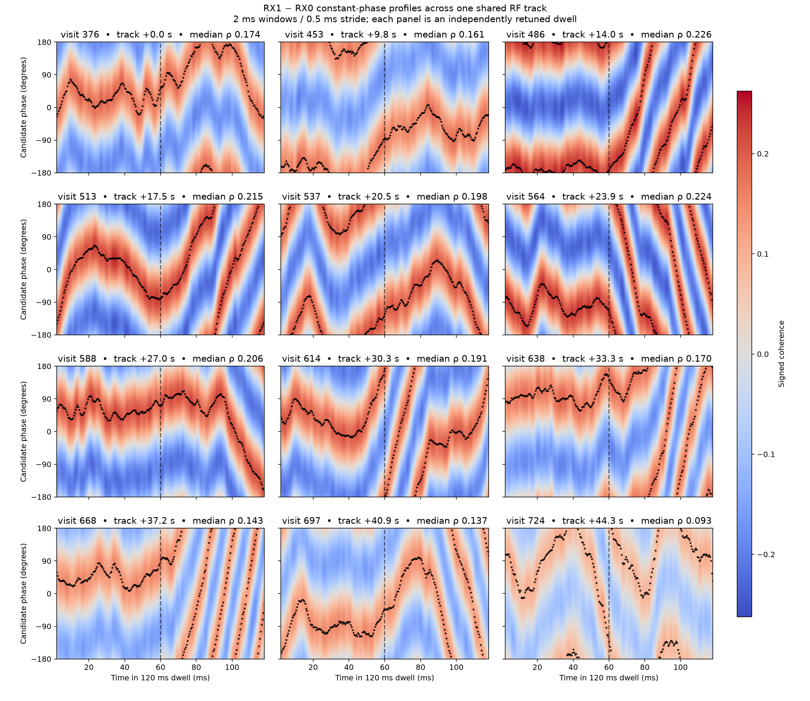
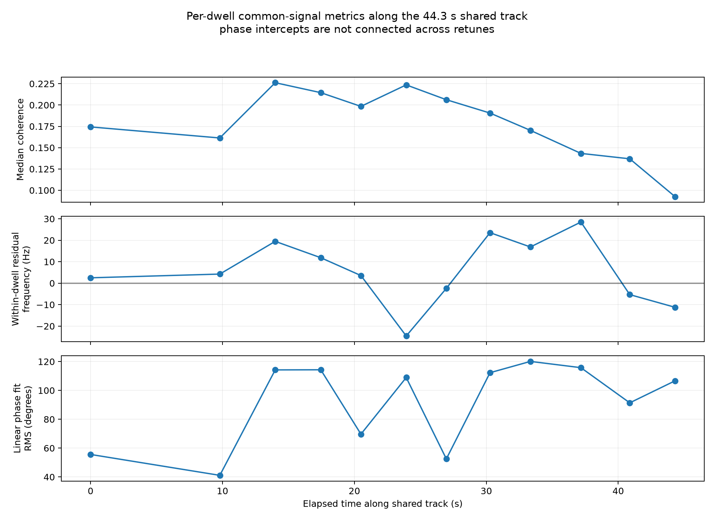

# Constant-phase profiles across multiple dwells of one shared track

This repeats the per-window RX1-minus-RX0 phase enumeration across 12 frozen visits from one persisted shared RF track in `scan-hop-e46d3aba244cf641`. The track is channel 2 upper, target index 5, with 106 visits shared between the receiver-local tracklets over 44.3 seconds. Those tracklets contain 109 RX0 and 141 RX1 observations. Each of the 12 visits has exactly one retained phase-blind paired GLRT source in the prior raw-IQ replay.

This is strong operational evidence that RX0 and RX1 were following the same RF trajectory. It is not an independently established satellite catalogue identity. The 12 visits were selected by the earlier frozen phase-replay policy before this heatmap was examined, so phase appearance did not select the dwells.



Each panel is a separately retuned 120 ms dwell. It uses 233 overlapping 2 ms windows at 0.5 ms stride. The color evaluates signed coherence at 721 candidate phase offsets; black points mark the most-likely phase. The dashed line separates the first 60 ms used by the per-dwell broadband alignment model from its second-half application.

The per-dwell correction estimates relative RX1 frequency/drift and fractional delay, then applies the same 1.675 MHz common-band filter to both receivers. It does not equalize the remaining frequency-dependent channel response. Positive phase is `arg(RX1 * conj(RX0))`. The phase intercepts are not connected across retunes.

## Results

| Visit | Track time | Median coherence | Median prediction error | Scalar-described energy | Linear residual frequency | Linear phase RMS | Median conditional phase SE |
|---:|---:|---:|---:|---:|---:|---:|---:|
| 376 | +0.0 s | 0.174 | 0.9847 | 3.04% | +2.5 Hz | 55.6° | 4.4° |
| 453 | +9.8 s | 0.161 | 0.9869 | 2.60% | +4.2 Hz | 41.1° | 4.3° |
| 486 | +14.0 s | 0.226 | 0.9741 | 5.12% | +19.5 Hz | 114.2° | 3.4° |
| 513 | +17.5 s | 0.215 | 0.9767 | 4.60% | +11.9 Hz | 114.3° | 3.5° |
| 537 | +20.5 s | 0.198 | 0.9801 | 3.94% | +3.6 Hz | 69.7° | 4.0° |
| 564 | +23.9 s | 0.224 | 0.9747 | 5.00% | −24.6 Hz | 108.9° | 3.8° |
| 588 | +27.0 s | 0.206 | 0.9785 | 4.25% | −2.4 Hz | 52.5° | 3.6° |
| 614 | +30.3 s | 0.191 | 0.9817 | 3.63% | +23.5 Hz | 112.3° | 4.2° |
| 638 | +33.3 s | 0.170 | 0.9854 | 2.90% | +16.9 Hz | 120.1° | 4.6° |
| 668 | +37.2 s | 0.143 | 0.9897 | 2.05% | +28.5 Hz | 115.8° | 5.3° |
| 697 | +40.9 s | 0.137 | 0.9906 | 1.87% | −5.3 Hz | 91.4° | 5.4° |
| 724 | +44.3 s | 0.093 | 0.9957 | 0.86% | −11.2 Hz | 106.6° | 7.7° |

`Scalar-described energy` is median coherence squared. It is the fraction of RX1 energy described by a single gain-and-phase-scaled RX0 waveform in a window, under this model. It is not total satellite signal power. `Linear residual frequency` is the slope of one unwrapped linear phase fit over the dwell. Its circular residual RMS is 41–120°, showing that this single-number slope is generally a poor description of the trajectory.



The common component is strongest in the middle of the track: median coherence reaches 0.215–0.226 in visits 486, 513 and 564, then declines to 0.093 by visit 724. Every dwell shows a moving phase ridge. Several later halves exhibit rapid wraps even though coherence remains measurable. One constant phase per dwell, or one residual frequency over the whole dwell, is therefore inadequate.

The conditional local phase estimates are much tighter than the failure of a global line: median deletion-jackknife SE is 3.4–7.7°, while the phase trajectory itself changes by many cycles. That supports a locally tracked phase/frequency model, with uncertainty propagated per window. It does not support joining absolute phase between retunes; retuning and receiver/LNB terms leave an unknown intercept for every dwell.

## Reproduction and artifacts

- [All 2,796 window estimates](figures/2026_09_22_multi_dwell_track_phase/multi-dwell-windows.csv).
- [Full models, source bindings and results](figures/2026_09_22_multi_dwell_track_phase/multi-dwell-results.json).
- [Reproduction script](figures/2026_09_22_multi_dwell_track_phase/plot_multi_dwell_phase.py).

The result binds the raw input manifest, shared-tracking manifest, two receiver-local tracklet IDs and raw-recording authority digest. The script verifies the frozen 12-visit selection, target index, paired-source count, track membership and manifest before reading IQ. A known-tone control verifies relative-frequency and fractional-delay correction signs. Saved IQ is read-only; no new RF was collected.

Run with the source and environment at research commit `660bd85a`:

```bash
sudo -u leo env OPENBLAS_NUM_THREADS=1 MPLCONFIGDIR=/tmp/leo-multi/mpl \
  PYTHONPATH=src:tools .venv/bin/python \
  /path/to/published/reports/figures/2026_09_22_multi_dwell_track_phase/plot_multi_dwell_phase.py \
  --research-root "$PWD" --bulk-root /srv/bulk/leo --output /tmp/leo-multi
```

The next useful estimator is a smooth local residual phase/frequency tracker inside each dwell, validated on disjoint frequency groups as before. Geometric interpretation still requires separating stable receiver/LNB/channel phase and respecting the lack of phase continuity across retunes.
