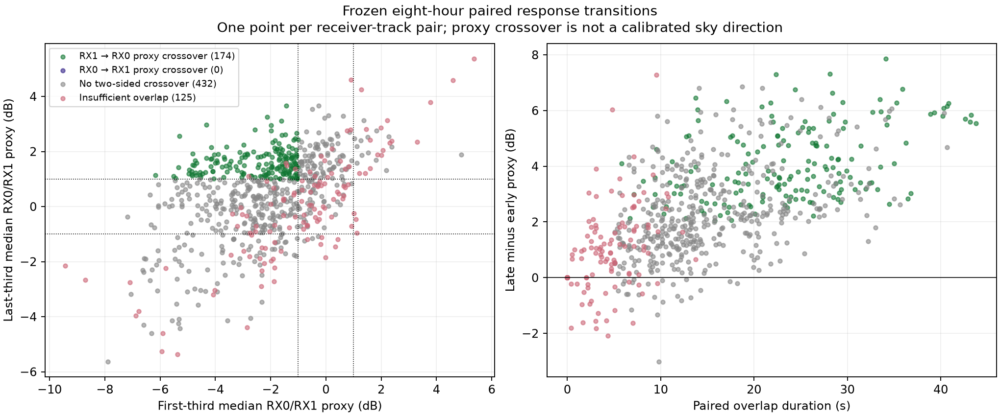
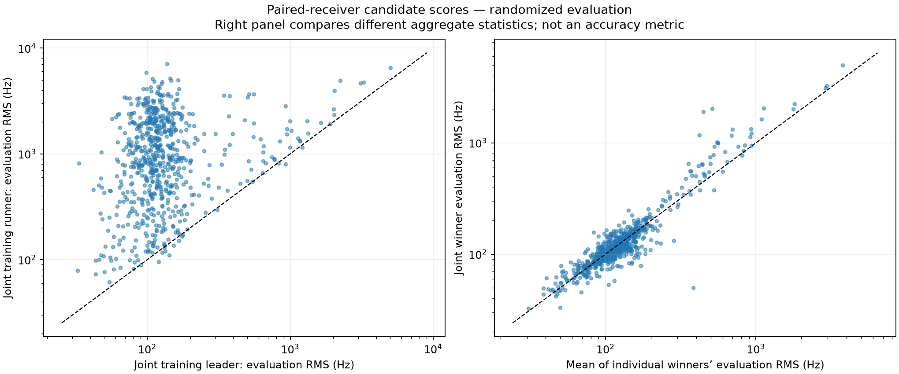
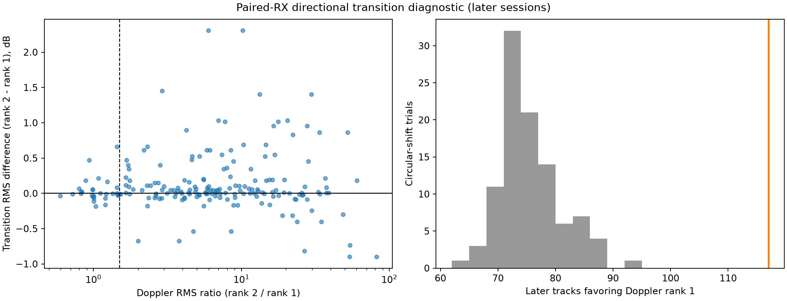

# Paired-receiver satellite identification: frozen eight-hour rerun

## Scope and protocol

This research extends the [previous identification study](2026_09_21_dual_lnb_identification_eight_hours.md)
using the same recording interval, **2026-09-21 07:33:13–15:33:13 UTC**
(`[1789975993000000000, 1790004793000000000)` nanoseconds). It does not collect new RF
or change production identification policy. The original inventory contains 77
scans, 75 with completed tracking products and two pending at export, and 2,948
tracks. All are 2.5 MS/s dual-receiver recordings. Missing products remain in
coverage accounting rather than being silently removed.

The question is whether shared-signal observations can distinguish candidate
satellites better than either receiver alone. Two complementary analyses are
specified before examining their results:

1. **Joint Doppler identity.** Link receiver paths using existing exact paired
   detection provenance. Reconsider the union of candidate identities from both
   paths, comparing each candidate against both trajectories with receiver-specific
   frequency offsets and a shared orbital time adjustment. Candidate selection
   uses fitting observations only. Randomized evaluation keeps the same paired
   visit together across receivers. Simultaneous copies are not independent
   physical passes. Compare recomputed single-receiver and paired rankings under
   the same candidate population, site, orbit availability and split.
2. **Directional transition evidence.** Use change in the relative receiver
   response during overlap, rather than interpreting first-detection order alone.
   Learn a shared response-versus-direction relation from the fixed early
   calibration data, then evaluate later passes with that calibration fixed.
   Compare level-only, transition-only and combined descriptive evidence. Preserve
   correlated pass structure in controls and bootstrap uncertainty. This split
   checks installation-calibration transfer; it is not a chronological TLE
   residual validation or association gate.

The global calibration cutoff remains **2026-09-21 13:56:54 UTC**, assigning whole
sessions by their earliest retained support as in the prior study. A calibration
session may contain points later than that clock boundary; no session is split
between calibration and evaluation. These are
retrospective protocol checks, not a prospectively collected experiment. Candidate
identities and calibrations are conditioned on a known observer site; they do not
prove blind localization or provide independent satellite identity truth.

## Geometry, mapping and obstruction assumptions

The mounting axis is approximately east–west. Its azimuth does not by itself fix
the two beam boresights, mechanical tilt or RX0/RX1 cable mapping. A shared
calibration must account for unknown sign and heading; each candidate must not
choose its own convenient receiver mapping. Relative response is a GLRT-margin
proxy, not calibrated received power. Therefore a nominal fitted response should
not be interpreted as an accurately measured arrival angle.

Geometric visibility does not establish an unobstructed radio path. Common and
differential blockage can alter observed strength, shift detection onset and hide
one or both receivers. A missing detection or beam-response mismatch **cannot by
itself reject a Starlink classification or a NORAD candidate**. Positive paired
timing and compatible frequency evolution support continuity; failure to match
does not prove different emitters. Early/late detection is descriptive only unless
scan exposure, thresholds and obstruction status are established.

Joint Doppler and response evidence share underlying detections and sometimes
calibration labels. We do not multiply them as independent likelihoods or report
an uncalibrated identity probability. Candidate-rank changes, corroboration,
ambiguity and insufficient support must be reported separately. Any exploratory
tie-breaking policy is distinct from a verified operational identification rule.

## Execution status

The transition model, independent audit and joint Doppler candidate-union rerun
have completed. Previous reports and artifacts are preserved.
Results below distinguish retrospective research candidate changes from an
operational acceptance rule or a measured identity accuracy.

## Observed transitions before candidate scoring

Deduplicating the two receiver views yields **9,182 paired observations in 731
receiver-track groups**. As a descriptive inventory, require at least five visits
and five seconds of overlap, then compare first-third and last-third median
GLRT-response ratios. A two-sided crossover requires medians on opposite sides
of both -1 and +1 dB. These thresholds categorize available overlap; they do not
gate identity or claim an antenna angle.

| Observed proxy behavior | Pair groups |
|---|---:|
| RX1-dominant early, RX0-dominant late | 174 |
| RX0-dominant early, RX1-dominant late | 0 |
| Sufficient overlap without a two-sided crossover | 432 |
| Insufficient visits or overlap span | 125 |

The one-sided asymmetry requires a selection/instrumentation check before being
interpreted as compass direction. Pair groups can share tracks and satellite
passes; 174 groups are not 174 independent spacecraft or confirmed identities.

## Directional-transition model results

The shared calibration removes mean response and mean ENU direction separately
within each satellite/session/RF-lane group. This avoids interpreting a constant
gain or lane offset as motion. Whole satellite/session groups are bootstrapped.
The calibration uses 2,800 points in 134 early groups; three singleton groups
cannot constrain a centered response change. The globally fitted horizontal
response vector is approximately `[18.38, 2.03]` dB per unit east/north direction
cosine. Its empirical heading is about 84 degrees; this is not a mechanical
boresight measurement. Swapping RX labels mirrors the vector and response and
leaves candidate scores unchanged, so physical cable mapping remains unresolved.

| Later-session result | Track rows |
|---|---:|
| Scoreable using both candidate direction sequences | 195 |
| Bootstrap-stable transition preference for Doppler rank 1 | 102 |
| Bootstrap-stable transition preference for rank 2 | 54 |
| Calibration-bootstrap preference uncertain | 39 |
| Nominal transition model favors rank 1 | 117 |
| Frozen level-response model favors rank 1 by RMS | 152 |
| Better of the two directional candidates beats the early-trained common time trend | 133 |
| Exploratory weak-Doppler transition tiebreak changes | 10 |

The exploratory rule changes a candidate only when its original Doppler RMS ratio
is below 1.5, bootstrap transition scores consistently favor the runner, and that
runner's transition RMS is no larger than the calibration residual scale. These
are **10 track-row proposals, not 10 corrected satellite identities**. They share
observations and calibration labels, have no independent identity truth, and use
the persisted Doppler evaluation score to define the ambiguity stratum. They must
not be described as newly validated held-out improvements. The final joined output
keeps them diagnostic rather than allowing a beam mismatch to veto a candidate.

Across all 2,948 tracks, 1,216 can be scored; 442 lack two candidates and 1,290
lack three paired points. Unsupported tracks retain their existing Doppler evidence.

## Does this distinguish candidates, or merely recognize a rising response?

An early-trained candidate-independent response slope is **+0.220 dB/s**. This
confirms that a general increasing trend is a serious alternative explanation.
The directional model beating it for the better of two candidates on 133/195
tracks is suggestive, but includes candidate selection and is not an unbiased
identity success rate.

The independent audit fits a free intercept and time slope on each evaluated
track. That flexible in-sample baseline beats the directional rank-1 response on
184/195 tracks. This is not a fair held-out prediction comparison: it fits the
evaluation data directly, whereas the antenna vector was learned elsewhere.
It is a structural diagnostic showing that most observable variation is smooth
linear time dependence. Removing that dependence leaves a median candidate RMS
gap of approximately 0.00194 dB rather than 0.0243 dB, with only 49.2% preservation
of candidate preference under that aggressive residualization.

Circularly shifting a short monotonic sequence creates a discontinuity, so its
trial tail is not used as calibrated significance. A stronger sensitivity check
swaps complete smooth response profiles between different passes on the same RF
lane, resampling normalized time and sharing a donor draw across a pass. For the
same 195 tracks, actual rank-1 preference is 117, versus a minimum/median/maximum
of **80 / 95.5 / 111** across 100 donor trials. None reaches 117. This preserves
more of the temporal shape, supporting some candidate-specific alignment beyond
the mere existence of an increasing trend. It still changes donor speed/amplitude
and preserves only part of the correlation structure; it is a sensitivity control,
not an exchangeable randomization test or false-identification probability.

These checks justify retaining the new response term as **conditional corroboration**,
while withholding claims that its candidate changes improve true identification
accuracy. Neither inconsistent response nor unknown obstruction rejects an ID.

## Joint satellite identification using both Doppler trajectories

The rerun covers all **682 pairs with at least three exact matched visits** out of
731 total pairs. It reconstructs the measured GLRT track points, takes the union
of each receiver's stored top-two candidates, and recomputes both single-receiver
and joint scores. The common site is the persisted review site, 37.858988° N,
122.478103° W, altitude -29 m. This differs by about 1.29 km from the supplied
site used for the existing ENU geometry export; the joined result explicitly
remains conditional on that mismatch.

Each candidate uses one shared time correction from -5 to +5 seconds in integer
steps, with separate constant RX0/RX1 frequency offsets. These parameters are fit
only on the randomized fitting visits. No receiver-specific frequency slope is
fit, because that could absorb distinguishing Doppler evolution. Per-visit mean
squared residuals give each visit total weight one regardless of receiver count;
the offset fit uses the corresponding weights. Both receivers' observations of
the same visit stay in the same partition. This handles simultaneous copies but
does not make distinct nearby visits or overlapping pair groups independent.

Candidates are ranked on fitting RMS. Evaluation RMS is diagnostic and does not
reselect the winner. This same protocol recomputes each receiver alone for a
fairer comparison than treating stored RMS values from different splits as
directly interchangeable. Snapshot collection and element epochs must precede
capture start. No future orbit information is used.

| Joint outcome | Pair groups |
|---|---:|
| Eligible pairs processed | 682 |
| Have at least one scoreable candidate | 675 |
| No candidates in the stored union | 7 |
| Fitting leader remains evaluation leader | 658 / 675 |
| Previously agreeing receivers retain their common leader | 518 / 520 |
| Previously disagreeing receivers: joint selects old RX0 leader | 14 / 42 |
| Previously disagreeing receivers: joint selects old RX1 leader | 27 / 42 |
| Previously disagreeing receivers: joint selects neither old leader | 1 / 42 |

The 658/675 persistence is **ranking stability**, not 97.5% proven identity
accuracy. All 675 scored pairs have at least two scoreable candidates. The
candidate bank is restricted to existing top-two
lists and may omit the true satellite. Shared source detections and uncertain
path matching remain additional dependencies. Seven empty unions stay unsupported;
the analysis does not invent a catalogue identity from response geometry alone.

## Combined identification output

The output now joins each joint Doppler leader and runner with the transition
evidence from both receiver views, matching actual NORAD numbers rather than
assuming receiver ranks correspond. A paired observation is not counted as two
independent geometry votes. The per-side columns preserve mixed or unsupported
evidence. If one side supports a candidate while the other is unscored, the pair
is labeled supportive with that limitation visible.

| Conditional geometry evidence | All 682 pairs | Later-session 110 pairs |
|---|---:|---:|
| Supports joint Doppler leader | 346 | 57 |
| Supports joint runner-up | 196 | 30 |
| Mixed definite preferences | 2 | 0 |
| Unsupported or uncertain | 138 | 23 |

These counts are not added to Doppler log-likelihoods. In particular, the 30 later
pairs favoring the runner do not automatically reject the Doppler leader: proxy
response, obstruction, calibration, site mismatch and selected sky coverage can
explain disagreement. The conservative integrated result is a joint candidate
ranking accompanied by conditional directional evidence and all limitations.
The ten exploratory transition tiebreak proposals remain a separate research
comparison, not accepted identity changes or production policy.

## Examples, figures and reproducibility

The median evaluation RMS is **115.77 Hz** for the training-selected joint leader
and **926.80 Hz** for its training-selected runner. The following disagreement
examples show why neither joint ranking nor receiver agreement proves identity:

| Session | Old RX0 / RX1 leaders | Joint leader / runner | Evaluation RMS leader / runner, Hz | Shared fitted time correction |
|---|---|---|---|---:|
| `scan-hop-09d72b8f81edd530` | 61534 / 66570 | 66570 / 61534 | 102.72 / 299.26 | -1 s |
| `scan-hop-04659e64a57981df` | 64762 / 66599 | 66599 / 64762 | 545.62 / 542.96 | -5 s |
| `scan-hop-fdee4a852c49e0ae` | 68307 / 100031 | 59577 / 62606 | 1906.33 / 1908.09 | +5 s |

The second example loses its training ordering on evaluation. The third is the
single disagreement case selecting neither old leader, but its large residuals,
tiny separation and boundary time correction make it a poor identification—not
a successful correction. These rows are retained in the report rather than
excluded to improve aggregate results. Exact track IDs and all candidate scores
are in the linked ledgers.





The second figure uses logarithmic axes to retain the full residual range. Its
right panel is descriptive: the mean of the two independently fitted receiver
RMS values is not algebraically the same statistic as joint equal-visit RMS.
Neither its diagonal nor median difference proves an accuracy improvement.



The circular-shift panel illustrates a weak sensitivity control only; the
[smooth donor control](2026_09_22_paired_receiver_identification/smooth-donor-control.json)
and the [independent audit](2026_09_22_paired_receiver_transition_audit.md) provide
the necessary qualifications.

Complete outputs:

- [Joint ranking plus geometry, all 682 pairs (CSV)](2026_09_22_paired_receiver_identification/joint-geometry.csv)
- [Single/joint candidate outcomes (CSV)](2026_09_22_paired_receiver_identification/joint-pair-outcomes.csv)
- [Full joint candidate scores and randomized masks](2026_09_22_paired_receiver_identification/joint-scores.json.gz)
- [Transition scores for all 2,948 tracks](2026_09_22_paired_receiver_identification/transition-scores.json.gz)
- [Deduplicated response inventory](2026_09_22_paired_receiver_identification/response-inventory.json.gz)
- [Input/output/source hashes](2026_09_22_paired_receiver_identification/manifest.json)
- [Research tools and component tests](2026_09_22_paired_receiver_identification/reproduction-sources.tar.gz)

The new source archive overlays the previous report's research source archive in
a separate research checkout. Raw track reconstruction requires the existing
frozen source cache and causal TLE archive; the published score/plot artifacts can
be inspected without radio or database access. No new collection was performed.

```bash
PYTHONPATH=src .venv/bin/python tools/research_dual_lnb_joint_identity.py \
  --continuity reports/2026_09_21_dual_lnb_identification_eight_hours/exact_continuity.json \
  --source-cache /tmp/lt3d-id-20260921T153313 \
  --tle-archive /var/lib/leo/tle --output /tmp/joint-scores.json
.venv/bin/python tools/research_dual_lnb_transition_identity.py \
  --input reports/2026_09_21_dual_lnb_identification_eight_hours/exact_pairs.json.gz \
  --output-dir /tmp/transition-scores
.venv/bin/python tools/summarize_dual_lnb_joint_geometry.py \
  --joint /tmp/joint-scores.json --geometry /tmp/transition-scores/scoring.json \
  --output /tmp/joint-geometry.json
```

The focused suite passes **18 tests**, covering shared randomized visits,
training-only candidate selection, equal-visit offset weighting, static response
invariance, candidate-ID joins, duplicate removal, smooth profile controls and
missing-data safeguards. Implementation review corrected evaluation-based ranking,
per-candidate beam refitting, lane centering and inconsistent actual/null statistics
before the final reported runs. This is retrospective research with review-driven
corrections; it is not a prospective preregistered validation.

The new paired analysis is complete and usable for research candidate ranking and
diagnostic corroboration. Production acceptance policy is unchanged. The next
useful validation would test candidate-specific response on independent passes
with greater directional diversity and measured receiver/pointing calibration,
while retaining obstruction uncertainty and the single-receiver evidence.
