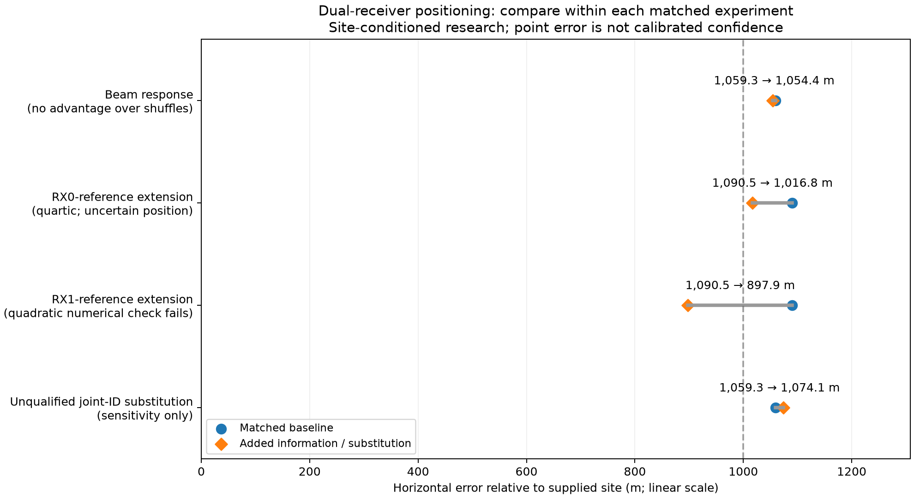

# Did paired-receiver identification improve positioning?

## Answer and scope

The latest receiver-pair identification rerun has **not demonstrated a position
accuracy improvement**. It provides additional evidence about shared signals and
candidate ranking, but those benefits must be distinguished from a measured
reduction in location error. Earlier receiver-path fusion produced a promising
sub-kilometre point estimate; that is a different experiment and remains
conditionally evaluated rather than a validated position lock.

The [identification rerun](2026_09_22_paired_receiver_identification.md) covers
2026-09-21 **07:33:13–15:33:13 UTC**. The position comparison reuses the earlier
frozen 988-track, 45,115-observation benchmark. Only its overlap with the rerun can
receive revised identities; this is not a new position fit over the complete later
eight-hour window. Measurements, randomized fitting/evaluation membership,
causal orbit availability, initialization and model settings stay fixed.
The earlier export's nominal interval is **05:56:54–13:56:54 UTC**; its retained
position observations span **06:00:54.323991–13:35:14.721604 UTC** on the same date.
There are 36,494 fitting and 8,621 evaluation observations. The 540 tracks without
a scored exact pair in the later identity rerun retain their baseline identities.

All distances below are horizontal errors relative to the user-supplied site,
**37.84903264307456° N, 122.4856541910174° W**. The candidate selection and local
search region are site-conditioned, so these experiments do not establish a
blind global location solution. The identification scorer also retains its
original configured observer site for comparability; that site differs from the
supplied location by about 1.29 km.

## Three different ways two receivers can help

| Experiment | Baseline error | Added-information error | Interpretation |
|---|---:|---:|---|
| Add measured relative beam response | 1,059.319 m | 1,054.390 m | 4.929 m closer, but shuffled responses perform similarly or better; no demonstrated geometric gain |
| Extend RX0 paths with calibrated RX1 samples, quartic orbit refit | 1,090.485 m | 1,016.765 m | 73.720 m closer (6.76%); still above 1 km, and common evaluation RMS does not improve |
| Choose native RX1 paths by coverage and add calibrated RX0 extensions | 1,090.471 m | 897.853 m | 192.618 m closer (17.66%); promising conditional point result, but numerical and uncertainty checks still fail |

The last two experiments use a baseline with calibration anchors excluded; they
must not be compared directly with the first row's full-corpus baseline as if only
one model option changed. Receiver-reference choice and coverage also change
together in the third row. Detailed receipts and prepared inputs are in the
[geometry follow-up report](2026_09_21_dual_lnb_geometry_followup.md).

The direct beam experiment ranks fourth among the real response and five shuffled
controls. The quartic extension experiment passes the exact-orbit approximation
check, but its common evaluation RMS changes from 100.7399 to 100.8171 Hz. The
native-RX1 experiment changes RMS on 8,124 unchanged evaluation observations from
100.5392 to 100.4944 Hz, a small improvement of 0.0448 Hz. Its original quadratic
orbit approximation still fails the unchanged 0.2 Hz maximum exact-propagation
tolerance (0.25080 Hz). Its nominal 95% major semiaxis is 460.7 m, smaller than
the actual 897.9 m error. Therefore the sub-kilometre coordinate is not evidence
of well-calibrated sub-kilometre confidence.

## What the latest identity update changes in the position corpus

Exact session/tracklet provenance maps paired candidate results onto **448 of the
988 selected position tracks**, comprising **23,597 observations**. There are no
conflicting candidate claims where several scored pairs reference one track.
Of these tracks, **447 retain their previous satellite identity**. One 30-point
track in `scan-hop-fdee4a852c49e0ae` would change from NORAD **68307** to **59577**
if we unconditionally substituted the joint training leader.

That exceptional case is already an explicit counterexample in the identification
report. Its joint leader and runner-up evaluation RMS are approximately **1,906
and 1,908 Hz**, and the fitted time adjustment reaches the **+5 s search boundary**.
It is not a convincing correction. Retaining the previous identity for this
ambiguous case leaves the position input unchanged; a deterministic refit with
the same settings therefore cannot gain accuracy from accepted identity changes.
This statement does not certify the old identity either.

A matched sensitivity test substitutes the one unqualified leader while retaining
all 45,115 measurement rows. It tests the numerical consequence of unconditional
substitution, not a proposed acceptance policy. Each arm uses the same causal
snapshot available before capture and the optional five-state quartic orbit
approximation, followed by exact propagation verification. Reused association
observations prevent interpreting the position evaluation split as independent
validation of the new candidate selection.

The completed matched comparison is:

| Quartic fit, identical measurements | Position error | Fitting RMS | Evaluation RMS | Nominal 95% major semiaxis | Maximum exact-orbit difference |
|---|---:|---:|---:|---:|---:|
| Original reviewed identities | 1,059.332 m | 98.246 Hz | 101.772 Hz | 469.540 m | 0.10152 Hz |
| Substitute the unqualified joint leader | 1,074.111 m | 112.259 Hz | 111.898 Hz | 469.511 m | 0.10169 Hz |

Both fits and their nuisance solves converge, and both pass the unchanged 0.2 Hz
exact-propagation gate. The substitution makes location error **14.779 m worse**
(1.40%) and increases evaluation RMS by **10.127 Hz** (9.95%). The nearly unchanged
formal uncertainty still fails to cover the actual error. Neither the worse
result nor the better baseline proves which satellite emitted this ambiguous
track; it shows that unconditional adoption does not improve this position fit.

Keeping the ambiguous update out retains the original input and baseline result.
No newly calibrated identity-confidence threshold or production policy is being
claimed. No weights or beam strengths were tuned to the surveyed position.



## Reproduction and supporting artifacts

The [complete fit receipt](2026_09_22_paired_receiver_position_comparison/results.json.gz)
records both solver outputs, per-source corrections, exact-propagation checks and
the sole changed track. The [prepared measurements](2026_09_22_paired_receiver_position_comparison/prepared.npz)
and [selection provenance](2026_09_22_paired_receiver_position_comparison/selection.json.gz)
preserve the frozen corpus. Joint candidate input is the preceding report's
[joint scores](2026_09_22_paired_receiver_identification/joint-scores.json.gz).

Research scripts and their focused tests are frozen in
[reproduction sources](2026_09_22_paired_receiver_position_comparison/reproduction-sources.tar.gz).
They use the core research modules from the earlier
[geometry source snapshot](2026_09_21_dual_lnb_geometry_followup/reproduction-sources.tar.gz)
and the read-only causal TLE archive. These archives are report artifacts, not a
production deployment. The manifest records input and artifact hashes. After
extracting the source snapshots into a compatible research checkout and
decompressing the JSON inputs, run:

```sh
PYTHONPATH=src:tools OPENBLAS_NUM_THREADS=1 OMP_NUM_THREADS=1 \
  .venv/bin/python tools/compare_dual_lnb_position_identity.py \
  --prepared prepared.npz --selection selection.json \
  --identity joint-scores.json --tle-archive /var/lib/leo/tle \
  --output results.json
.venv/bin/python tools/render_dual_lnb_position_comparison.py \
  --identity-result results.json --output comparison.png
```

The age of replacement elements uses the original capture-time reference, not
each individual observation time. Candidate replacement must be present in the
same original snapshot, and its element epoch must predate capture. Measurement
and split arrays are asserted unchanged. Conflicting pair claims retain the
baseline identity. Focused tests exercise conflict handling and preservation of
the capture-time orbit-age convention.

## Why direction can help identity without yet improving coordinates

Relative response and cross-receiver continuity can distinguish very different
sky paths and extend a Doppler curve. That does not make the response a precise
angle measurement: beam tilt, compass heading, cable mapping, gain calibration and
obstructions remain uncertain. A missing detection or unexpected response must
not alone reject a satellite identity. The east–west mounting axis also does not
fully specify either beam's pointing direction.

The current evidence favors retaining the joint identity and transition
diagnostics while pursuing longer, covariance-aware Doppler paths. Demonstrating
a reliable improvement requires a fixed selection policy evaluated on independent
passes, calibration and orbit uncertainty that cover the actual errors, and
matched observation controls. Increasing the beam weight until one known-site
result improves would not establish better tracking.
