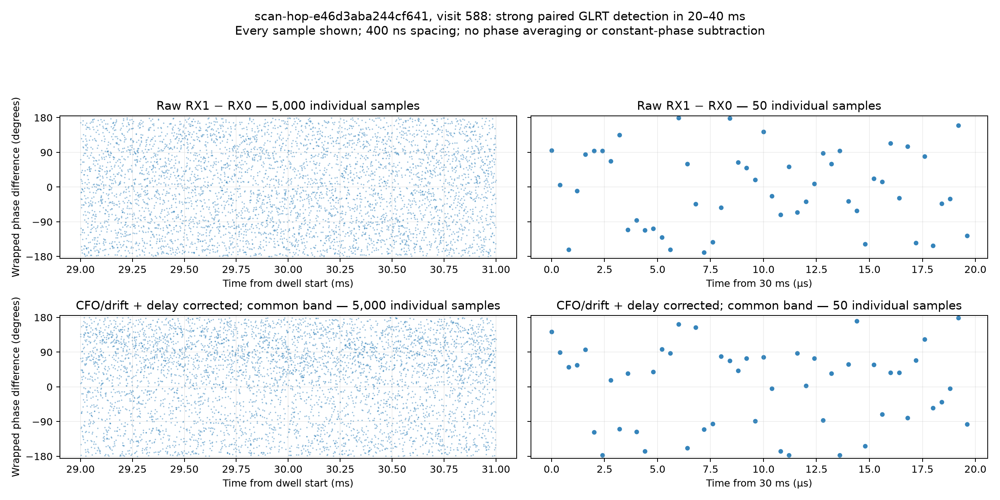
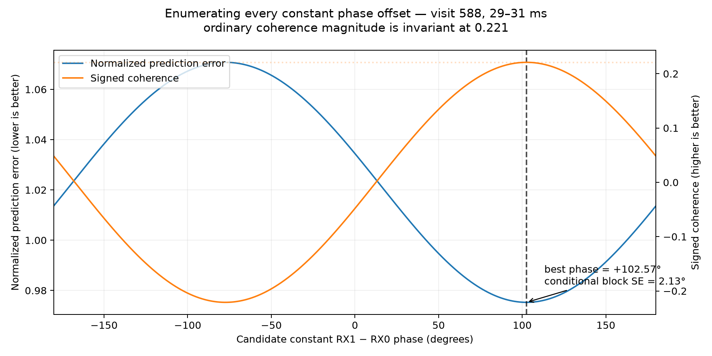

# Phase difference for every paired IQ sample

The plot uses saved `scan-hop-e46d3aba244cf641`, visit **588**, at **2.5 MS/s**. Both receivers have a strong, phase-blind matched Starlink GLRT candidate in the **20–40 ms** probe. This supports a common candidate signal; an individual satellite identity has not been independently verified.

| Receiver | Fractional GLRT64 exact score | Control score | Margin | Required margin |
|---|---:|---:|---:|---:|
| RX0 | 0.61624 | 0.04095 | 0.57529 | 0.025 |
| RX1 | 0.67110 | 0.04403 | 0.62707 | 0.025 |

The candidates share integer epoch sample 3062 within that probe, with fractional refinements −0.0714 and −0.0837 samples. Selection used paired detection evidence, not the appearance of the phase plot.



- Left: **every one of 5,000 paired samples** from 29 ms inclusive to 31 ms exclusive within the valid dwell.
- Right: **50 consecutive paired samples**, 30.0000–30.0196 ms, spaced **400 ns** apart.
- Top: raw `arg(RX1[n] * conj(RX0[n]))`, wrapped to ±180 degrees.
- Bottom: the same definition after correcting differential frequency/drift and fractional envelope delay, then applying the same wide common-band FIR filter to both channels. There is no phase averaging, point decimation, constant-phase subtraction, or selection of high-amplitude samples. Filtering does combine neighboring IQ samples; it does not turn filtered samples into independent observations.

The frozen prior model has relative frequency **−675476.447 Hz** at sample 75,000 (30 ms), drift **−0.379 Hz/s**, and effective RX1 delay **+0.010 sample**. RX1 is derotated and advanced by that delay. Both streams are filtered over RX0-baseband −500 to +1175 kHz (1.675 MHz), using a 513-tap centered complex bandpass FIR. This conservative common band allows transitions inside the physically recorded overlap. A centered 65-tap fractional-delay filter performs the advance. The plotted interval is far from dwell/filter boundaries. A known-tone test checks the correction sign and filter centering.

This plot is deliberately a direct waveform diagnostic. It does not equalize the frequency-dependent channel response, extract only pilot symbols, or claim calibrated geometric phase. The model was fitted on the first 60 ms; this interval is in-sample visualization, not additional held-out validation.

**Observation:** even in this strong dual-detection probe, instantaneous phase differences are widely dispersed. The compensated common-band section has normalized complex coherence **0.2210** and unit-phasor resultant **0.1846**. A coherent common component is present, but noise, unshared signal, amplitude fades, and unequal channel response make individual waveform-sample phases poor standalone estimates of the common source phase. Strong GLRT detection benefits from known-waveform accumulation and does not imply high single-sample signal-to-noise ratio.

## Enumerating the constant phase



The profile enumerates 1,441 candidate RX1-minus-RX0 offsets at 0.25-degree spacing. For each candidate `phi`, it evaluates signed coherence, where larger is better, and normalized prediction error for `Y ≈ a exp(j phi) X`, where smaller is better.

Both select **+102.57° RX1-minus-RX0**, equivalent to applying **−102.57°** to RX1. A ten-contiguous-group deletion jackknife gives **2.13° conditional standard error**. This interval does not include uncertainty from candidate identity, channel-response equalization, model selection, calibration, or geometry.

Ordinary coherence magnitude is **0.2210 for every candidate constant phase**: taking the magnitude removes the phase rotation. It cannot select the offset by itself. Signed coherence has the expected cosine profile, peaking at +0.2210; the minimum normalized prediction error is **0.9753**. Thus the preferred constant is identifiable, but it aligns only a weak fraction of the total waveform energy. It is also an interval/common-band phase, not directly interchangeable with the full-band channel-intercept phase at another frequency reference.

## Data and reproduction

- [Every plotted sample as CSV](figures/2026_09_22_sample_phase/sample-phase.csv), including sample index, time, both phase differences and both receiver amplitudes.
- [Enumerated offset scores as CSV](figures/2026_09_22_sample_phase/constant-phase-profile.csv).
- [Metadata and exact GLRT candidates](figures/2026_09_22_sample_phase/metadata.json), including raw manifest, model, and script hashes.
- [Plotting script](figures/2026_09_22_sample_phase/plot_sample_phase.py).

Use the environment and source at research commit `660bd85a`, with the saved IQ available read-only at `/srv/bulk/leo`. From that research checkout:

```bash
sudo -u leo env OPENBLAS_NUM_THREADS=1 MPLCONFIGDIR=/tmp/leo-sample-phase/mpl \
  PYTHONPATH=src:tools .venv/bin/python \
  /path/to/published/reports/figures/2026_09_22_sample_phase/plot_sample_phase.py \
  --research-root "$PWD" --output /tmp/leo-sample-phase
```

See the [broadband phase report](2026_09_21_glrt_guided_broadband_phase.md) for the underlying estimator, references and independent validation, and the [report index](2026_09_21_phase_geometry_report_index.md) for the full analysis history.
