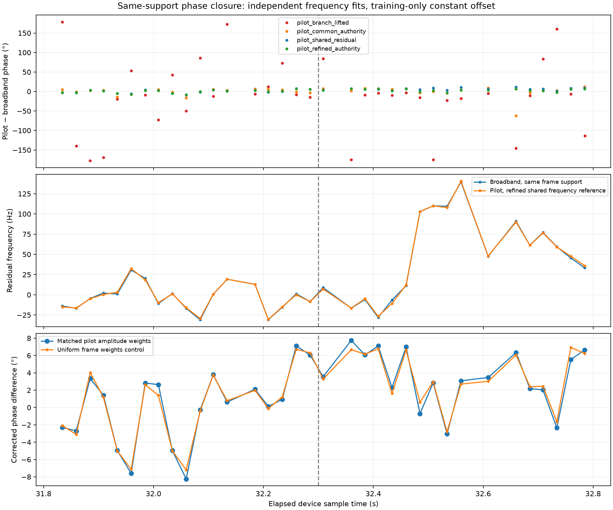

# Phase-estimation resolution for the post-fix dual-RX example

**The large estimator disagreements on this example are resolved to a measured, bounded inter-method discrepancy.** Matched-support, properly referenced pilot and broadband estimates agree on held-out time to **4.75° circular RMS**, with **7.75° maximum absolute difference**. Their independently fitted residual-frequency curves follow the same rapid late evolution. This is a relative receiver-phase result, not identification of the physical oscillator/channel cause or a measurement of calibrated satellite geometric phase.

Input is unchanged: `cap-20260825T010019-89c2889553e0`, stream-1, `.21`, RX0/RX1 at 2.5 MS/s, **31.800–32.800 s**, after the continuous-capture fix. Counter continuity is verified; no new RF collection or selection based on the appearance of phase occurred.

## Diagnosed problems and solutions

1. **Apparent chaos was wrapped phase motion.** The late interval accumulates about 15 residual turns in 170 ms. Faster-stride, shorter-window replay and separate frequency bands reproduce it. A fixed frequency/drift model does not remove that motion. Use time-varying A-band phase tracking, checked against B bands, and display phase alongside local residual frequency. See the [wrapping diagnosis](2026_09_22_postfix_phase_winding_diagnosis.md).
2. **Channel averaging cancelled valid signal.** The original frozen-polynomial correction left phase rotation in training data, which weakened the average cross-spectrum. Normalize each training block's phase before response fitting. Qualified support increased from 0.414 to 1.800 MHz; B-band residual scatter decreased from 21.3° to 11.1°. On identical spectral support, prediction error also improved. See the [response-fitting tests and ablation](2026_09_22_dynamic_channel_phase_fixes.md).
3. **Pilot frequency branches were incompatible.** A broadband-selected differential-frequency branch must bind both receivers, with one reference sample and one common within-frame residual. Independently acquired pilot aliases cannot define separate receiver phase origins.
4. **The comparison mixed time support.** A pilot measurement averages multiple frames over roughly 20 ms; the old comparison evaluated a 2 ms broadband point at its center. During changing frequency those are different quantities. The new comparison samples broadband phase at the exact pilot frame starts and independently fits its frequency and phase with the same frame weights. No pilot frequency is supplied to the broadband fit. Uniform frame weights provide a control.
5. **A differential phase-epoch bias remained within pilot symbols.** Their mean template-energy reference is about 149.32 microseconds after frame start. Forcing a common within-frame residual while a differential residual remains does not transport both phases exactly back to frame start. At 100 Hz this is approximately 5.38°. The implementation now estimates local differential frequency from the first pilot pass, then re-correlates on that refined difference before reporting frame-start phase. This is a second correlation of the IQ, not a fitted phase offset chosen to match broadband.

The last step is implemented in [refined_pilot.py](figures/2026_09_22_pilot_support_closure/refined_pilot.py). The independent broadband authority establishes the frequency branch; refinement is guarded to remain within its principal ±375 Hz frame interval. The wrapper returns both initial and refined observations for audit. The measured time-varying phase is retained, not artificially forced flat.

## Same-support held-out results

Each comparison learns one constant phase-reference offset **only before 32.300 s**. It is frozen afterward. The phase/frequency fits in each later probe use that probe's own IQ; this is local estimation on held-out time, not a claim of forecasting unseen IQ.

| Pilot method | Later phase RMS difference | Largest later difference |
|---|---:|---:|
| Independently seeded, frame-branch lifted | 89.61° | 175.22° |
| Common broadband frequency authority | 16.36° | 62.27° |
| Common authority and shared within-frame residual | 6.90° | 11.28° |
| **Refined common authority, second IQ correlation** | **4.75°** | **7.75°** |
| Same refined method, uniform frame weights control | **4.58°** | **6.94°** |

The final weighted comparison has mean signed discrepancy **+3.52°**. We retain this bias rather than fitting another offset on validation data. Different waveform/spectral weighting, temporal approximation and noise remain; these numbers are not errors against absolute physical truth or a calibrated confidence interval. Earlier 82°/23° numbers used a pointwise comparison and are not identical to the same-support controls above.

There are 17 later paired probes. One initial training probe is excluded from the same-support comparison because its first pilot frames precede the valid filtered broadband window centers. It is recorded explicitly in `excluded`; its value is not extrapolated or silently clamped. All later probes are retained. The final curve does not discard the former late outliers.

The broadband comparison uses 0.5 ms phase windows advanced every 0.2 ms, with interpolation only inside available window centers. It fits constant local frequency to the same discrete frame times as the pilot estimator. This matches frame support, not the exact pilot-symbol spectral filter, so perfect zero discrepancy is neither imposed nor demonstrated. Pilot and broadband estimates share underlying IQ and a coarse frequency authority; their remaining-frequency fits are separate, but they are not statistically independent instruments.

## Verification

- Exact same raw slice and digest as the counter-qualified selection; final replay completed with all 36 probes and all five pilot variants (180 observations), zero extractor failures.
- Four new known-truth tests cover upper/lower templates with authority errors of −140 and +100 Hz. The old shared-residual phase bias exceeds 3°; re-correlation reduces frame-reference phase error below **0.05°**, and frequency error below **0.1 Hz**, in these noiseless controlled cases.
- The response-fitting tests cover known channel recovery under rotating phase, independent-noise rejection, and known time-varying phase recovery at both high and approximately 0.2 coherence.
- Combined report-owned and existing estimator suites: **32 tests passed**. Existing suites cover broadband delay/frequency recovery and disjoint-band validation behavior.
- The final factored wrapper replay produced byte-identical numerical JSON to the validated two-pass replay. The figures were inspected.

This is exploratory debugging on an example already inspected during development. “Held-out” means excluded from model/reference fitting, not an untouched pre-registered test set. Generalizing accuracy to other captures or claiming calibrated uncertainty requires further independent examples. No production deployment or unrelated unfinished code is published.

## Usable result and scientific limits

For this recording, use the phase-normalized broadband response with A-band local phase estimation and B-band checks as the dense relative-phase trajectory. Use the refined, common-reference pilot estimator as the known-waveform cross-check, comparing equal frame support. Preserve the fitted carrier, response gauge, phase sign (RX1 minus RX0), exact reference times and uncertainty diagnostics with the output. The companion JSON files already retain these quantities and phasors.

The solution does **not** claim that the true receiver phase should be constant, that AGC caused its evolution, or that the resulting relative phase is satellite geometric phase. Gain history was not saved. The measured rapid differential-frequency evolution survives both estimator families after their reference problems are corrected. Its physical attribution is therefore separate from the estimator failures fixed here.

## Reproduction and artifacts

- [Final pilot replay](figures/2026_09_22_pilot_support_closure/replay_refined.py)
- [Reusable refined pilot implementation](figures/2026_09_22_pilot_support_closure/refined_pilot.py)
- [Known-truth regression tests](figures/2026_09_22_pilot_support_closure/test_refinement.py)
- [Same-support comparison and plot generator](figures/2026_09_22_pilot_support_closure/compare.py)
- [All pilot results](figures/2026_09_22_pilot_support_closure/pilot-results.json)
- [Comparison rows, exclusions and metrics](figures/2026_09_22_pilot_support_closure/results.json)
- [Dynamic channel fitting and validation](2026_09_22_dynamic_channel_phase_fixes.md)

Use the research environment at commit `660bd85a2ccb4622868f1136443c99587a216db6`, with `src:tools` on `PYTHONPATH` and access to saved `/srv/bulk/leo` IQ. Run `replay_refined.py --output /tmp/pilot-refined-final`; its `results.json` reproduces the published `pilot-results.json`. Run `compare.py` to create `/tmp/pilot-support-closure/results.json` and the figure. No hardware collection is performed.
