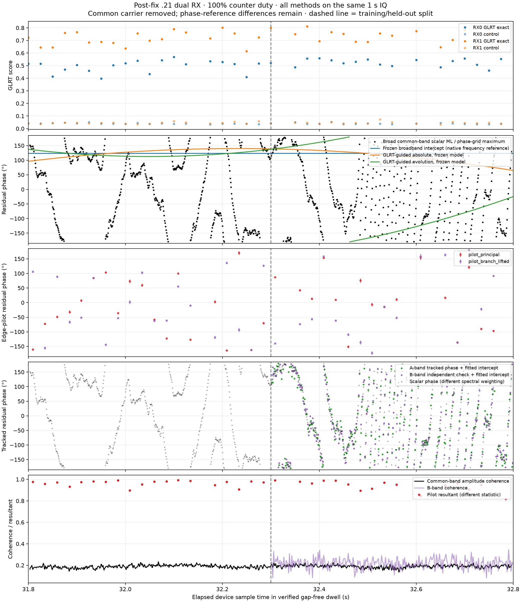
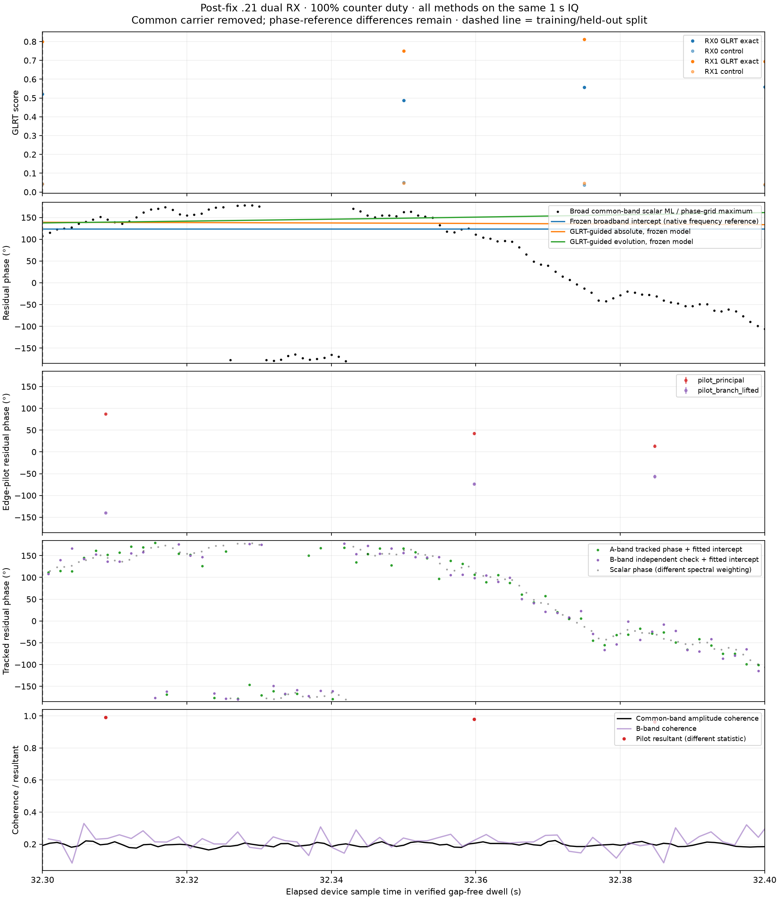
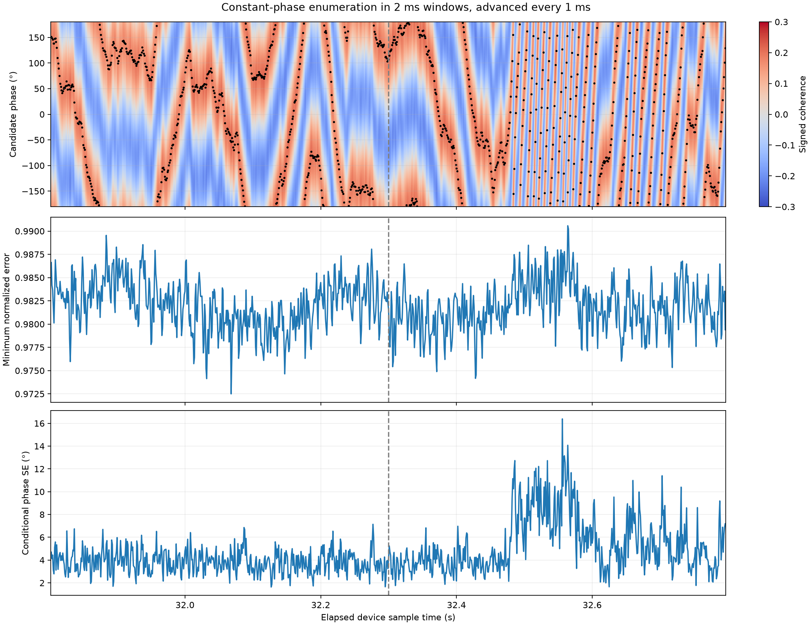
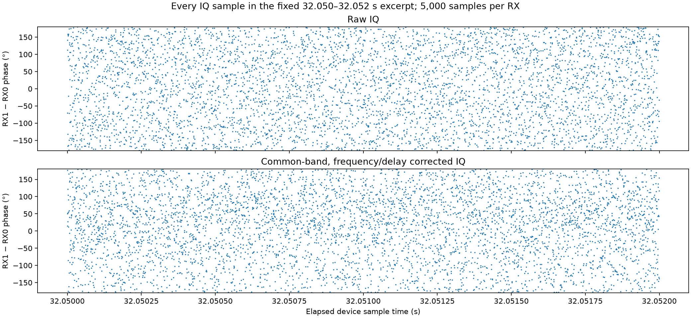

# Phase-method comparison on the verified post-fix dual-RX dwell

Follow-up: [the right-hand wrapped pattern is rapid coherent phase winding](2026_09_22_postfix_phase_winding_diagnosis.md). Shorter-window IQ replay and unwrapped residual-frequency plots distinguish it from random phase and a training-split artifact.

All applicable relative-phase estimators below were rerun on the **same saved IQ**, rather than overlaying results from different recordings. Input: `cap-20260825T010019-89c2889553e0`, stream-1, radio `.21`, RX0/RX1, **31.800–32.800 s**, 2.5 MS/s. Its [selection and counter-continuity verification](2026_09_22_postfix_dual_capture_selection.md) establish 100% device-counter duty after the continuity fix. The one-second slice has 2.5 million complex samples per receiver; the raw digest is checked against the selection receipt.

**Main result:** a measurable common component supports time-varying inter-receiver phase tracking, but a frozen frequency/drift model does not predict the later phase well. Strong edge-pilot detection and high local pilot resultant do not establish agreement of phase between methods or across independently acquired probe epochs.





## What is plotted

| Approach from the phase reports | Application here |
|---|---|
| Raw per-IQ-sample RX1−RX0 phase | Every sample in a fixed 2 ms excerpt, below |
| Frequency/delay-corrected common-band per-sample phase | Same excerpt; no point decimation |
| Constant-offset enumeration / scalar complex least-squares phase | 2 ms windows, 1 ms stride; black ridge and heatmap |
| Broadband cross-spectrum delay/phase/frequency/drift model | Frozen intercept and later validation |
| GLRT-guided broadband model | Absolute-frequency and bias-tolerant frequency-evolution variants |
| Frequency-held-out residual phase tracker | A-band tracking; separate B-band phase/coherence check |
| Original edge-pilot receiver-product phase | Principal frame-frequency branch, red points |
| Branch-lifted edge-pilot receiver-product phase | Within-frame frequency authority resolves frame-rate aliases, purple points |
| Intersource single/double-difference and three-source closure | Not identifiable from this selected single paired branch; no second/third independently matched source was supplied |
| Orbit/holder geometric phase simulation | Not a measurement method; no qualified orbit or installed geometry for this August recording is established, so no invented geometric curve |

The older per-receiver Doppler/Kalman plots estimate frequency or its rate, not the same broadband RX1−RX0 phase. They are not relabeled as additional relative-phase measurements here. In particular, a difference of model-integrated receiver CFO curves is not an independently measured phase.

## Phase references and fitting boundaries

The sign is **RX1 minus RX0**. Except for the explicitly raw sample plot, every phase method has the **same broadband frequency/drift carrier removed** at its own measurement time. This makes residual evolution visible without plotting approximately 620,000 wraps per second. The displayed phase is not absolute RF phase or geometric path phase.

The broadband carrier reference is slice sample **624639.5**, or recording time **32.0498558 s**. It has relative frequency **−619924.974 Hz**, drift **+34.438 Hz/s**, fitted fractional delay **−0.010 sample**, and channel intercept **+123.41°** at RX0 baseband frequency **+408178.724 Hz**. Delay includes channel-response ambiguity and is not an independently calibrated geometric delay. The phase's basic fit-scatter SE is 2.75°, but the guided implementation's broader spectral/group uncertainty is about 32°; neither is a calibrated total physical confidence interval.

Models and response masks use only the **first 500 ms**. The dashed line at **32.300 s** starts held-out time. The A-band tracker can then use current A-band IQ to estimate residual phase; it cannot use current B-band IQ for that correction. Black rolling phase is a descriptive estimate using both channels in each window, not held-out evidence by itself. Its full-slice FIR has local time support across the partition; independent validation is performed by the blockwise frequency-held-out tracker, not that FIR display.

The scalar estimate is phase of an aggregate cross product over its physical common band (approximately −600075 to +1220000 Hz in RX0 coordinates). The broadband intercept is defined at a particular spectral reference; A/B phase has the fitted channel removed and the fitted intercept added back. Edge-pilot phase has its known-waveform/timing reference. **These are different response weightings and gauges.** No constant has been fitted to force agreement among their plotted intercepts. Pilot phases are plotted at their weighted frame-center epochs, with their conditional standard-error bars; 25 ms probe spacing is too sparse to unambiguously follow every residual wrap.

## Frequency ambiguity discovered during replay

The initial difference of associated GLRT frequencies was about **−392626 Hz**. The ±200 kHz broadband search failed its coherent-support gate, both on the full second and a short diagnostic excerpt. Expanding the search to ±600 kHz on training IQ recovered the common component near **−619925 Hz**: approximately one **227273 Hz pilot-symbol alias** away. Thus the initial failure was not evidence that this capture lacked a common signal. The final figures use the successful full-second replay (first-half fitting), not the short diagnostic fit. The earlier failed search remains recorded in JSON.

The GLRT-guided models use frame-bootstrap uncertainties from the same source-associated 20 ms probes, restricted to complete probe support within training time. Absolute guidance retains 18 and rejects one training guide; bias-tolerant evolution guidance retains 19. The likelihood and guide are derived from the same IQ, so their combination is conditional composite guidance, not an independent Bayesian posterior. All 36 paired probes yield both pilot variants with matching timing hypotheses within the declared two-sample gate.

## Validation and observed behavior

| Method | Held-out amplitude coherence | Interpretation |
|---|---:|---|
| Frozen unguided broadband | 0.0267 | Phase prediction deteriorates across later time |
| Frozen absolute GLRT-guided | 0.0204 | No improvement in coherence |
| Frozen evolution GLRT-guided | 0.0219 | No improvement in coherence |
| A-band phase tracking, checked on B | **0.2027** | Supports a coherent time-varying common component |
| Tracker wrong-time control | **0.0067** | Much smaller than matched-time coherence |

The B-band tracked mean residual is **−2.49°**. This is alignment error after correction, not the observed source phase. There are 305 held-out blocks, each 4096 samples. The frozen spectral gate retains 679 bins, about 0.414 MHz of summed bin widths; this is selected support, not necessarily one contiguous occupied band. All available common bandwidth was eligible, but only qualified support informs the frozen response tracker. Window leakage and colored noise mean separated frequency groups are not exactly independent.

The rolling scalar phase has median amplitude coherence **0.1893**, median conditional deletion-jackknife phase SE **4.14°**, and median minimum normalized prediction error **0.9819**. The error is `sqrt(1 − coherence²)` for an optimal complex scalar prediction of RX1 from RX0: only about 3.6% of waveform energy is described by that scalar at the median window. Overlapping windows and filtering make neighboring estimates correlated; raw sample count is not an independent-evidence count.

Edge-pilot principal/branch-lifted median resultants are **0.973 / 0.971**, with conditional phase SE medians **3.61° / 3.73°**. Those local known-template resultants are not waveform coherence and should not be compared numerically to 0.203. The native edge-pilot points do not establish a continuous common phase curve between probes; source/timing reference and alias handling remain relevant despite precise-looking local error bars.



Color shows signed coherence `rho*cos(candidate_phase − estimated_phase)`. Its maximum is the scalar phase estimate. Coherence magnitude itself is invariant under a constant phase rotation and cannot choose that rotation. Wrapped jumps at ±180° are plot conventions, not automatically physical discontinuities. The residual ridge moves considerably even in this counter-contiguous capture; the old missing-sample explanation cannot account for all residual evolution here.



These are all 5,000 samples per RX in 32.050–32.052 s, with no amplitude selection or point decimation. Filtered samples combine neighboring inputs. This excerpt is in training time and is descriptive, not another validation trial.

## Reproduction

The [runner](figures/2026_09_22_postfix_phase_methods/replay.py) and [complete numerical results](figures/2026_09_22_postfix_phase_methods/results.json) preserve the input receipt, raw and source-product digests, model, response, guides, pilot phasors, scalar windows, failures and validation. Existing estimator code is on the remote research branch at commit `660bd85a2ccb4622868f1136443c99587a216db6`.

```bash
env OPENBLAS_NUM_THREADS=1 MPLCONFIGDIR=/tmp/postfix-phase-mpl \
  PYTHONPATH=/home/mouse9911/gits/leo-tracker-adaptive-geometry-phase/src:/home/mouse9911/gits/leo-tracker-adaptive-geometry-phase/tools \
  /home/mouse9911/gits/leo-tracker-adaptive-geometry-phase/.venv/bin/python \
  reports/figures/2026_09_22_postfix_phase_methods/replay.py --output /tmp/postfix-phase-methods
```

The four existing component suites (`test_broadband_alignment`, `test_broadband_phase_tracking`, `test_glrt_guided_broadband_phase`, `test_adaptive_dual_rx_phase_extract`) passed **24 tests**. This is a report-only saved-data replay, with no new collection or deployment.
