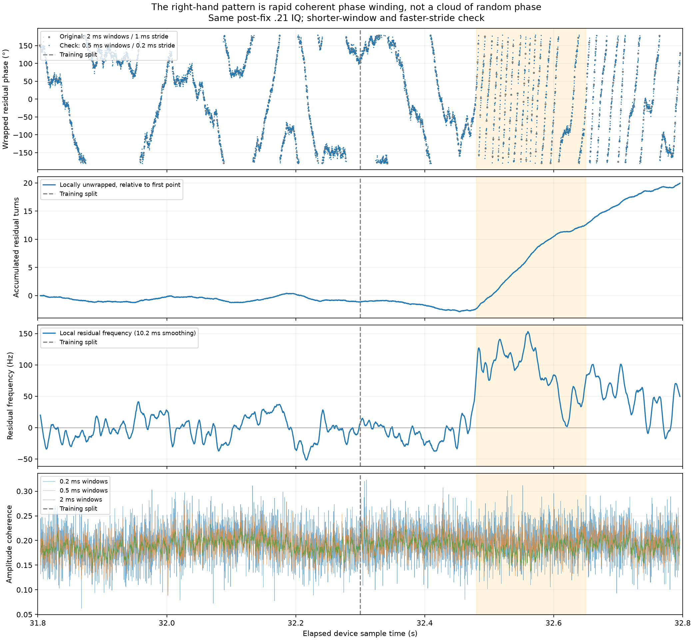
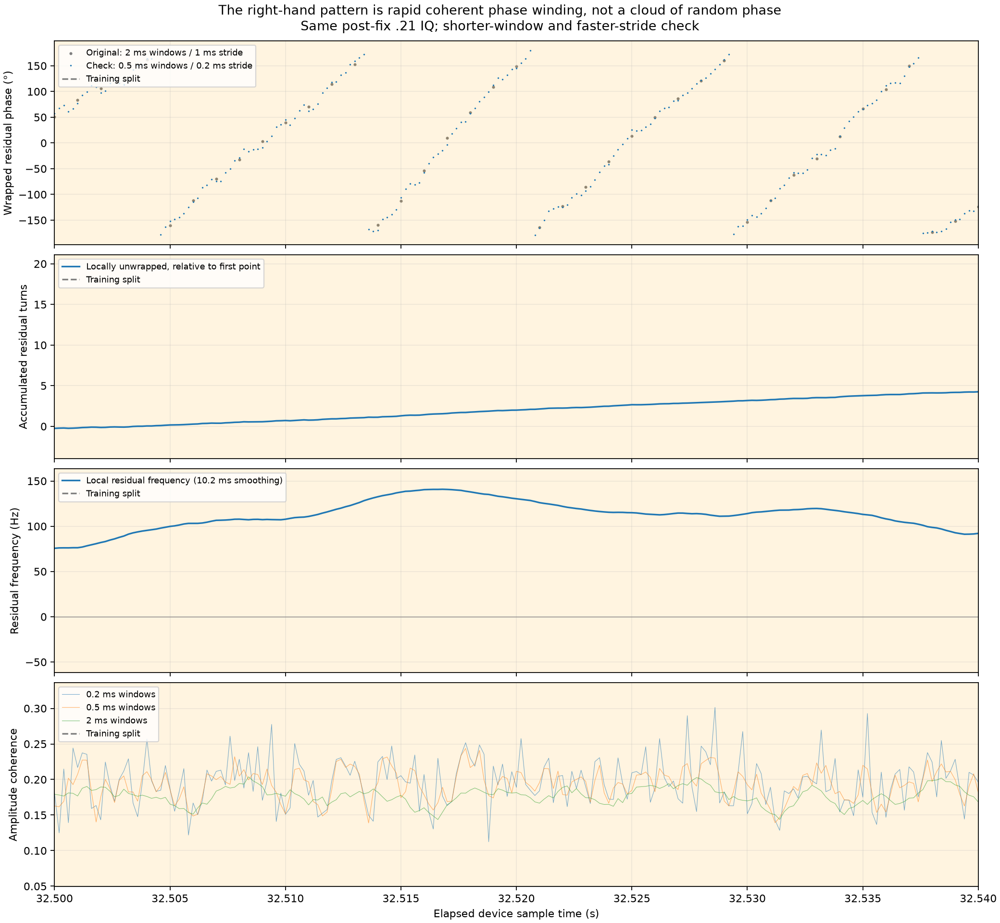

# Why the right side of the post-fix phase plot looks wild

**The dense right-hand pattern is predominantly rapid, coherent phase winding displayed modulo 360°, not random phase or disappearance of the shared signal.** Shorter-window raw-IQ replay reproduces it. The remaining physical cause of the differential-frequency variation is not identified by this recording.

Input remains the same verified `.21` stream-1 RX0/RX1 recording, `cap-20260825T010019-89c2889553e0`, at 31.800–32.800 seconds. No new collection, different example, or phase-based reselection was used. The raw slice was reread with verification and matched the earlier SHA-256.



The orange region is 32.48–32.65 s. Its residual phase advances **14.85 turns in 170 ms**; median local residual frequency is **+92.8 Hz**, with 5th–95th percentiles **+11.8 to +140.5 Hz**. In the first half, the median is −2.1 Hz. These are frequencies remaining after the common plotting correction, not absolute satellite Doppler.

Phase obeys `d(phi)/dt = 360 * delta_f` in degrees per second. At 100 Hz residual difference, phase advances 36° per millisecond and completes a turn in 10 ms. A ±180° plot repeatedly returns from its top edge to its bottom edge. Sampling that rotating ridge every millisecond produces the diagonal/striped patterns seen in the original image. Its turn rate varies, so this is not evidence for a stable new protocol period. The apparent ±360° jumps are display wraps; they are not measured instantaneous phase resets.



## Debugging checks

1. **Window and plotting resolution.** Recomputed the complex cross product in 0.2, 0.5, 1 and 2 ms windows, every 0.2 ms. All recover 14.80–14.88 turns in the highlighted interval. The original 2 ms / 1 ms-stride phase differs from the finer 0.5 ms estimate by 6.38° circular RMS across the second. The right-hand structure is not created by the original window duration or plotting stride.
2. **Unwrapping stability.** Maximum adjacent wrapped phase increments at the faster stride are 64.0°, 30.7°, 21.1° and 16.7° for the four respective window lengths, well below 180°. Their matching local turn counts support this descriptive unwrap. This is not a proof of an absolute phase-cycle count extending beyond the interval.
3. **Shared frequency-band evidence.** The existing A/B held-out estimates retain virtually unchanged residual agreement: circular RMS 21.25° before the rapid region versus 21.78° inside it; unit-phasor resultants 0.9336 in both. The late mean B-minus-A residual is −4.29°. This is separate-band agreement of phase evolution, not high raw waveform coherence or calibrated geometry.
4. **Signal strength/coherence.** The 0.5 ms common-band coherence medians are 0.199 immediately before and 0.195 inside the highlighted region. The phase accelerates without a collapse of the measurable common component. Strong GLRT detections remain present on both receivers.
5. **Training split.** The dashed line is at 32.300 s; the rapid winding begins roughly 180 ms later. The scalar estimator applies the same frozen correction throughout, with no switch at that line. This is not a code discontinuity at the training/validation boundary.
6. **Capture loss.** The selected recording has independently verified counter continuity across all 572 refill transitions. Unlike the previous pre-fix example, this pattern cannot be explained by the documented omitted-refill-time mechanism.

The derivative plot uses a 10.2 ms local quadratic smoothing window applied to the unwrapped 0.5 ms estimates. It is descriptive, uses neighboring time samples, and is not an online predictor or calibrated frequency confidence interval. Window overlap and filtering mean its points are correlated.

## What failed, and what remains unknown

The plotted correction removes a **fitted differential receiver carrier**, not every physical contribution to phase. Its global frequency/drift model was learned from the first 500 ms. The changing differential frequency afterward is not captured by that frozen model. Its residual then accumulates into many turns. The frozen unguided and GLRT-guided predictors perform poorly on later time; allowing current A-band data to track phase successfully predicts B-band phase substantially better.

Expecting a slowly varying **geometric** phase is different from expecting the uncalibrated receiver output phase to be constant. A common satellite Doppler term can cancel in RX1−RX0 while differential LNB/receiver phase evolution and channel/source effects remain. The data establish residual frequency evolution of a common component; they do not determine whether its origin is LNB oscillator behavior, receiver/channel effects, or changing signal mixture. We have no saved AGC gain values, so AGC cannot be either blamed or excluded as a contributor. Absolute calibration is not needed to measure this relative evolution, but attribution needs more evidence.

The edge-pilot points in the original panel are a separate issue: 25 ms-spaced probes with native waveform/timing and alias references do not resolve a roughly 100 Hz residual rotation (multiple turns between probes). Their high local resultant does not establish an unambiguous continuous trajectory. A mismatch between those dots and the dense broadband ridge is not itself evidence that the ridge is noise.

For analysis, keep wrapped phase alongside unwrapped local turns and residual frequency; track time-varying phase on A bands and validate on B bands. Do not simply subtract a fit learned from all later data and call the resulting flat line proof of geometric phase. The current checks diagnose the visual pattern and failure of the frozen correction; they do not recover satellite geometric phase or uniquely identify the hardware cause.

## Reproduction

[Read-only debugging script](figures/2026_09_22_postfix_phase_diagnosis/debug.py), [all series and diagnostic statistics](figures/2026_09_22_postfix_phase_diagnosis/diagnosis.json), and [original method comparison](2026_09_22_postfix_phase_methods.md).

```bash
env OPENBLAS_NUM_THREADS=1 MPLCONFIGDIR=/tmp/debug-phase-mpl \
  PYTHONPATH=/home/mouse9911/gits/leo-tracker-adaptive-geometry-phase/src \
  /home/mouse9911/gits/leo-tracker-adaptive-geometry-phase/.venv/bin/python \
  reports/figures/2026_09_22_postfix_phase_diagnosis/debug.py
```

Outputs go to `/tmp/postfix-phase-diagnosis`. Only report artifacts are published; no production estimator change or deployment is included.
