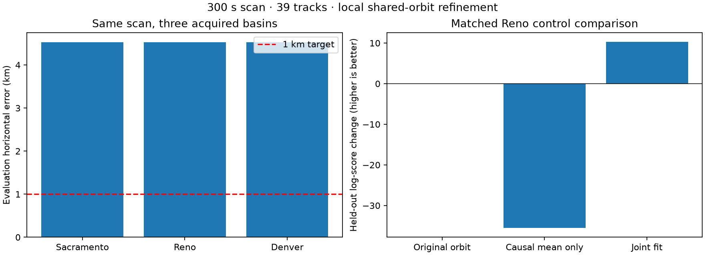
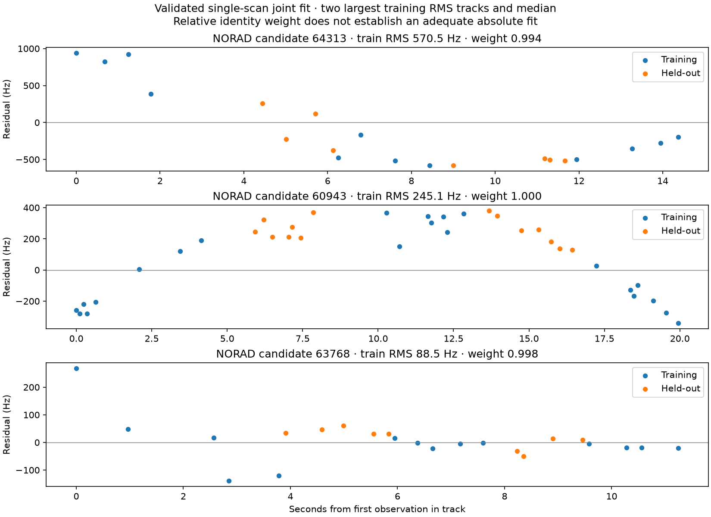
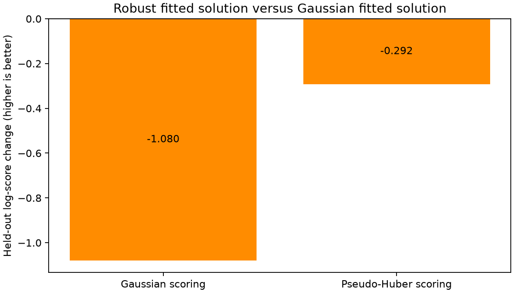

# Joint position and satellite association: three blind initializations

The 300-second scan `scan-fw-1d05092feaa8f7d5` reaches **4.526 km horizontal
error** from all three independently acquired Sacramento, Reno, and Denver
basins. This improves the approximately 10.7 km original-orbit single-scan
baseline, but does not establish sub-kilometre accuracy. Agreement between
initializations measures optimizer repeatability, not uncertainty.

| Initialization | Latitude | Longitude | Evaluation error (km) | Held-out log predictive |
|---|---:|---:|---:|---:|
| Sacramento | 37.812895389 | -122.509370234 | 4.526022 | -1414.430370 |
| Reno | 37.812894369 | -122.509371570 | 4.526177 | -1414.430375 |
| Denver | 37.812893246 | -122.509369664 | 4.526211 | -1414.430457 |

## Scope and validation

The original acquisitions searched 5000 by 5000 km regions at 50 km spacing.
These new fits locally refine their sealed basins; they are not fresh global
searches with corrected orbits. The single scan contains 39 track episodes and
1,415 Doppler observations. Position and shared NORAD orbital-rate corrections
are fitted together, marginalizing candidate identities and an explicit null
component. One correction prior per NORAD couples observations of the same
candidate. The full catalogue denominator is retained. These composite
likelihood association weights are not calibrated identity probabilities.

Every fit converged. Exact propagation replay evaluated 433,134 candidate/track
cases per initialization, with no failures or visibility changes. Maximum
cached-versus-exact Doppler error was below 0.0000034 Hz; the 117 policy
exclusions per fit are three rejected orbital objects across 39 episodes.
This validates interpolation at the fitted solution, not global optimality.
Evaluation coordinates were read only after fitting and exact replay.

### Follow-up: matched elevation policy

The original replay used a 0-degree elevation cutoff while fitting used the
configured -1-degree cutoff. Replay now applies the fit policy to both exact and
interpolated states. All three complete 433,134-case replays were repeated and
pass; objective and held-out scores agree within 0.00000001. Positions and the
reported errors are unchanged. The new `*-matched-elevation-{summary,receipt}.json`
artifacts preserve these checks. A regression test explicitly exercises a
-0.5-degree candidate that the two policies treat differently.

For comparison across initializations, each cell below is original-orbit baseline
error followed by shared-orbit joint error, in km. Centre distances are spherical
horizontal distances to the evaluation site, used only for reporting.

| Scan count | Sacramento: 119 km away | Reno: 298 km away | Denver: 1,528 km away |
|---|---:|---:|---:|
| 1 (300 seconds) | 10.700 → 4.526 | 10.697 → 4.526 | 10.697 → 4.526 |
| 5 (3.2-hour span) | 5.667 → pending | 5.667 → pending | 5.665 → pending |

The baseline already estimates position with uncertain associations; the added
joint fit also estimates shared orbital corrections. Pending entries are not
accuracy claims. There is no validated blind eight-hour comparison yet.

All three fits agree on the leading signal candidate for every episode; three
episodes have null-majority weight. The split trains on time blocks 0/2/4 and
holds out blocks 1/3. It measures interpolation within the observed span, not
future prediction. At the original Reno basin, original-orbit held-out score
is -1424.720411; causal mean corrections alone worsen it to -1460.242697.
The final joint fit improves on the original by **10.290036** log-score units.

## Remaining bottleneck

Among 31 tracks with leading training weight above 0.9, median training RMS
is approximately 88.5 Hz and median held-out RMS is 74.9 Hz. A strongly weighted
NORAD 64313 episode still has about 570 Hz training RMS and 414 Hz held-out RMS.
A candidate can win against alternatives while fitting the observations badly.
Robust residual modeling and temporally correlated errors remain research
directions; no robust-loss improvement is claimed here.

The nominal LT3D-001A geometry does not yet supply a validated useful position
constraint: differential geometric Doppler is small compared with these
residuals, and installed phase centres, pose and differential receiver phase
remain uncalibrated. This result is not a geometry-based accuracy claim.

## Completed robust-loss trial (Reno initialization)

A pseudo-Huber residual model, applied to both signal and null components, now
converges and passes exact propagation replay on all 433,134 candidate/track
cases. Maximum Doppler interpolation error is 0.00000464 Hz. It retains the same
250 Hz signal scale, full catalogue, shared orbital prior and effective count.
Constant offsets are profiled from training observations only. The first trial
failed to converge inside the offset solver; safeguarded bracketing was corrected
and tested before the successful run. Time-limited runs were resumed without
changing the observations or using the reference position.

| Frozen fitted solution | Evaluation error (km) | Gaussian held-out score | Pseudo-Huber held-out score |
|---|---:|---:|---:|
| Gaussian | 4.526 | -1629.461992 | -1682.540241 |
| Pseudo-Huber | 4.141 | -1630.541502 | -1682.832601 |

Both scoring columns use normalized densities and identical observations;
higher is better. The legacy Gaussian outputs omit a common density constant,
so 215.031617 was subtracted from their held-out scores for this table. The
robust solution improves its own training objective by 0.644520 but worsens
held-out prediction by 0.292361 under its own loss and 1.079510 under Gaussian
loss. **It is not preferred on predictive evidence**, despite a smaller error
against the evaluation site. Selecting it because of that error would use truth
to choose the estimator. This is one fixed-scale robust trial, not evidence
against every robust or correlated-noise model.

The best numerical error in these completed single-scan trials is therefore
4.141 km, while the predictively preferred result remains 4.526 km. Neither is
sub-kilometre. New `robust-*` artifacts preserve the complete fit, exact receipts,
cross-loss scores, evaluation binding and failed-run terminal receipts.

The five-scan, 3.2-hour joint refinements are unfinished and excluded from this
completed report. No validated eight-hour accuracy or calibrated coverage is
claimed. No production changes were deployed.

## Artifacts and reproduction

`artifacts/` contains the complete three fit outputs, their replay adapter
inputs and exact replay receipts, evaluation table, matched Reno controls and
residual diagnostic. `manifest.json` binds each copied artifact to its SHA-256.
The fit outputs bind numerical source, sealed initial refinement and input cache
digests. The research implementation remains under validation in the working
tree; this publication preserves completed results rather than claiming a
self-contained released estimator. The published evidence bundle in
`../2026_09_22_joint_blind_geometry/evidence/recent-inputs.tar.gz` supplies the
original scan evidence. `render.py` regenerates the comparison from the saved
outputs without reading evaluation truth into a fit.

Focused estimator, cache-state, gradient, held-out isolation and replay tests:
26 passed at report preparation. The separate robust location primitive has
three passing tests, including normalization, bounded outlier influence and
training-only profiling; it is not enabled in these fits.
