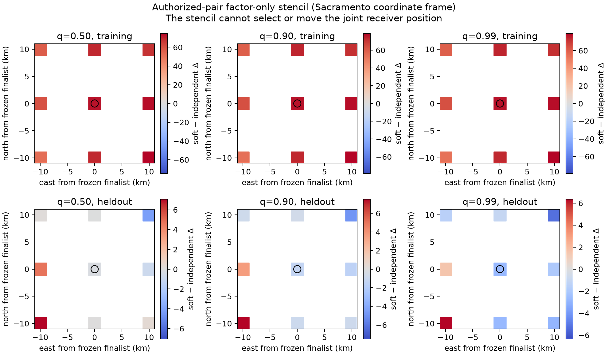

# Soft receiver-pair conditional score stencil

## Result

This bounded, truth-free ablation replaces the earlier hard shared-identity
constraint with a latent shared-versus-independent state for each RF-authorized
receiver pair. It evaluates three fixed prior probabilities, `q=0.5`, `0.9`,
and `0.99`, plus the matched independent control. It performs no position
selection and does not access a reference coordinate.

At each of the three independently sealed five-block finalists, every soft arm
improves training evidence but **reduces aggregate held-out predictive score**:

| q | Sacramento train Δ | Sacramento heldout Δ | Reno train Δ | Reno heldout Δ | Denver train Δ | Denver heldout Δ |
|---:|---:|---:|---:|---:|---:|---:|
| 0.00 | 0.000 | 0.000 | 0.000 | 0.000 | 0.000 | 0.000 |
| 0.50 | +72.399 | -0.169 | +72.399 | -0.169 | +72.398 | -0.169 |
| 0.90 | +76.587 | -1.334 | +76.587 | -1.334 | +76.587 | -1.335 |
| 0.99 | +77.123 | -2.753 | +77.123 | -2.754 | +77.123 | -2.753 |

There is no demonstrated predictive gain at the same frozen positions. The
pair-factor-only training maximum in the 3 by 3 stencil lies 10 km east and
10 km south of each finalist, but this is not a joint all-track score and cannot
justify moving the receiver position. At that point `q=0.5` has only about
`+0.18` to `+0.35` held-out units, while `q=0.9` and `q=0.99` remain negative.



## Model and matched support

For each link, the independent state contains two receiver-path identity
mixtures, each with effective count three, its full-catalogue signal prior and
explicit null. The shared state contains one common candidate mixture with
effective count six, one full-catalogue signal prior and a joint null. Both have
the same total effective count. The soft evidence is

\[
\log E_q=\log[(1-q)E_{ind}+qE_{shared}].
\]

The prior `q` is applied once to training evidence and once to joint evidence;
held-out prediction is `log E_joint - log E_train`. Training therefore updates
the latent shared-state probability implicitly. The implementation does not mix
conditional held-out scores or select a satellite identity.

Part of the large training gain is the shared model's single catalogue-identity
prior compared with two catalogue priors in the independent state. This is an
Occam-factor consequence of the shared-identity hypothesis, not evidence from
new independent observations. Held-out prediction tests whether that simpler
hypothesis predicts withheld shape.

All authority-building rows are removed from both states. The remaining union
of common-clock visits is split into five chronological blocks, with blocks
0/2/4 training and 1/3 held out. A visit cannot cross the receiver paths'
training boundary. This support differs from the published independent
five-block baseline, so absolute baseline score comparisons are invalid; the
reported quantities are only soft-minus-matched-independent pair-factor deltas.

All ten RF-authorized links are evaluable with this whole-visit five-block mask.
The earlier hard-pair study reported nine because it used one chronological
60/40 whole-visit cut and required at least two rows on both sides for both
paths. The change from nine to ten reflects the declared partition, not new RF,
new pair authority, or relaxed anchor exclusion.
The separately audited authority supplies paired left/right anchor rows for all
ten executed links; the result accounting removes both members of every anchor.

The saved authority establishes repeated common pilot-waveform observations,
not a satellite identity. The unresolved pilot alias remains. The nominal 80 mm
mechanical spacing supplies no calibrated phase center, angle, or useful
kilometre-scale Doppler baseline; this model uses shared temporal shape only.

## Scope and provenance

The three stencil centers are the sealed Sacramento, Reno and Denver five-block
finalists. Those refinements agree geographically, but the other four scans do
not enter this score: they only contributed to selecting the already frozen
basins. The pair authority comes only from `scan-fw-1d05092feaa8f7d5`.
Composite scores are not calibrated likelihood ratios.

The completed run used one BLAS thread, took 9.14 seconds and peaked at 437,636
KiB RSS. The executed source digest is
`sha256:ad38791c8def3ba9b633897b25cc4ac336d596d79012fe3b3afe63ce671317c2`.
`result.json` binds the authority, evidence, causal TLE, replay helper, source,
and each sealed refinement digest. `execution-receipt.json` binds the archived
files and runtime.

The first development execution is retained as
`development-all-excluded-invalid.json`. It recorded all ten links as excluded
because the adapter omitted the `randomized` partition declaration required by
`ObservationArc` for an alternating five-block mask. It performed no numerical
pair scoring and is not a scientific result. The corrected execution changed
only that partition metadata and then evaluated all ten links.

Reproduce into a fresh path:

```bash
sudo -n env OPENBLAS_NUM_THREADS=1 OMP_NUM_THREADS=1 nice -n 10 \
  .venv/bin/python \
  tools/research/ablate_soft_receiver_pairs.py \
  --refinement /tmp/recent-five-block-regional-v1/sacramento-set-refinement-v2/result.json \
  --refinement /tmp/recent-five-block-regional-v1/reno-set-refinement-v2/result.json \
  --refinement /tmp/recent-five-block-regional-v1/denver-set-refinement-v2/result.json \
  --evidence /tmp/recent-regional-evidence-v1/evidence/scan-fw-1d05092feaa8f7d5.json \
  --authority /tmp/recent-paired-source-authority-1d-v6.json \
  --output /tmp/soft-pair-reproduction.json --stencil-km 10
```

Validation:

```bash
.venv/bin/pytest -q tests/tools/test_ablate_soft_receiver_pairs.py
.venv/bin/ruff check tools/research/ablate_soft_receiver_pairs.py \
  tests/tools/test_ablate_soft_receiver_pairs.py
```

The tests independently check full-population identity/null normalization,
probability-space soft marginalization, joint-minus-training prediction, and
shared whole-visit partition behavior with asymmetric anchor exclusion.
