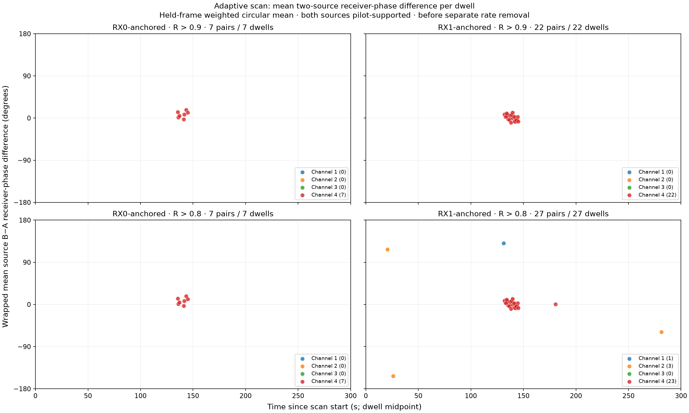

# Adaptive scan: thresholded mean dwell phase over 300 seconds

This expands the random-30 review to all 301 already replayed dwells with
archived GLRT detections on both receivers in `scan-hop-28d7592ea614f624`.
It is not an exhaustive search of all 2360 scan visits. No additional IQ
processing, fits, phase centering, or outcome-selected anchor direction is used.

Each dot is the saved amplitude-weighted circular mean of the held-frame
source B minus source A receiver-phase difference within one 120 ms dwell,
before separate source-rate removal. Time is the dwell midpoint. The mean is
`arg(sum(w * exp(i * phase)))`, with the same weights used for resultant R.
Both candidate sources must pass the existing held pilot-support checks on
both receivers; the requested R thresholds are strict greater-than cuts.
RX0-native and RX1-native anchor analyses are kept in separate columns.

| Threshold | RX0-anchored dwells | RX1-anchored dwells |
|---|---:|---:|
| R > 0.9 | 7 | 22 |
| R > 0.8 | 7 | 27 |

All R > 0.9 points are channel 4. At R > 0.8, the RX1 arm has one
channel-1, three channel-2, and 23 channel-4 points. No thresholded dwell
has multiple passing pairs within an arm. Counts across arms overlap and
must not be added as unique dwells. The lower threshold includes the higher
threshold's points.

These are conditional wrapped phase means: source ordering and carrier/epoch
branches have not been resolved into a common geometric reference across
visits. Thus the points show where coherent within-dwell measurements exist;
their near-zero cluster does not itself establish continuous satellite phase,
identity, direction, or speed across retunes. No connecting line or unwrapping
is applied. R is circular concentration, not a probability of correct association.

The [all-pair CSV](figures/2026_09_23_relaxed_adaptive_coherence/all-dwell-pair-means.csv)
retains rejected pairs, support flags, and wrong-time controls. The
[JSON cache](figures/2026_09_23_relaxed_adaptive_coherence/all-dwell-pair-means.json)
allows `tools/research/plot_relaxed_dwell_means.py` to regenerate the figure
without raw replay shards. Counts were independently checked by Terra.
