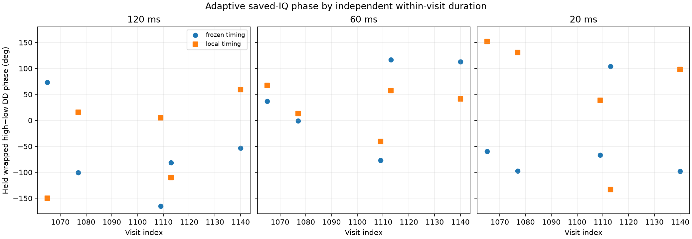

# Adaptive-scan independent-chunk phase replay

**Superseded interpretation:** this first replay omitted residual-frequency
correction before coherent pilot-symbol summation. Its negative result is a
frontend failure, not evidence that adaptive phase was physically lost. The
[corrected replay](2026_09_23_adaptive_multiscale_phase_refined.md) recovers strong
held pilot evidence and within-dwell two-source differential coherence. The
original numbers below are retained for reproducibility.

This retrospective development replay applied the long-dwell held-frame phase
frontend to five predeclared visits of `scan-hop-28d7592ea614f624`: 1065, 1077,
1109, 1113, and 1140. It read 0.60 s of saved IQ in about 70 s. The source and
protocol were frozen at `09d6829630eaf9da57255259fd004b86f2c6bd82` before IQ
was opened. All five visits use the manifest-bound lower edge, source-specific
fractional sampling, low-to-high acquired-CFO ordering, and the previously
audited raw RX frequency-offset prior.

All 30 visit/duration/mode rows returned a numerical estimate, but none is
called scientifically qualified. The table reports medians across the five
visits; parenthesized values are the worst value in the unfavorable direction.

| timing mode | duration | held coherence, weaker source | exact/rolled-17 held power | exact/+37-sample held power | absolute train/held DD disagreement | absolute change from 120 ms |
|---|---:|---:|---:|---:|---:|---:|
| frozen | 120 ms | 0.103 (0.072) | 0.99 (0.69) | 1.04 (0.63) | 68.2° (121.3°) | reference |
| frozen | 60 ms | 0.114 (0.036) | 0.84 (0.82) | 0.91 (0.82) | 154.1° (176.3°) | 99.8° (166.0°) |
| frozen | 20 ms | 0.349 (0.122) | 1.12 (0.89) | 1.06 (0.70) | 95.9° (137.2°) | 98.1° (174.4°) |
| local | 120 ms | 0.200 (0.038) | 1.85 (1.33) | 1.45 (1.02) | 45.5° (172.7°) | reference |
| local | 60 ms | 0.302 (0.199) | 1.24 (1.04) | 1.46 (1.24) | 51.3° (88.3°) | 45.6° (167.4°) |
| local | 20 ms | 0.440 (0.321) | 1.33 (0.73) | 1.06 (0.86) | 114.0° (173.9°) | 38.9° (115.4°) |

Local timing improves some template-control ratios, but the held phase remains
inconsistent with the train phase and changes substantially with chunk length.
The experiment therefore locates the immediate failure before cross-retune
transport: these 120 ms visits do not yield a repeatable held double-difference
under this fixed eight-tone frontend and the bound coarse carrier prior. It does
not show that retuning itself destroys phase, and it does not isolate whether
the failure comes from source binding, residual carrier behavior, unequal source
support, or pilot contamination.

The five rows are a fixed subset of a previously exposed development cohort,
and the raw RX branch prior was learned in an earlier audit. The 120 ms value is
only an internal reference, not ground truth. The phase-blind pairs are candidate
bindings rather than established physical emitter identities. Points remain
wrapped and disconnected across visits; no retune-gap unwrapping, per-visit
alignment, LO-cancellation claim, geometric-motion claim, or validation claim is
made.

Machine-readable results and every per-source diagnostic are in
`reports/figures/2026_09_23_adaptive_multiscale_phase/results.json`.
