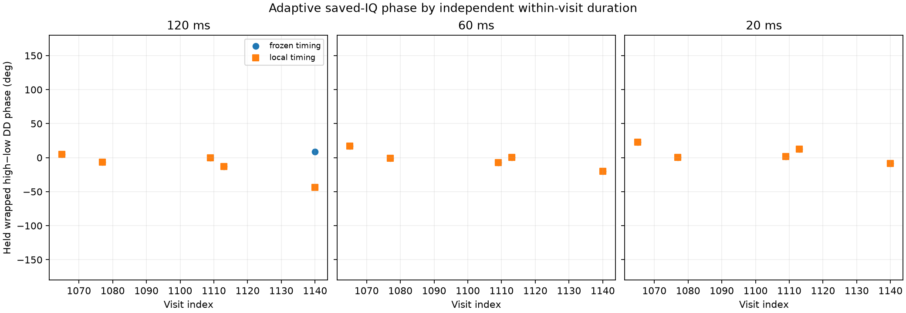
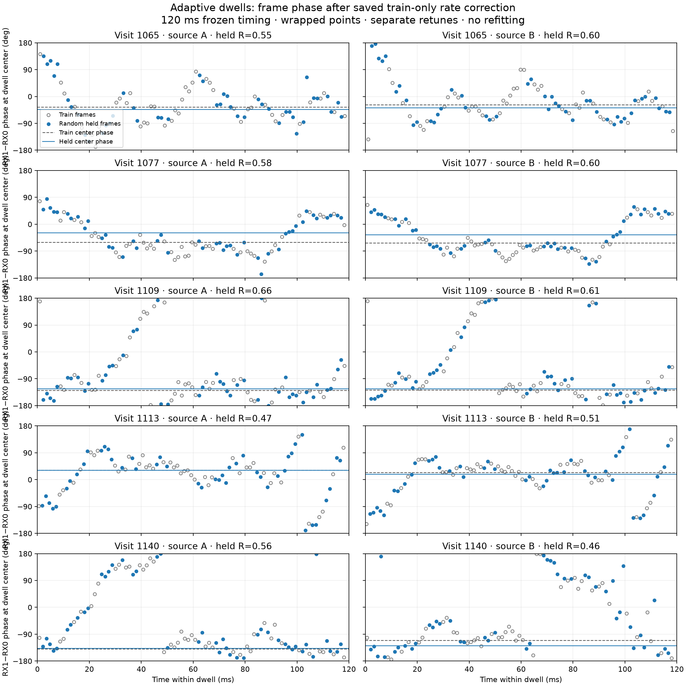
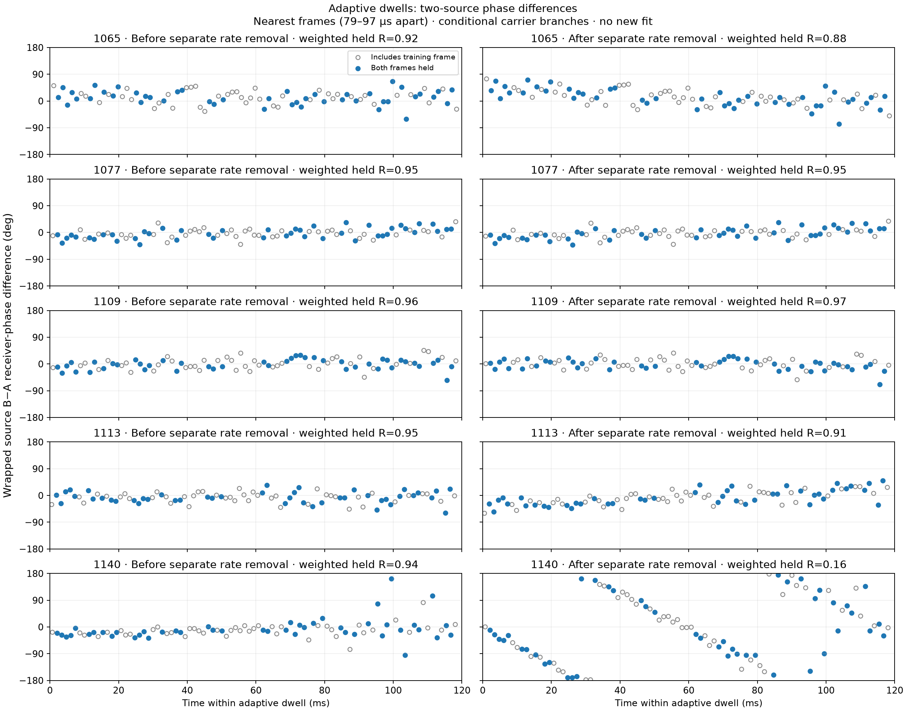

# Adaptive phase replay with train-only within-frame CFO refinement

**Phase information is recoverable inside these adaptive dwells.** All five
tested 120 ms visits have random-held-frame two-source differential coherence
of 0.922–0.963 before separately removing each source's rate. Independent 20 ms
chunks also recover strong pilot evidence. Two processing problems explain the
apparent failures: summing symbols before residual-frequency correction loses
coherence, and separately subtracting fitted source rates can introduce a
false trend into their difference. These are results for this fixed development
cohort, not a measured success rate across adaptive scans.

This retrospective development replay reran the fixed five-visit
`scan-hop-28d7592ea614f624` cohort after correcting the first replay's missing
within-frame CFO refinement. It read the same 0.60 s of existing IQ under the
frozen lower-edge, fractional-epoch, low-to-high source binding. The first
refined attempt was stopped before it wrote any result because its scalar
fractional interpolation exceeded the bounded runtime; the replacement uses a
component-tested vectorization of the same correlations and parameters.

All 30 visit/duration/mode rows returned. The table summarizes the five
visits. Coherence and control ratios use the weaker of the two sources in each
visit; values are median (worst). The phase quantities are absolute wrapped
differences in degrees, reported as median (largest).

| timing | duration | weaker-source held resultant | exact/rolled-17 | exact/+37 samples | train/held DD | change from 120 ms |
|---|---:|---:|---:|---:|---:|---:|
| frozen | 120 ms | 0.547 (0.463) | 16.77 (8.87) | 22.70 (14.09) | 3.62° (20.34°) | reference |
| frozen | 60 ms | 0.831 (0.478) | 15.21 (11.57) | 17.26 (13.48) | 4.89° (13.37°) | 11.88° (28.54°) |
| frozen | 20 ms | 0.940 (0.809) | 13.09 (8.76) | 15.86 (10.72) | 9.06° (16.34°) | 17.39° (25.65°) |
| local | 120 ms | 0.565 (0.470) | 16.77 (8.87) | 22.70 (14.09) | 3.62° (4.67°) | reference |
| local | 60 ms | 0.831 (0.478) | 15.21 (11.57) | 17.26 (13.48) | 4.89° (13.37°) | 11.88° (23.65°) |
| local | 20 ms | 0.940 (0.809) | 13.09 (8.76) | 15.86 (10.72) | 9.06° (16.34°) | 17.39° (34.68°) |

The corrected frontend now produces strong held exact-template discrimination
over both controls and small train/held DD discrepancies. It establishes that
the earlier failure was compatible with its omitted pre-sum CFO correction;
it does not establish a physical phase calibration, a cross-retune phase
connection, source identity, satellite association, direction, or orbit.
The 120 ms reference is an internal result of the same development replay,
not truth. The five visits were previously exposed during the raw-branch audit,
so this is not a fresh randomized validation.

The frame plot is a visualization-only replay of the saved 120 ms frozen-timing
fits. It reuses each saved timing shift, within-frame residual, and
receiver-product rate, and asserts its held circular mean equals the stored
held phase. Its points have that saved rate removed and are wrapped at the
dwell center; their curved or discontinuous appearance is neither a new fit
nor a physical phase trajectory. The unrefined V1 and refined V2 outcomes are
not competing measurements of a hardware change: V1 omitted the symbol-wise
correction required before coherent summation, while V2 adds it.

Using only that cached frame export, nearest A/B frames were paired within the
predeclared half-frame bound. The table retains all pairs and reports circular
resultants before and after independently removing each source's saved
receiver-product rate. Both use the same 45 held-by-both pairs and pair weight
`sqrt(w_A*w_B)`, where each saved source weight is
`sqrt(abs(c_RX0)*abs(c_RX1))`.

| visit | paired frames | maximum gap | held-by-both | DD resultant before source-rate removal | DD resultant after separate source-rate removal |
|---:|---:|---:|---:|---:|---:|
| 1065 | 89 | 78.9 µs | 45 | 0.922 | 0.882 |
| 1077 | 89 | 81.9 µs | 45 | 0.953 | 0.950 |
| 1109 | 89 | 90.0 µs | 45 | 0.963 | 0.965 |
| 1113 | 89 | 90.9 µs | 45 | 0.953 | 0.905 |
| 1140 | 89 | 97.3 µs | 45 | 0.935 | 0.157 |

The high pre-removal resultants are compatible with a stable conditional
within-dwell source differential. Visit 1140 demonstrates why the detrended
frame plot is not itself a differential-coherence test: its independently
fitted source rates differ by 17.74 Hz, so subtracting them separately
manufactures a DD sweep even though the cached near-simultaneous DD is
concentrated. Small difference-of-averages train/held DD error likewise does
not prove per-frame differential coherence. These diagnostics are conditional
on the selected branches, source pair, timing, and saved train-only rate fits;
they are not raw-LO calibration or geometric phase measurements.

Each source's residual CFO is fitted only on its seeded random whole-frame
training group before the 64-symbol coherent sum. That frozen residual and the
train-fitted receiver-product rate transport held phasors to the 60 ms dwell
center. Neither a held intercept nor a held timing/CFO selection is fitted.
Rolled and wrong-timing controls use the same saved residuals. The local timing
mode selects its shift using training frames only. Source A/B frame lattices
can have distinct epochs; their phases are transported to the declared center,
not treated as exact simultaneous samples.

The recovered center phase remains conditional on the selected carrier
branches. The post-frame product fit is modulo the 750 Hz frame cadence, while
the within-frame residual is modulo the symbol rate; this replay does not lift
those aliases. The raw RX1-minus-RX0 frequency prior is a controlled relative
receiver gauge, not independent absolute LO calibration. Across visits, values
remain ordinary wrapped high-minus-low double differences with no unwrapping,
alignment, or continuity claim.

Machine evidence: [results JSON](figures/2026_09_23_adaptive_multiscale_phase_refined/results.json), binding SHA-256 `6512cc01121272221956b88328425ed6c97a1d6174791579795c16771ff7968b`,
protocol SHA-256 `f3ce9ffa6b4b2f0031ecae5971d86ba97651f017d17ebd17d5723feb247d1917`,
and executed source SHA-256 `31d380c262d5d72748a027507dcf1619c2b8554c59a7e62636542e474004d73b`.

The executed source was frozen at `2509800a` and the protocol at `ff6ac3e0`;
the only subsequent replay-source change wraps one line for lint compliance.
Eight focused tests pass, including the synthetic phase-origin check and
equivalence of scalar and vectorized fractional correlations. No new RF was
collected; the analysis uses 0.60 s of unique saved IQ, with a second read for
the visualization-only export.

The next association experiment should form the paired source differential
before estimating its rate, or fit a shared receiver phase term jointly with
source differences. Candidate/timing-swap controls should then test whether
that observable distinguishes bindings. Linking it across retunes still
requires consistent source and carrier-branch handling; this report does not
yet estimate satellite speed, direction, or orbit.
