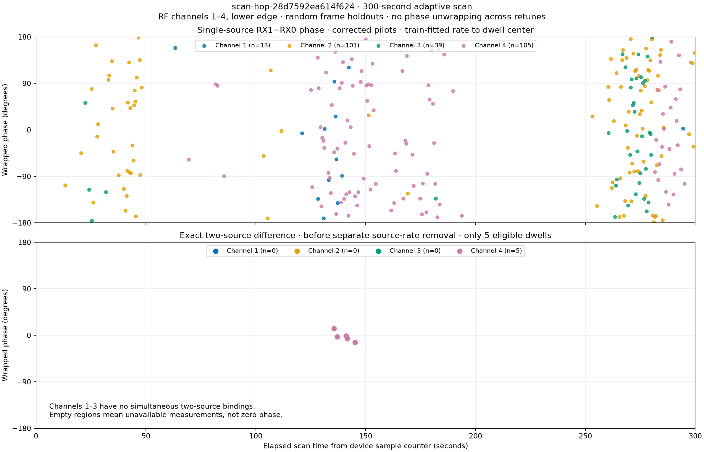

# Adaptive phase versus time, colored by RF channel

The figure spans the full 300-second recording
`scan-hop-28d7592ea614f624`. Colors identify RF channels 1–4, all lower edge;
the acquisition used 2.5 MS/s and manual 40 dB gain. Times come from device
sample counters, including the gaps between retuned dwells.

The **bottom panel is the exact previously demonstrated two-source technique**:
paired held-frame receiver-phase differences, before independent source-rate
removal. It reuses the saved phase values and weights without refitting. Only
five dwells have two simultaneous phase-blind source bindings, all on channel 4
between approximately 135.5 and 145.2 seconds. Channels 1–3 therefore have no
points for this observable; missing measurements are not zero phase.

The **top panel is a separately labeled single-source RX1−RX0 observable**,
provided to show the channel coverage across the whole scan. It uses the same
corrected pilot frontend, with frequency correction before coherent symbol
summation, frozen timing, and random whole-frame holdouts. Each point is the
held circular phase at the dwell center after applying a training-only rate.
The per-visit coarse RX frequency offset is estimated from raw training frames;
the native RX0 fractional epoch is deliberately shared by both receivers, as in
the preceding replay. This is a conditional timing/carrier convention, not an
independent absolute receiver calibration.

| RF channel | Captured dwells | Single-source plotted dwells | Two-source plotted dwells |
|---|---:|---:|---:|
| 1 | 496 | 13 | 0 |
| 2 | 716 | 101 | 0 |
| 3 | 553 | 39 | 0 |
| 4 | 595 | 105 | 5 |

All 258 dwells with a phase-blind receiver pair are retained in the upper panel;
none was removed based on its resulting phase, coherence, or control score. The
primary pair is chosen by existing fractional-margin evidence, not phase.
Points need not represent the same physical source across visits. In
particular, the scattered single-source phases do not contradict the strong
within-dwell two-source cancellation: they are different observables, and the
single-source phase retains receiver and source-dependent effects.

Single-source held coherence varies substantially: resultant lengths range
from 0.038 to 0.841, with median 0.513. Every exact-template held power exceeds
both controls, but that alone does not make every phase estimate reliable.
The raw training-only receiver offsets span −677.113 to −676.319 kHz; carrier
alias choices remain conditional. Independent review verified that the five
bottom-panel means reproduce the saved two-source values exactly.

There is no unwrapping, joining, or phase alignment across retunes. Neither
panel establishes a calibrated satellite trajectory. The exact two-source
method cannot currently provide a dense four-color 300-second curve from these
bindings; doing so would require additional simultaneous source support.

The [frozen protocol](2026_09_23_adaptive_phase_300s_protocol.md) describes the
selection and estimator. Reproduction scripts are
`tools/research/bind_adaptive_phase_300s.py` and
`tools/research/plot_adaptive_phase_300s.py`. The latter was frozen at `5b33767f`
before reading the saved IQ. Machine-readable binding, single-source results,
and the five exact double-difference points accompany the PNG. Nine focused
tests pass, including a destructive held-frame mutation test confirming that
the raw-offset estimator does not use held samples. No new RF was collected.
