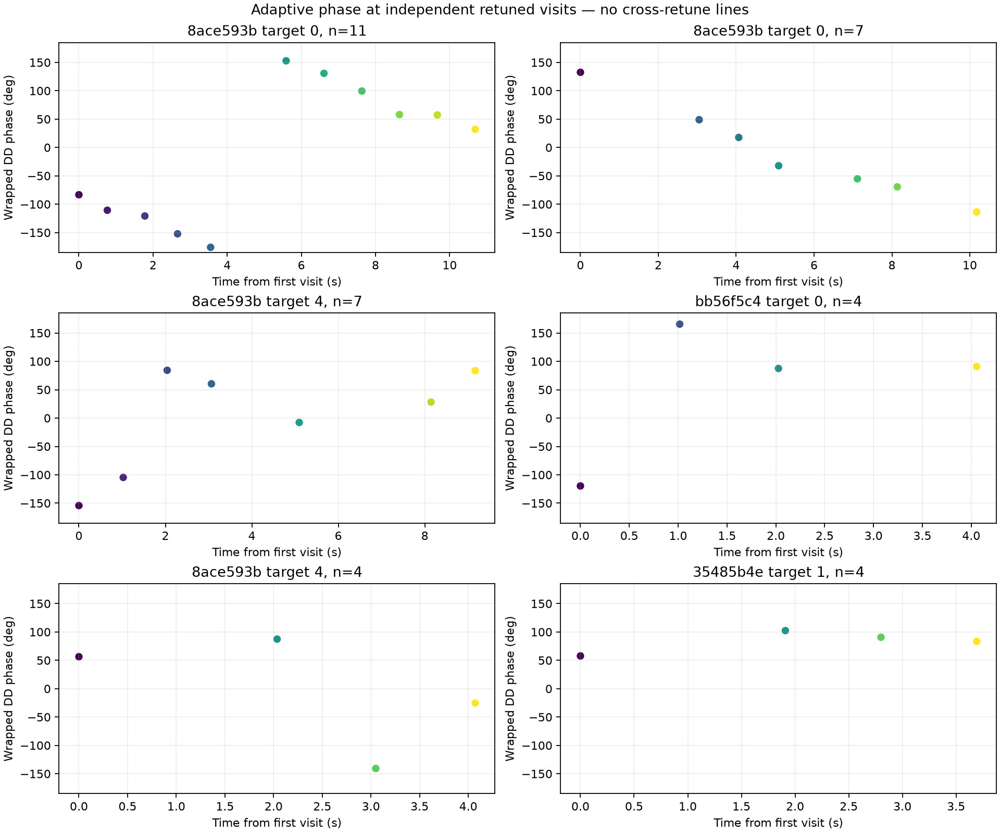

# Adaptive-scan phase across retunes

The same within-visit double-difference approach applies to adaptive scans.
Each visit retains RX0/RX1 on common sample rows, and a simultaneous two-source
double difference can cancel a receiver-common offset introduced by a retune.
The five historical adaptive products already contain 377 qualified two-source
visits out of 727 attempted (individual sessions: 133/212, 35/68, 63/114,
103/243, and 43/90). This is enough for a random whole-visit conditional test
without collecting RF.

The storage accounting is not the blocker. `AdaptiveHopIqManifestV1` binds IQ
chunks to consecutive visit indices and sample counts. The analysis source
exposes immutable visit events. `extract_longarc_phase.py` verifies that a
bound IQ ordinal still names the expected visit and derives session time from
`valid_start_counter - source_first_counter`; its protocol explicitly sets
`phase_continuity_across_visits=False`.

The unsupported bridge is in the older consumer
`tools/report_adaptive_dual_rx_phase.py`. `phase_metrics()` applies
`np.unwrap()` directly across separate visits, fits a global line, and performs
a chronological first-half extrapolation. `plot_best_recovery()` then connects
those unwrapped visit values with lines. The same plot shows that locally fitted
short-dwell rates do not predict the revisit gaps. No ambiguity guard chooses
the integer cycle count across the 1.7--5.1 s retune gaps, and the current
random-holdout policy does not permit relabeling the chronological extrapolation
as validation. Those historical slope, residual, and forward metrics are
deprecated as evidence of phase continuity. The phase-blind association itself
is unaffected.

This replacement view preserves each phase modulo $2\pi$ and deliberately draws
no line across visits. A retune does not automatically destroy double-difference
phase: common receiver phase can cancel. The remaining barriers are specific:

- separately fitted source timing and carrier coordinates must be transported
  to the same physical sample reference within every visit;
- frequency-dependent receiver-chain phase may change with tuning;
- source identity and orientation must be frozen without using tested phase;
- an across-visit model must score circular phase directly, without silently
  selecting cycle counts;
- whole visits, rather than time-adjacent halves, must form the random split.

A bounded next proof can use the 377 existing qualified visits. Freeze a
phase-blind source/candidate path and random whole-visit split; fit one
candidate-specific baseline and any declared global channel nuisance on train
visits; score held wrapped phase against candidate-swap, wrong-time, and
template controls. Per-visit free phase offsets are not allowed because they
would remove the motion signal. Visits whose two sources are not simultaneous
at a common physical epoch must abstain.
