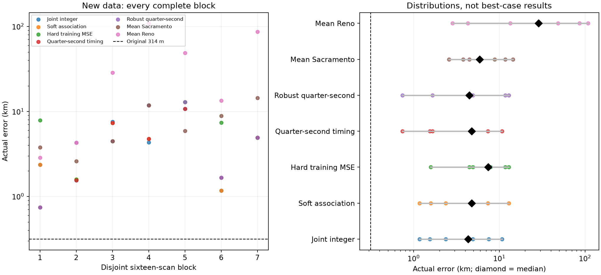
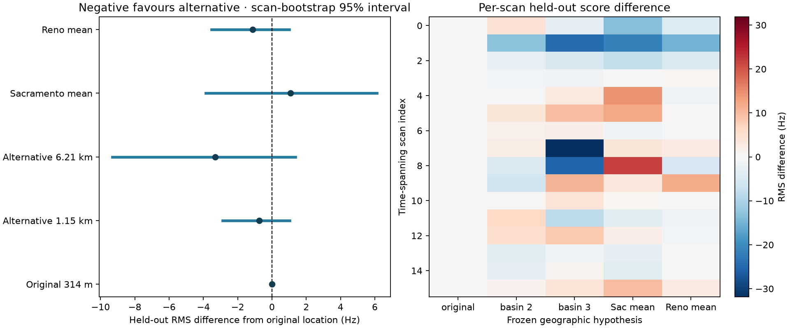

# Twenty-four-hour validation: 314 metres did not generalize

**The new data do not validate repeatable 300 m positioning.** Repeating the frozen
joint method on seven disjoint sixteen-scan groups gives **4.321 km median error**,
a **1.168–10.734 km range**, and **zero sub-kilometre results**. Some fractional-timing
and robust variants achieve 0.741 km on one group, but their medians remain above 4 km.
The separate full-catalogue held-out test also does not confirm the original location:
a 6.215 km-error alternative has the lowest frequency residual, with substantial
uncertainty in the score differences.

Two SOL workers ran the replication and full-catalogue test; Terra reviewed the
protocol and ran method ablations. The coordinator froze the cohort, checked common
inputs, and produced the aggregate and uncertainty figures. No new RF collection or
production deployment was performed.

## The data and the two validation questions

The frozen window covers capture starts from **2026-09-22 15:15 to 2026-09-23 15:15
UTC**. All original sixteen development scans were excluded. There are **116 eligible
new scans, 3,741 tracks and 98,082 frequency observations**. Three captures at
14:40, 14:50 and 15:00 lacked positioning evidence at the inventory cutoff and remain
listed as unavailable; they are not counted as zero detections or silently added later.

| Test | Scope | What is held fixed | What it can establish |
|---|---|---|---|
| Repeatability | Seven disjoint groups of 16, plus one separate group of 4 | Algorithm, timing/loss choices, search budget; each group supplies its own seeds and evidence | Empirical errors of the conditional method on different recordings |
| Predictive frequency test | 16 time-spanning new scans; 524 tracks; 13,877 observations | The original five geographic hypotheses; full-catalogue training-only association and nuisance fits | Whether reserved frequency samples support those fixed hypotheses |

The predictive subset has **8,112 training and 5,765 reserved evaluation observations**.
It is selected at evenly spaced chronological indices before scoring. This is a
time-spanning recording selection, **not a chronological frequency train/test split**:
both tests preserve the exact randomized within-track masks. All selections and source
bindings are in [inventory.json](inventory.json) and [holdout_protocol.json](holdout_protocol.json).

The 116-scan cohort is disjoint from this experiment's original sixteen scans; it is
not a claim that no prior historical report ever inspected any of these recordings.
Track construction/support is conditioned upon. Raw sample counts are not independent
evidence counts.

## Repeatability of the position estimates

| New group | Scans | Joint error km | Sacramento mean km | Reno mean km |
|---|---:|---:|---:|---:|
| 01 | 16 | 2.364 | 3.779 | 2.845 |
| 02 | 16 | 1.542 | 2.584 | 4.300 |
| 03 | 16 | 7.541 | 4.468 | 28.597 |
| 04 | 16 | 4.321 | 11.769 | 108.529 |
| 05 | 16 | 10.734 | 5.876 | 48.530 |
| 06 | 16 | 1.168 | 8.849 | 13.389 |
| 07 | 16 | 4.902 | 14.444 | 86.444 |
| 08, separate remainder | 4 | 1.937 | 5.321 | 180.701 |

Group 04 spans the gap left by excluding the development scans. No group represents
continuous IQ. The four-scan remainder is excluded from every headline sixteen-scan
distribution. Full group counts, source checks and geographic coordinates are in
[replication/results.json](replication/results.json).

The fit uses each group's own prior-selected candidate union and geographic seeds,
never the original 314 m point. It retains the original integer timing support,
duration-weighted capped score and maximum 35 evaluations per spatial basin. The
search remains within the Sacramento-250-km/Reno-500-km intersection; this is not
separate global reacquisition from each prior. The coordinate-mean controls preserve
their original prior-specific inputs.

All 116 cached evidence digests and source manifest bindings matched the frozen
inventory. Nevertheless, published candidate discovery had used evaluation samples,
so this arm remains a **conditional replication**, not untouched frequency prediction.
The optimizer remains budget-limited: these outcomes validate the bounded algorithm,
not a claim that every basin reached its mathematical optimum.

## Comparing the frozen alternatives on the same groups

| Approach | Median error km | Range km | Groups within 1 km |
|---|---:|---:|---:|
| Joint integer-timing score | **4.321** | 1.168–10.734 | 0/7 |
| Soft association with null support | 4.738 | 1.168–12.919 | 0/7 |
| Fractional timing, 0.25 s | 4.738 | 0.741–10.734 | 1/7 |
| Robust loss, 0.25 s | 4.468 | 0.741–12.919 | 1/7 |
| Hard training mean-square objective | 7.378 | 1.580–12.919 | 0/7 |
| Mean of Sacramento solutions | 5.876 | 2.584–14.444 | 0/7 |
| Mean of Reno solutions | 28.597 | 2.845–108.529 | 0/7 |

The full [method table](METHODS_TABLE.md), [CSV with coordinates](method_errors.csv),
and [summary JSON](method_summary.json) include all timing/identity-selection variants.
No tested method produces a sub-500-metre estimate in these seven complete groups.

Within each group, ablations compare identical finalist locations: the retained leading
joint basins and that group's two coordinate means. As in the original experiment,
they choose among shared locations rather than perform a separate continuous search
for every loss. Soft association uses the same integer timing grid as its original
run; only explicitly fractional variants use finer timing. The native integer score
matches the independent integer-timing scorer at every comparison point.

The original coordinate averages were particularly favorable: those same cheap
controls now include very poor outcomes, especially for Reno. This illustrates why
the original single-cohort result could not establish typical performance. It does
not justify choosing new weights from these known errors.

## Full-catalogue held-out frequency test

At each unchanged geographic hypothesis, the validator searches **10,689–11,109
causal Starlink catalogue candidates per scan**. Only training frequency samples
choose the satellite, integer timing shift and frequency offset. Decisions are recorded
in digest-bound, no-overwrite retention receipts before evaluation scoring. A synthetic
test replaces evaluation frequencies with arbitrary large values and verifies that
training selections are unchanged.

Evaluation replays the **single hard-MAP training choice**, without refitting identity,
timing, CFO or location. Eight training hypotheses are retained for audit support;
they are not an evaluation-selected shortlist or a predictive soft mixture. There
were 28 coarse-propagation exclusions across the catalogues; every one of the 2,620
location/track combinations has a scored choice.

| Frozen position | Reference error km | Held-out capped RMS Hz | Difference from original Hz | Paired scan-bootstrap 95% interval Hz |
|---|---:|---:|---:|---:|
| Original joint location | 0.314 | 172.913 | 0 | — |
| Joint alternative 2 | 1.149 | 172.170 | -0.743 | -2.889 to +1.035 |
| Joint alternative 3 | 6.215 | **169.598** | -3.316 | -9.310 to +1.359 |
| Sacramento mean | 2.043 | 174.000 | +1.086 | -3.859 to +6.129 |
| Reno mean | 1.498 | 171.779 | -1.134 | -3.518 to +1.006 |

Negative differences favor the alternative. Every nontrivial difference interval
includes zero. The original location wins only 2.45% of the whole-scan resampling
rankings, while alternative 3 wins 76.52%. These are **ranking-stability frequencies,
not probabilities that a location is correct**, and the intervals concern frequency
scores, not geographic confidence radii. The data do not establish reliable
sub-kilometre discrimination among the five hypotheses.

The strict arm validates integer-timing hard-MAP frequency predictions. It does not
yet provide a full-catalogue held-out comparison of the soft mixture or fractional/
robust nuisance models; those families were assessed in the separate conditional
replication arm. The held-out scores must not be compared directly with the original
202.6 Hz score as though that were a method improvement: the recording cohort changed.

## What this changes

The 314 m answer was a favorable observed error on one development cohort. It is
not a validated accuracy specification. The new tests indicate both variable position
estimates and weak correspondence between residual ranking and geographic error.
They do not isolate one physical cause: association ambiguity, timing/orbit modelling,
nuisance freedom and incomplete spatial convergence remain plausible contributors.

Next, freeze a stronger model and convergence protocol before another evaluation.
Check that improvements survive full-catalogue training-only discovery, rather than
only selecting another point from a response-conditioned shortlist. Extend the clean
predictive test to fractional timing and soft predictive distributions with calibrated
noise/null assumptions. Retain whole-scan uncertainty and multiple geographic modes;
do not tune until the known coordinate happens to win. Additional observations alone
have not made the present score a reliable 300 m positioning criterion.

## Reproduction and validation

The frozen selection and rules are in [PROTOCOL.md](PROTOCOL.md), with an independent
[protocol review](protocol_review/README.md). Replication reproduction is in
[replication/README.md](replication/README.md). The source tools are
`tools/research/day_position_replication.py`, `day_method_ablation.py`, and
`day_frozen_position_holdout.py`. Use fresh output directories.

The held-out tool accepts `--inventory .../inventory.json --locations
.../holdout_protocol.json --output <fresh-directory>`. Read access to the original
source stores and causal TLE archive is required; on this host use the qualified
`.venv/bin/python` with the `leo` group. Omitting `--sessions` evaluates the full frozen
protocol set; the published run used two disjoint eight-scan shards with identical
settings. Source data are read-only. Retention receipts and the merged result are
published under `heldout/`. `summarize_holdout.py` reproduces its aggregate and paired
bootstrap, while `summarize_methods.py` reproduces the common error table and plot.

Replication took 490.9 s with two workers. The strict catalogue test took 332.7 s
across two shards, peaking at 770,544 KiB RSS per process. The large deterministic
propagated-state NPZ caches remain local; their saved input evidence, source bindings,
catalogue snapshot identifiers and numerical outputs are published. Rebuilding those
caches requires the original read-only source stores.

Five new synthetic tests cover known candidate/timing/CFO recovery, evaluation
invariance, chunked-search equivalence, no-visible-candidate handling and disjoint
replication groups. They pass alongside the existing numerical tests. This work
changes research/report artifacts only; it does not deploy a positioning method.
