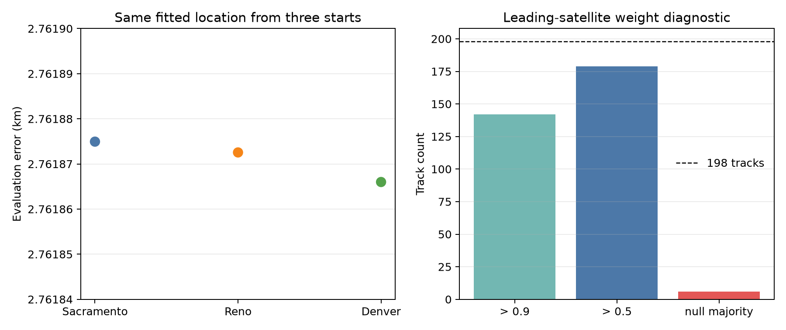
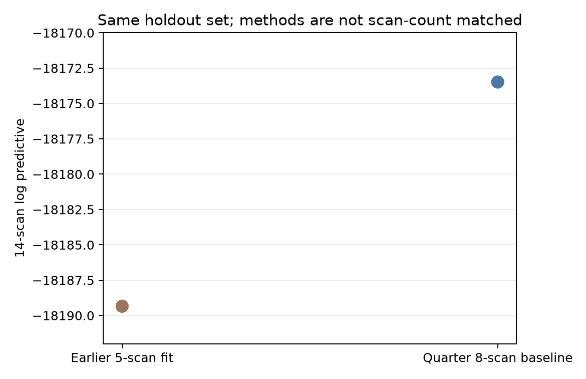

# Eight-hour quarter-cohort causal baseline

Eight scans from the 44-scan, eight-hour corpus converge from Sacramento,
Reno, and Denver starts to the same fitted location and an evaluation error of
about 2.76187 km. This is a fixed-zero-residual-rate causal-orbit baseline over
198 tracks and 5,890 observations. It is a subset result, not the completed
joint model and not a fit over all 30 training scans.

| Start | Evaluation error (km) | Negative log posterior | Projected gradient max |
|---|---:|---:|---:|
| Sacramento | 2.761875 | 9034.553966 | 1.669e-4 |
| Reno | 2.761873 | 9034.553966 | 3.421e-5 |
| Denver | 2.761866 | 9034.553966 | 5.207e-5 |



All three exact replays evaluated 2,161,682 cases and agreed with the fitted
score. Their zero maximum Doppler disagreement specifically compares raw-node
interpolation with exact propagation; it is not a bound on every source of
compression error. The exact replay objective differences are approximately
-1.07e-7. The copied evaluations bind each fit and exact-result digest to the
evaluation-only position reference.

## Association diagnostic

All 198 tracks retain the same highest-weight satellite-or-null option across
the three starts. The leading satellite exceeds 0.9 weight for 142 tracks and
0.5 for 179; six tracks have null majority, leaving 13 with neither a
satellite nor null majority. These composite weights are not calibrated
identity probabilities. Agreement across starts does not establish satellite
identity truth.

A retrospective paired-receiver diagnostic finds all 20 expected RF pairs,
with the same leading satellite for 17. None of the three disagreements has
both sides above 0.9 leader weight: one side is effectively null in one pair,
and the other two disagreements are ambiguous on one side. This does not alter
the inference. Pairing anchor rows were already present in the baseline fits,
the diagnostic is not independent validation, and RF aliasing remains
unresolved.

## Whole-scan holdout

The split is 30 training scans and 14 holdout scans, but this fit uses only 8
of the 30 training scans. With the Reno fitted position frozen, the 14 holdout
scans score -18173.482046. The earlier five-scan fit scores -18189.345927 on
the same holdouts, a difference of +15.863881 for this baseline.



This is not a pure scan-count experiment: the fits differ in cohort and
construction as well as scan count. The holdout score is a frozen-parameter
composite Doppler-shape score; parameters were not refitted and orbit
uncertainty was not integrated.

## Interpretation limits

The result does not establish calibrated position confidence, calibrated
identity confidence, identity truth, or a completed full-cohort solution. The
nominal 80 mm paired-receiver geometry cannot yet justify a calibrated
positioning claim; the pairing data remain a separate investigation.

## Reproduction

Run from the repository root:

```bash
.venv/bin/python reports/2026_09_23_eight_hour_quarter_baseline/render.py
```

The script reads only files copied into this report, independently checks fit,
exact, evaluation-reference, association, and holdout bindings, regenerates
both plots and `summary.json`, and rewrites `artifact-manifest.json`. The
`source/` directory freezes the numerical and orchestration sources named by
the machine receipts. No mutable research-cache path is required to verify or
render the report.
