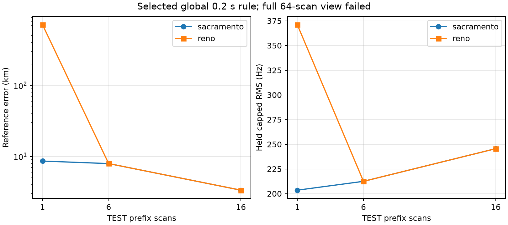

# Once-only selected-rule TEST

The frozen final TEST is **incomplete and failed**. One exact-cohort session at frozen position 48 lacks complete counter-continuity authority, making both 64-scan arms ineligible. A transparent pre-execution amendment retained those two failures and evaluated only the independently predeclared, unaffected 1/6/16 prefixes. No session was dropped, replaced, filtered, or reordered.

| Scans | Prior | Error (km) | Held capped RMS (Hz) | Global tau (s) | Tracks | Outcome |
|---:|:---|---:|---:|---:|---:|:---|
| 1 | Sacramento | 8.595 | 203.532 | -0.043 | 49 | completed |
| 1 | Reno | 714.375 | 371.044 | -0.090 | 49 | completed |
| 6 | Sacramento | 7.930 | 212.472 | -0.412 | 197 | completed |
| 6 | Reno | 7.930 | 212.472 | -0.412 | 197 | completed |
| 16 | Sacramento | 3.348 | 245.553 | -0.609 | 617 | completed |
| 16 | Reno | 3.348 | 245.553 | -0.609 | 617 | completed |
| 64 | Sacramento | — | — | — | — | failed input at position 48 |
| 64 | Reno | — | — | — | — | failed input at position 48 |

None of the six completed arms reached 300 m. The one-scan prior sensitivity is extreme: the two starts differ by over 700 km. The 6- and 16-scan starts agree closely, but remain 7.930 km and 3.348 km from the reference. The complete 64-scan primary view has no metric and is ineligible, so this run cannot support a final accuracy or reliability claim.

All six completed timing fits satisfied the frozen stopping rule, remained inside their prior bounds, had zero visibility failures, and had no active tau bounds. Baseline searches took 217.43 s and timing fits took 6.85 s. All eight baseline outcomes sealed before timing, and all eight timing outcomes sealed before held/reference evaluation.

`selection_freeze.json` was written before TEST metadata access and binds the validation-selected global epoch model at scale 0.2 s. `freeze.json` then bound exact Sep 22 00Z TEST membership. The export preserved one deterministic failure for `scan-hop-6cd2560365a058bc`. This ID is 48th in frozen order, so the 1/6/16 prefixes are unaffected and the 64 view is not executable. `execution_amendment.json` binds this fact, the original freeze, receipt manifest, and amended sources. Independent review approved it before inference. The evaluator reverified every successful receipt and NPZ digest before scoring.

The earlier `pre_evaluation_amendment.json` records the initial cache-verification finding. It was superseded before execution by the comprehensive `execution_amendment.json`; both remain for audit history.

Key SHA-256 values:

- Selection freeze: `cad59db741783e8db8f8093b8f16327792d97a4a95c58a3cd445cf51c46e9a5d`
- Membership freeze: `9948bb508d1bc170a04f2d51b8e3d4412e3867df077c61f346ecd85d60f3387e`
- Cache outcomes: `4bc0d6fb738281123bb06864e13075f6566a51575aa92d67e5a3d9f098a09f57`
- Execution amendment: `80c8f7b03e696c7c4285da3da22377443042d6dd35ea2be8faeca7e8a2f46f6a`
- Baseline inference: `df7467db9a912a1005f1877ab604a3bd2ad6d1f1b523719c34d9d53f22cf54e5`
- Timing inference: `bf38ded88d5254da1aad9fd7a75eccb551bb5c0281573f0f924e4cf27e554c2c`
- Results: `2e365ef449bbd419c93b845310bad7abe41c1435584a345920b8a8025d30ed2e`
