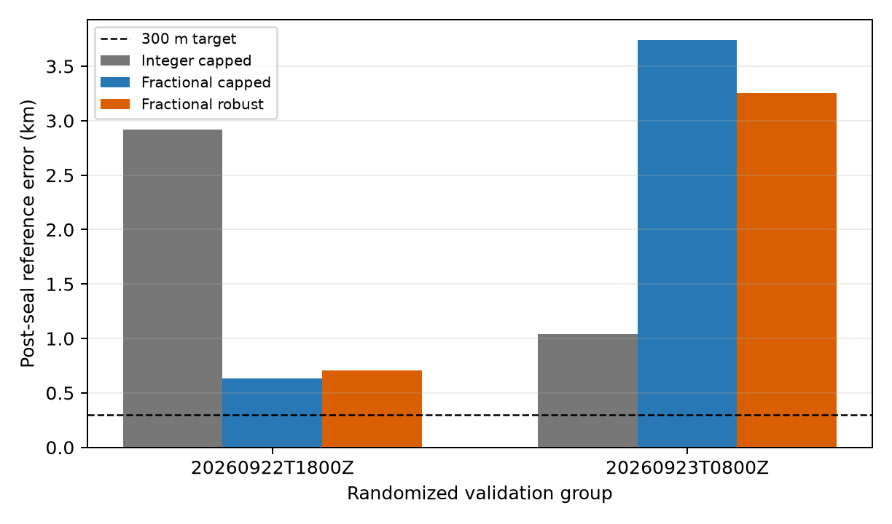

# Fractional timing spatial comparison

This experiment repeats the frozen random-group spatial protocol with continuous
per-track timing. For each candidate and every adjacent pair of cached 0.25 s
nodes, it jointly profiles a constant CFO and a fractional position inside the
interval using training rows. It selects candidate, interval, fraction, CFO, and
receiver coordinate without reserved rows or the reference coordinate. The
truth-free inference was sealed before reserved and geographic scoring. No test
partition evidence was opened.

The integer duration-capped 800 Hz arm is the exact control. The two fractional
arms use the same seeds, bounds, candidate pool, and 150-evaluation budget with
either capped 800 Hz or the predeclared pseudo-Huber 150 Hz track loss.

## Whole randomized groups

| group | method | train objective Hz | reserved capped RMS Hz | error km | support-edge tau | noninteger tau |
|---|---|---:|---:|---:|---:|---:|
| Sep 22 18Z, 10 scans | integer capped | 123.89 | 146.84 | 2.920 | 3.3% | 0.0% |
| | fractional capped | 115.41 | **139.56** | **0.631** | 3.3% | 95.9% |
| | fractional robust | **99.38** | 139.57 | 0.704 | 3.3% | 95.9% |
| Sep 23 08Z, 12 scans | integer capped | 148.42 | 155.38 | **1.042** | 5.1% | 0.0% |
| | fractional capped | 140.42 | **147.80** | 3.741 | 3.4% | 96.0% |
| | fractional robust | **107.67** | 147.86 | 3.252 | 3.1% | 95.7% |

Fractional timing lowers both training and reserved frequency RMS in both groups,
but its geographic effect reverses: error falls from 2.92 to 0.63 km in one group
and rises from 1.04 to 3.74 km in the other. It therefore improves prediction
without establishing more accurate position. No arm reaches 300 m. The nested
first-scan views remain poor: fractional errors are 31.24–32.45 km and
23.06–23.48 km.

## Numerical qualification

The selected piecewise-linear Doppler curves were compared on every observation
with `prediction_for_track` evaluated directly at each selected arbitrary tau.
Across the four windows and both fractional arms, raw discrepancy RMS is
0.132–0.198 Hz with maximum absolute error 0.478 Hz. After removing a constant
per-track offset, RMS is 0.041–0.092 Hz and maximum absolute error 0.387 Hz.
These errors are negligible beside 140–198 Hz reserved RMS. The reported
second-difference curvature statistic is only a diagnostic proxy, not a rigorous
bound.

Synthetic tests recover an injected fractional tau and CFO exactly, prove that
heldout-frequency mutation cannot change training selection, verify deterministic
finite behavior when time derivative is collinear with CFO, and confirm that an
out-of-support optimum clips to the timing boundary.

## Interpretation and limitations

About 96% of selected track taus are noninteger, while only 3–5% lie at the
±5 s support edge in the whole-group fits. The wide per-track ±5 s support is
far broader than the roughly ±182 ms midpoint uncertainty documented by saved
host timing brackets. It can absorb TLE or model errors as well as capture-time
error, and independent track timing remains highly flexible. A receiver-common
scan-level timing model constrained by those brackets is the next identifiable
comparison.

The candidate pool and own-window seeds remain conditional on historically
response-conditioned published analyses. There are only two randomized
validation groups, and first-scan views are nested rather than independent.
Inference took 292.8 seconds and post-seal scoring took 2.9 seconds.
