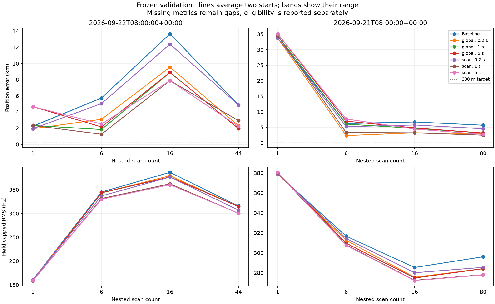

# Frozen two-group validation

The frozen rule selected the conditional **global epoch model at the 0.2 s
regularization scale**. Its equally weighted short/medium/long, two-group mean
location error was **8.355 km**. The per-scan 1 s model was numerically close at
8.359 km and within the frozen 0.010 km tie tolerance; the predeclared preference
for the simpler global model resolves that tie. None of the 112 evaluated
arms reached 300 m; the best individual arm was 1.254 km.

| Configuration | Eligible | Mean regime error (km) | Worst arm (km) |
|---|:---:|---:|---:|
| Baseline | yes | 10.455 | 33.777 |
| Global, 0.2 s | yes | **8.355** | 33.765 |
| Global, 1 s | yes | 8.793 | 34.535 |
| Global, 5 s | yes | 9.398 | 35.141 |
| Per-scan, 0.2 s | yes | 9.896 | 33.765 |
| Per-scan, 1 s | yes | 8.359 | 34.535 |
| Per-scan, 5 s | yes | 9.338 | 35.141 |

The long-view results, averaging the Sacramento and Reno starts, were:

| Configuration | Sep 21 08Z, 80 scans (km) | Sep 22 08Z, 44 scans (km) |
|---|---:|---:|
| Baseline | 5.688 | 4.882 |
| Global, 0.2 s | **2.981** | 2.312 |
| Global, 1 s | 3.172 | 1.972 |
| Global, 5 s | 3.181 | **1.956** |
| Per-scan, 0.2 s | 4.556 | 4.885 |
| Per-scan, 1 s | 2.486 | 2.934 |
| Per-scan, 5 s | 2.722 | 2.217 |

The short regime is unstable across groups. On Sep 21 08Z, every one-scan timing
configuration was 33.765–35.141 km from the reference and the baseline was
33.709 km. The corresponding Sep 22 08Z one-scan errors were 1.942–4.662 km,
with a 2.259 km baseline. The selected model therefore improves the aggregate
frozen criterion without demonstrating reliable single-scan localization or
sub-300 m accuracy.

All seven configurations were eligible. Across all 112 rows there were zero
worker failures, nonfinite results, out-of-prior coordinates, visibility
failures, timing-boundary arms, or missed timing stopping rules. The baseline
stage sealed 16 arms in 1,678.36 s, followed by 96 timing arms in 236.95 s.
Held rows and reference coordinates were excluded from fitting and used only
after both inference files were sealed. The two validation groups are the only
independent groups; nested views and two prior starts are correlated.

The result and both inference SHA sidecars verify. All 124 cache contents,
frozen source hashes, exact group membership, and baseline-to-timing binding
were rechecked by the evaluation stage. The final 64-scan TEST group remains
closed at validation completion. The selected complete rule must be frozen before its once-only TEST
evaluation; validation outcomes must not be used for further tuning.

`PUBLICATION.sha256` binds the completed report, plotting source and figure in
addition to the numerical artifacts. It is a post-evaluation publication
manifest, not a claim that the plotting source was frozen before inference.
Independent source and outcome reviews are included alongside this report.

Key SHA-256 values:

- Freeze: `e7e86f3be98ac9bd1c79b0d6b1aa5ed30578caa865daa4b1a1464209fa1d4998`
- Baseline inference: `61d04af0cc8d95adaec8e81ac8a0c9d8db49497b09a73b6aa7d064c7e4ade8b7`
- Timing inference: `ca24132f58490641e7be14b2abc2a4466d458043d74693c491e957951f5ab5c3`
- Results: `ef36be4d8c739eea59c0f2a0b076ac847d4650cbee78bd4d06e124f5da1a5aff`
