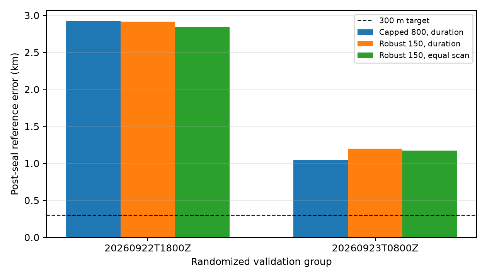

# Grouped robust position validation

This experiment fits a fresh continuous coordinate from the saved training rows
inside each of the two randomly assigned validation groups. Candidate identity,
integer timing offset, CFO, and position are selected without reserved-frequency
rows or the reference coordinate. `inference.json` was sealed with a SHA-256
receipt before reserved-row and geographic scoring. The 23 retrospective test
scans were not loaded or scored; their IDs were read from the split manifest only
to enforce exclusion.

Three objectives were frozen before validation: duration-weighted capped 800 Hz,
duration-weighted pseudo-Huber with a 150 Hz scale, and the same robust loss with
equal outer weight per scan. All retain duration weighting among tracks inside a
scan. The robust scale comes from earlier development diagnostics and was not
chosen using these validation results.

## Whole randomized groups

| group | scans | method | error km | reserved capped RMS Hz | reserved uncapped RMS Hz |
|---|---:|---|---:|---:|---:|
| 2026-09-22 18:00 UTC | 10 | capped, duration | 2.920 | 146.84 | 202.52 |
|  |  | robust, duration | 2.916 | 146.85 | 202.52 |
|  |  | robust, equal scan | **2.841** | **146.81** | 202.53 |
| 2026-09-23 08:00 UTC | 12 | capped, duration | **1.042** | 155.38 | 169.31 |
|  |  | robust, duration | 1.199 | 155.45 | 169.32 |
|  |  | robust, equal scan | 1.171 | **155.34** | **169.24** |

Equal-scan robust weighting makes only a small change. It improves geographic
error in the first group and is slightly worse than the capped baseline in the
second. None of the fits approaches 300 m, and reserved-frequency RMS does not
identify the geographically closest arm consistently.

The predeclared first-scan views are unstable: their best errors are 7.15 km and
24.34 km. They are sensitivity views of the same validation groups, not extra
independent validation groups.

## Influence and limitations

The results include deletion-score influence at the frozen selected coordinate:
each scan is omitted from the training objective without refitting. This is a
cheap influence diagnostic, not an exact leave-one-scan-out position estimate.
The largest absolute objective changes are 4.06 Hz in the first group and
10.68 Hz in the second for the capped objective; robust objectives reduce these
maxima to 2.96 and 4.49 Hz respectively.

The candidate universe remains conditional on identities published by earlier
Sacramento/Reno analyses, whose identity choices used reserved rows. Seeds are
means of each current window's published Sacramento and Reno coordinates plus
their midpoint, filtered to the common prior intersection. Thus this tests the
spatial estimator and weighting under a conditional candidate pool; it is not a
blind full-catalogue validation. Only two whole randomized validation groups are
available, so uncertainty and generalization remain weakly identified.

Inference took 106.4 seconds and post-seal diagnostics took 12.7 seconds. Exact
coordinates, sessions, objectives, convergence diagnostics, source digests, and
per-scan influence values are in `results.json`.
