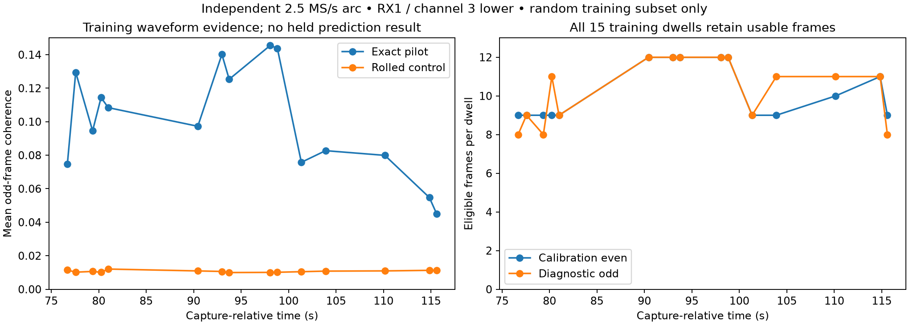

# Independent training-cohort phase comparison: frozen protocol

This is a new development comparison on the already assigned long-duration
**TRAIN** cohort. It does not reopen the 78-dwell firmware arc used to develop
the previous phase methods. The long-duration validation and test recording
groups remain unavailable for method selection.

**Status:** source binding and training-only waveform qualification. The candidate
prediction comparison below has not run, and no association/position improvement
is claimed. Its implementation must pass isolation checks before fresh held IQ
is opened.

Training-only extraction is complete: all 15 dwells retain 9–12 eligible
calibration-even frames and 8–12 eligible diagnostic-odd frames out of 12
opportunities per role. Mean all-frame diagnostic exact/control coherence is
0.100780 / 0.010735. These diagnostics establish waveform feasibility, not
satellite identity or an association gain. No quality threshold was tuned from
them. The [canonical training replay](figures/2026_09_23_independent_phase/train-frames.json.gz)
preserves all source branches, frame eligibility, IQ hashes, and read scope.

## Source selection and exposure

Use the first frozen training session, `scan-hop-85afa91453f8847b`, whose
[response-free candidate cache](2026_09_23_long_cache_feasibility/README.md)
already exists. Select the track with greatest support-time span, breaking ties
by lexical track ID. Do not select using CFO residual, phase coherence, candidate
identity, or geographic error. This selects
`sha256:5ac20b55330bad9be1ca7546a7a37860cff8240c11a8bba33c758dd7d8850ddf`,
span 40.815400965 s.

Of its 46 archived observations, bind only the 27 whose existing point mask is
training. The other 19 keep their reserved status and their IQ is not opened.
The cached source reconstruction already contains the full track's historical
metadata and aliases; this is not a claim of completely unexposed source
construction. Public input/analysis digests and exact observation identities
must reproduce before any saved-IQ read.

Within those 27 observations, use a new random **whole-dwell** split with seed
20260924 and three temporal strata: 15 train and 12 held. The split is frozen
in the [binding](figures/2026_09_23_independent_phase/binding.json). No
chronological holdout is used. The first replay opens only the 15 fresh training
dwells for feasibility; the 12 fresh held dwells remain unopened until the
prediction code and tests implementing this protocol are frozen.

The exact public binding identifies RX1, channel 3 lower edge, 2.5 MS/s, native
RF 11,209,687,500 Hz, with 120 ms saved dwell support. The source's relative
alias-index sign is not an additive frequency correction: use the explicit
`dealiased_native_cfo_hz` and RF normalization in the binding. Never choose a
held response alias by closeness to a fitted candidate.

## Waveform extraction

Use the preceding full-pilot complex split estimator, fixed four adjacent frame
opportunities nearest each of six 20 ms group centers, and integer frame timing.
The saved fractional epoch remains provenance. The prior timing-sensitivity
experiment does not justify a new timing rule selected from held data.

Candidate source seeds are acquired CFO, refined CFO, and the bound dealiased
native CFO, deduplicated. Choose a source branch using equal-group even-symbol
exact-minus-rolled-control coherence in groups 0, 3, and 5 only. Groups 1, 2,
and 4 supply odd responses. All branch opportunities and failures are retained.
Frame eligibility comes only from the existing even-symbol support policy;
no odd-quality filtering or manual outlier truncation is permitted.

Phase is not assumed continuous across retunes. This is a conditional prediction
given each dwell's local calibration, including local calibration on fresh
held dwells once the method is frozen. Preserve all physical sample reference
times, RF conventions, and source hashes. At 2.5 MS/s the frame lattice is
rounded; use actual sample intervals, never assume every interval is 1/750 s.

## Matched candidate prediction experiment

Both arms use the same response-free bank of 880 causal candidates and the
same two previously specified regional priors: Sacramento radius 250 km and
Reno radius 500 km, altitude zero. Neither receives receiver truth or a named
satellite label. Use a 50 km grid anchored on each prior center; retain grid
points inside the corresponding prior disk and deduplicate overlaps.

For each grid point/candidate, fit one constant receiver frequency offset and
one linear receiver drift using only the 15 fresh training dwells. Give each
dwell equal weight. The GLRT arm uses bound archived CFO; the phase arm uses
the average eligible calibration-even pilot CFO and its actual mean reference
time. No additional phase-geometry likelihood or phase-reliability weighting
is added: those additions failed the previous controls.

The cache may screen models, but rerank each arm's 16 best grid-point/candidate
models with exact nominal SGP4 at its training measurement times before choosing
the final model. Final response predictions use exact SGP4 at actual held-frame
UTC. Report the finite search scope and any cache/exact discrepancy; do not
describe this as a globally identified position/orbit solution. Require
above-horizon geometry at all training epochs. No truth-seeded refinement,
receiver-clock correction, orbital correction, or extra polynomial drift is
introduced in this experiment.

Each arm scores the identical eligible odd CFO responses in every fresh held
dwell. Primary endpoint is unweighted equal-dwell held RMS; also report Gaussian
NLL using the same fixed 250 Hz scale in both arms, coverage, residuals, and
candidate/location selections. Report the entire held population and every
failure. An unsupported dwell is an abstention, not a removable outlier. Do not
infer improved position accuracy merely from reduced CFO error on one arc.

The constant-frequency-rate control has a training-fitted affine CFO trajectory
and no satellite identity. A wrong-time geometry control mirrors each dwell's
location along the training arc while retaining within-dwell forward time;
it receives the same candidate/location/receiver-nuisance freedom and is selected
on training observations only. Compare both candidate arms and both controls on
the same held responses. A waveform gain must improve on its matched GLRT arm;
a satellite-specific gain must additionally beat the non-geometric and wrong-time
controls. Record all comparisons without selecting a preferred variant from
held outcomes.

## Limits and promotion

This single arc can justify a subsequent, separately frozen multi-arc study if
it passes the controls. It cannot by itself identify the satellite, establish
absolute velocity, or validate position tracking. The original 19 reserved IQ
observations and the independent long-duration validation/test blocks remain
reserved until a separate explicit method-freeze step. No new RF acquisition
is part of this protocol.
