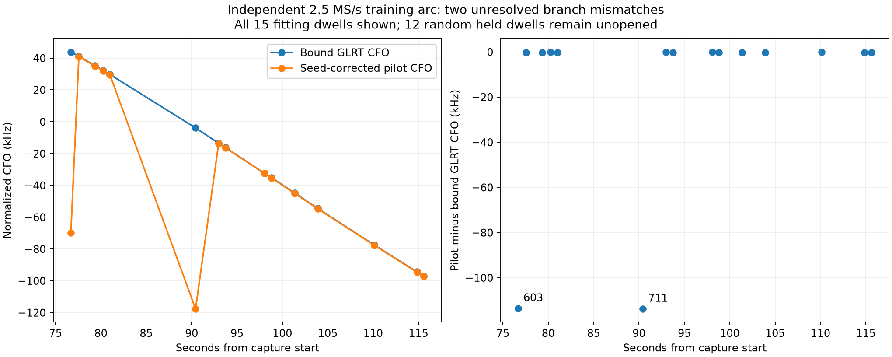

# Independent phase arc: training gate catches source-branch mismatch

The independent arc **fails the training feasibility gate for matched CFO
prediction**: two of 15 phase measurements differ from the bound GLRT trajectory
by approximately 113.6 kHz. The 12 randomly held dwells remain unopened. This
finding does not establish an association or position gain.

This report audits the [frozen protocol](2026_09_23_independent_phase_protocol.md)
on the independently selected 2.5 MS/s arc in `scan-hop-85afa91453f8847b`.
It follows the earlier [multirate pilot study](2026_09_23_source_seeded_phase.md),
[15 MS/s long-arc comparison](2026_09_23_longarc_phase.md), and
[geometry observability audit](2026_09_23_phase_geometry_observability_audit.md).

## Training result

| Frozen model | Training RMS, Hz | Selected NORAD |
|---|---:|---:|
| GLRT candidate | 66.690 | 59785 |
| GLRT wrong-time | 382.791 | 45542 |
| GLRT constant rate | 624.531 | — |
| Phase candidate | 36,425.212 | 45542 |
| Phase wrong-time | 36,423.246 | 45542 |
| Phase constant rate | 36,495.739 | — |

These are **fitting errors**, not held performance; the two arms fit different
training measurements, so this table is not a matched-response accuracy claim.
The phase failure is already evident without reading held outcomes. Opening
held data would not resolve the measurement convention.

| Training visit | Bound normalized GLRT CFO, Hz | Corrected pilot CFO, Hz | Difference, Hz |
|---|---:|---:|---:|
| 603 | 43,879.348 | −69,689.237 | −113,568.585 |
| 711 | −3,869.892 | −117,690.884 | −113,820.992 |

For these two observations, the acquired native seed is 113,192.472 Hz below
the bound native CFO. The acquired branch has substantially greater
calibration-even coherence margin than the refined/bound branch: 0.07636 versus
0.00653 for visit 603 and 0.09129 versus 0.00462 for visit 711. The frozen branch
selector consequently chooses acquisition. Its whole-period correction uses
1/(4.4 µs) = 227,272.727 Hz and cannot reconcile an approximately half-period
disagreement. The remaining 13 training differences range from about −252 to
−2 Hz. This is a source/branch-consistency problem that should be resolved
before interpreting orbit parameters, rather than masked by a finer location grid.

No half-period correction, frame rejection, or held-dependent alias selection
has been introduced. Stronger pilot coherence alone does not prove that a
branch represents the same physical frequency convention as the bound track.

There is a concrete mechanism to investigate: the actual complex-split estimator
fits `exact[::2]` and `exact[1::2]` separately at symbol spacing 2 × 4.4 µs.
For a fixed demodulated symbol matrix, each fold's profiled frequency likelihood
therefore repeats every 113,636.364 Hz. This follows from the stride-two sample
lattice, not merely from a modulo-π carrier-phase label. However, changing the
acquisition seed also changes the raw-sample NCO and tone demodulation. The
fold-level periodicity does not prove equivalent raw-IQ branches or a common
physical source. Any revised correction must be qualified on training data,
explicitly frozen, and tested for independence from held odd measurements.

## Experimental scope

The 40.8154-second RX1 arc was chosen by longest support span, with lexical
track-ID tie breaking, before inspecting its waveform fit. Of 46 historical
observations, only the 27 previously assigned to training were eligible. A
seeded random whole-dwell split, stratified into three time regions, assigned
15 to fitting and 12 to a future held comparison. There is no chronological holdout.
The other 19 observations' IQ and the separate long-cohort validation/test
recordings remain reserved. Historical full-track metadata and alias assignments
already existed; this is not a claim of completely unexposed source construction.

Both GLRT and phase arms search the same 880 causal satellite candidates and
398 receiver sites on a 50 km grid within the Sacramento/Reno regional priors.
They fit one frequency offset and one linear receiver drift, with equal dwell
weight. Cached states screen candidates; each arm's 16 finalists are reranked
with exact SGP4. Selected models use literal TLE lines from the causal snapshot
and exact propagation at actual held-frame times. This finite screen is not
a global orbit/location optimum.

The phase arm averages calibration-even pilot CFO from the training dwells.
The prepared evaluator will have all six frozen models predict the same eligible
odd-pilot CFO samples in the 12 held dwells. Each held dwell would supply its own even-symbol calibration
for source-branch choice and support eligibility. This is conditional prediction,
not blind signal acquisition. Native alias lifts are fixed from the source
binding and selected calibration seed, never from odd CFO or model proximity.
Its policy retains odd search-boundary responses and removes no outliers. It has
not been run on held IQ.

The constant-rate controls contain only an affine CFO trajectory. The wrong-time
controls mirror dwell location along the training arc, preserving forward
within-dwell frame timing. They receive the same training-only candidate/site
search and receiver nuisance freedom. Lower error alone cannot establish
satellite identity or better receiver position.

## Geometry interpretation

The operator reported **“axis is 79deg east”** in response to the pre-rotation
geometry question. The statement is recorded in
[station geometry notes](../deploy/station/GEOMETRY_NOTES.md). Whether this is
the antenna-center baseline or the antennas' pointing direction is unresolved,
as are the north convention, tilt, electrical baseline sign, and RF phase-center
spacing. It is orientation evidence, not verified calibration; this experiment
does not fit an inter-receiver phase-geometry likelihood using that number.

With calibrated geometry, Doppler constrains line-of-sight velocity and
inter-receiver phase evolution can add a transverse projection. A single short
baseline with unconstrained receiver phase drift does not uniquely determine
three-dimensional velocity or satellite orbit. The observability audit above
states the required calibration and nuisance assumptions.

## Reproducibility and status

- [Sealed training models](figures/2026_09_23_independent_phase/training-model.json):
  SHA-256 `7238580ad8e197cda707d3737b777211b8fc9b8ec6219e32d1a37ba0bec05572`.
- [All 15 training differences](figures/2026_09_23_independent_phase/training-alias-audit.json)
  and [plot generator](../tools/research/plot_independent_phase_alias_audit.py).
- [Training fitter](../tools/research/fit_independent_phase.py) and
  [prepared held evaluator](../tools/research/evaluate_independent_phase_holdout.py).
  The latter has **not** been executed on held IQ. A valid model hash is not
  evidence of scientific qualification; the saved model fails this training gate.
- Eight focused tests pass, covering affine fitting, regional grid support,
  exact prediction with within-dwell wrong-time transport, frozen split scope,
  odd-independent alias selection, equal-dwell weighting, and abstentions.
  These tests establish implementation properties, not physical source identity.

This result does not support a sample-rate ranking: it is one 2.5 MS/s arc with
an unresolved measurement branch problem. The earlier 10/15 MS/s studies and
this arc differ in sources and conditions. A finer location grid cannot remove
these approximately 113.6 kHz measurement discontinuities. The next necessary
step is training-only branch qualification, followed by a separately documented
method freeze before any random held evaluation.
