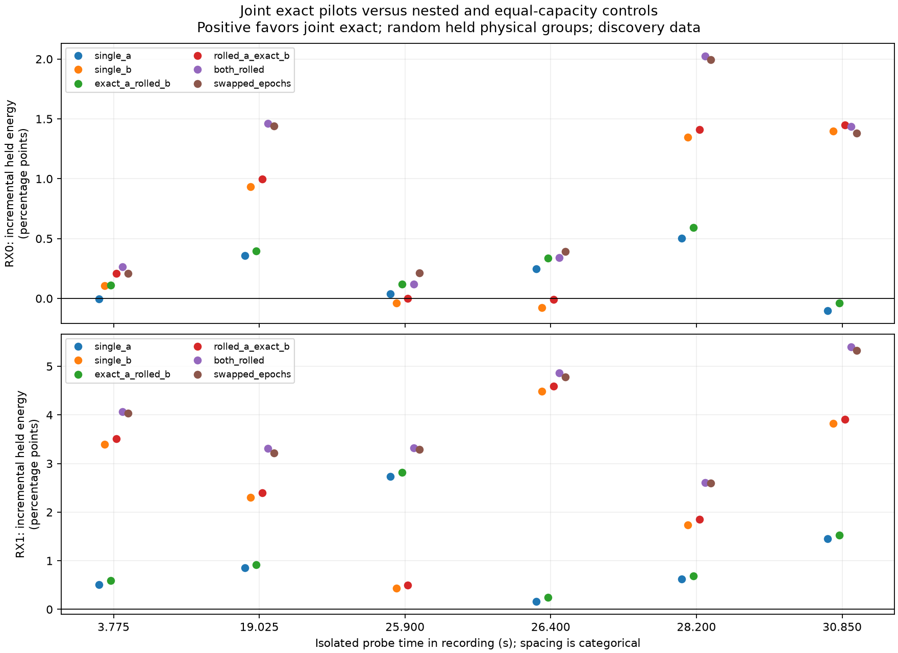

# Joint pilot source-isolation replay

Two of six discovery-selected snippets, **19.025 s and 28.200 s**, show lower
held error for the joint exact model than either single-source model and all
four controls on **both receivers**. RX1 shows that pattern in all six;
RX0 shows it only in those two. This is positive conditional waveform evidence
for pursuing two-source phase extraction at those opportunities, not a
statistically qualified source-isolation pass.

This replay tests whether two candidate pilot components improve held waveform
prediction beyond either component alone. It does not identify satellites,
calibrate differential receiver phase, or demonstrate a receiver-position gain.
The six snippets were selected using existing scores from the same recording,
so the result is conditional development evidence rather than an independent
population validation.

## Frozen method and provenance

The [protocol](2026_09_23_joint_pilot_isolation_protocol.md), numerical core,
runner, and synthetic tests were committed at `89787ab8`; a path-formatting
change was committed at `96907382`, before any IQ was opened for this replay.
The numerical method was not changed after extraction began. The
[binding](figures/2026_09_23_joint_pilot_isolation/binding.json) records the hashes
of the protocol, code, template, and metadata nominations. Each result file
records the raw snippet hash, nominated ranks, random training groups, sample
support hashes, training coefficients, CFO corrections, conditioning, and held
errors for every model.

Read-only verified recording access fetched six 20 ms snippets from the saved
August 25 stream-1 capture: 120 ms total capture duration, both receivers. No
new RF collection occurred. Each source has eight complex pilot-tone weights
constant over its snippet. CFO refinement uses the frozen ±2,500 Hz grid in
50 Hz steps and A,B,B,A coordinate order. Carrier phase uses a common snippet
sample origin and source-specific independently rounded frame starts.

Random 100 microsecond physical groups split training and held samples equally,
with 16-sample guards on both ends. All models and both receivers use identical
physical masks. Held data fits no carrier, coefficients, phase, or support mask.
The joint exact model is compared with both nested single-source models and
four equal-capacity controls: either source rolled, both rolled, and swapped
epochs. Full 300-symbol pilot response extends beyond the original GLRT64
screen's 64 symbols, while still using discovery-selected snippets.

Five synthetic checks cover two-source incremental response, absence of a
material false gain on a one-source case, whole random groups, invariance of
training parameters to changed held responses, and template/carrier/rational
frame-cadence synthesis. All passed before extraction. These checks validate
implementation properties, not real-world source identity.

## Reading the comparisons

Positive incremental held energy means the joint exact model has lower held
SSE than the named comparator, divided by held received energy and expressed
in percentage points. No threshold or significance level was chosen from the
results. Every opportunity and comparator is retained. In particular, beating
only the weaker single-source model is insufficient evidence for two sources;
the joint model must improve beyond both single-source alternatives, and the
rolled/epoch controls remain relevant.

| Probe time (s) | RX0 gain over best single (percentage points) | RX1 gain over best single (percentage points) |
|---:|---:|---:|
| 3.775 | −0.0047 | +0.5123 |
| 19.025 | +0.3568 | +0.8503 |
| 25.900 | −0.0372 | +0.4315 |
| 26.400 | −0.0779 | +0.1578 |
| 28.200 | +0.5010 | +0.6208 |
| 30.850 | −0.1036 | +1.4565 |

All twelve exact joint fits have full rank sixteen on training and held
matrices. Training Gram condition numbers are 1.057–1.201, and no exact-model
CFO correction reaches the ±2,500 Hz boundary. The exact model also improves
training SSE over both nested single-source fits in all cases; the negative
held gains are not failures of that simple training nesting check. Fitting
all models took 174 seconds, within the five-minute execution bound.

RX0 at 26.400 and 30.850 s also loses to one of the single-rolled controls.
These outcomes must remain in the record. Selecting only the two favorable
snippets for subsequent development is allowed as discovery, but cannot turn
their already inspected held responses into a fresh validation cohort.

The [summary](figures/2026_09_23_joint_pilot_isolation/summary.json) is generated
without refitting and checks the frozen input hashes and equal receiver sample
masks. The adjacent per-probe files preserve all numerical outcomes.

## Limits for phase, association, and motion

A subsequent [shared receiver-CFO attempt](2026_09_23_shared_cfo_results.md)
was inconclusive because its continuous optimizer failed to improve most
training initializers. Its held losses must not be interpreted as rejecting
the common-receiver hypothesis.

Any useful isolated waveform response is only a prerequisite for phase
research. Per-tone channel coefficients can contain source-dependent channel
phase; their difference is not automatically a calibrated baseline phase.
Different source pilot epochs still require supported transport to a common
physical time. A difference across carrier frequencies retains differential
receiver delay. The six isolated snippets do not form a continuous phase arc.

Failures can reflect integer timing, wrong nominated alias, unmodeled channel
variation, bounded optimizer limitations, or lack of a second signal. This
frozen test cannot distinguish those causes by itself. Neither positive nor
negative local waveform results establish a satellite orbit, transverse speed,
or receiver position. No production association/tracking code was changed.
