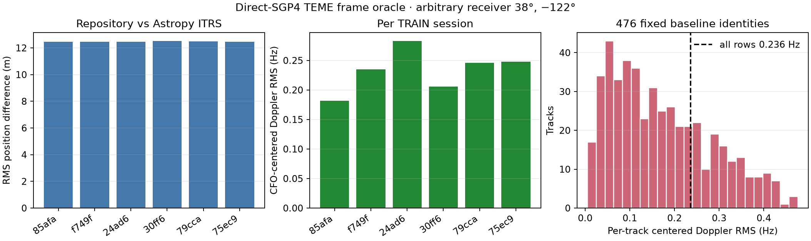

# Astropy Doppler frame oracle

This bounded numerical audit compares the repository TEME-to-ECEF conversion
with Astropy 8.0.1 TEME-to-ITRS on the same direct-SGP4 states. It covers all
476 fixed Sacramento baseline identities from the first six TRAIN sessions:
8,285 timestamps and 118 distinct satellites. The receiver at 38.0 degrees,
-122.0 degrees, ellipsoidal altitude 0 m is an arbitrary numerical probe, not
the real receiver reference. No location was fit. Measured frequencies,
training masks, the receiver reference, and VAL/TEST sessions were not used.
The upstream baseline result is hashed as bytes for provenance and is never
parsed by `audit.py`.

## Result

Across all observations, the repository-minus-Astropy state differences were:

| Quantity | RMS | Maximum absolute |
|---|---:|---:|
| ECEF/ITRS position-vector norm | 12.468 m | 12.861 m |
| ECEF/ITRS velocity-vector norm | 12.309 mm/s | 14.700 mm/s |
| Raw Doppler difference | 4.832 Hz | 6.821 Hz |
| Per-track-mean-centered Doppler difference | 0.236 Hz | 1.165 Hz |

Removing each track's mean mirrors the fitted per-track CFO nuisance and leaves
the Doppler shape used for positioning. The 0.236 Hz RMS shape difference is
small compared with the report family's 300 Hz synthetic-noise control. This
independent frame implementation finds no large Doppler sign, axis-rotation, or
Earth-rotation velocity-term error on this fixed support. It does not validate
the real-data position or establish a sub-300 m capability.

The position-only centered range derivative agreed with the velocity-based
range rate to 6.297 mm/s RMS for the repository path and 6.298 mm/s RMS for the
Astropy path, using the frozen 0.1 s half-width. The nearly identical residual
in both paths is not evidence of a repository-only velocity defect.

Astropy used its installed `IERS_Auto` table with downloads disabled. Every one
of the 8,285 queries had `from_iers_a_prediction` status; none was outside the
table and Astropy emitted no warning. UT1-UTC ranged from -0.0107773 to
-0.0107633 s. Predicted polar motion ranged from 0.192574 to 0.192597 arcsec in
x and 0.326297 to 0.326312 arcsec in y. The repository intentionally substitutes
UTC for UT1 and omits polar motion, so exact equality is not expected. These are
local predictions rather than observed Earth-orientation values for the capture
date, which limits their authority as a physical oracle.



## Scope and provenance

The audit re-propagated the exact causal TLE snapshot instance recorded by each
cache receipt at `start_utc_ns + round(times_s * 1e9)`. It did not use the
interpolated ECEF state caches for the comparison, although it verified and
bound every cache and receipt hash. `results.json` also binds each selected
textual element set, the eligible snapshot payload, repository frame and
propagation sources, the local IERS data file, the frozen protocol, and the
executed audit source.

Astropy supplies an independent frame transform, but both paths deliberately
share the same SGP4 TEME state and TLE. SGP4 implementation errors, TLE error,
radio-model error, atmosphere, oscillator behavior, and candidate-association
error remain outside this result.

## Exact reproduction

Run from `/home/mouse9911/gits/leo-adaptive-position-deploy`. The TLE archive is
read-only to the `leo` service identity, so the numerical output is first
written to a fresh temporary directory and then copied into the report.

```bash
rm -rf /tmp/leo-astropy-oracle-output
mkdir -m 0777 /tmp/leo-astropy-oracle-output
sudo -n -u leo env PYTHONPATH=/home/mouse9911/gits/leo-adaptive-position-deploy/src \
  /home/mouse9911/gits/leo-adaptive-position-deploy/.venv/bin/python \
  /home/mouse9911/gits/leo-adaptive-position-deploy/reports/2026_09_23_long_astropy_doppler_oracle/audit.py \
  --manifest /home/mouse9911/gits/leo-adaptive-position-deploy/reports/2026_09_23_long_inventory_complete/manifest.json \
  --baseline /home/mouse9911/gits/leo-adaptive-position-deploy/reports/2026_09_23_long_training_search_multi/results/results.json \
  --identities /home/mouse9911/gits/leo-adaptive-position-deploy/reports/2026_09_23_long_position_synthetic_control/materialization.json \
  --identity-tool /home/mouse9911/gits/leo-adaptive-position-deploy/reports/2026_09_23_long_position_synthetic_control/materialize.py \
  --identity-protocol /home/mouse9911/gits/leo-adaptive-position-deploy/reports/2026_09_23_long_position_synthetic_control/PROTOCOL.md \
  --identity-npz /home/mouse9911/gits/leo-adaptive-position-deploy/reports/2026_09_23_long_position_synthetic_control/materialized.npz \
  --cache-root /tmp/leo-long-training-cache-first16 \
  --tle-root /var/lib/leo/tle \
  --repository-frames /home/mouse9911/gits/leo-adaptive-position-deploy/src/leo/sky/frames.py \
  --repository-propagation /home/mouse9911/gits/leo-adaptive-position-deploy/src/leo/sky/propagation.py \
  --repository-prediction /home/mouse9911/gits/leo-adaptive-position-deploy/src/leo/analysis/adaptive_tle_prediction.py \
  --output /tmp/leo-astropy-oracle-output/results.json
cp /tmp/leo-astropy-oracle-output/results.json \
  reports/2026_09_23_long_astropy_doppler_oracle/results.json
cp /tmp/leo-astropy-oracle-output/results.sha256 \
  reports/2026_09_23_long_astropy_doppler_oracle/results.sha256
.venv/bin/python reports/2026_09_23_long_astropy_doppler_oracle/plot.py \
  --source reports/2026_09_23_long_astropy_doppler_oracle/results.json \
  --output reports/2026_09_23_long_astropy_doppler_oracle/astropy_doppler_oracle.png
```

Verification:

```bash
.venv/bin/ruff check \
  reports/2026_09_23_long_astropy_doppler_oracle/audit.py \
  reports/2026_09_23_long_astropy_doppler_oracle/plot.py
sha256sum -c reports/2026_09_23_long_astropy_doppler_oracle/SOURCES.sha256
python3 - <<'PY'
import hashlib
from pathlib import Path
p = Path("reports/2026_09_23_long_astropy_doppler_oracle/results.json")
assert hashlib.sha256(p.read_bytes()).hexdigest() == p.with_suffix(".sha256").read_text().strip()
print("sealed result OK")
PY
```
