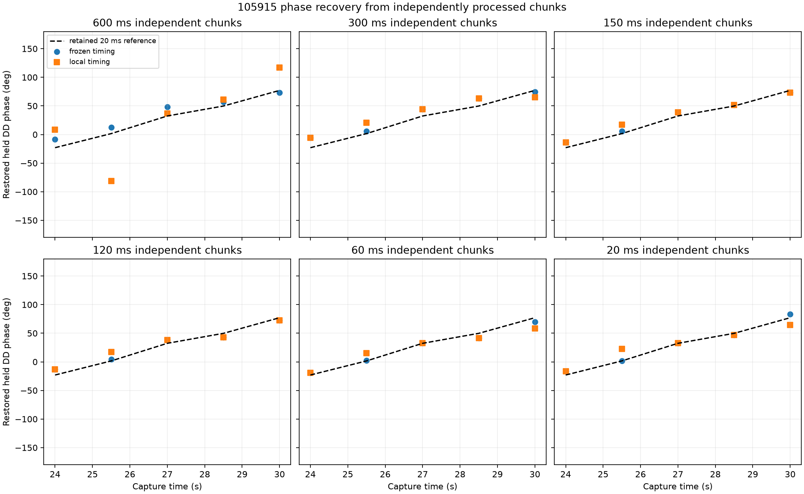

# Where phase recovery degrades in independently processed chunks

This raw-IQ replay used five non-overlapping centers from the existing 105915
two-source interval and independently processed 600, 300, 150, 120, 60, and
20 ms chunks at every center. It read 3.01 seconds of unique archived IQ. No RF
was collected.

The result does **not** show phase disappearing at the 120 ms adaptive-visit
scale. With historical timing retained, the held-only double-difference phase
at 120 ms differs from the retained corrected 20 ms curve by 5.54 degrees
median across all five centers. At 60 and 20 ms the medians are 3.83 and 2.72
degrees. Train-frame timing reacquisition increases those medians to 7.04,
8.58, and 6.76 degrees, respectively, but retains high held frame coherence.

| Independent chunk | Frozen timing median error | Local timing median error | Frozen/local median minimum held resultant |
| ---: | ---: | ---: | ---: |
| 600 ms | 10.94° | 31.16° | 0.601 / 0.537 |
| 300 ms | 11.83° | 13.30° | 0.823 / 0.823 |
| 150 ms | 3.90° | 6.08° | 0.943 / 0.947 |
| 120 ms | 5.54° | 7.04° | 0.955 / 0.956 |
| 60 ms | 3.83° | 8.58° | 0.967 / 0.967 |
| 20 ms | 2.72° | 6.76° | 0.956 / 0.956 |

All 60 source-pair/mode/duration cases returned a phase. Each table entry has
five independent physical centers. These are descriptive medians without a
population uncertainty claim.

The duration trend is consistent with two mechanisms. First, extending one
constant receiver-product residual-frequency fit across 300--600 ms coincides
with reduced held coherence, despite the explicit historical affine carrier
derotation. The experiment does not isolate residual curvature from source
mixture, timing drift, or other model mismatch as the sole cause. The
600 ms local-timing case is worst: its five errors are 31.2°, 83.0°, 4.3°,
11.2°, and 39.8°. Longer chunks therefore need a declared residual-curvature
model or shorter subgroups; treating one locally constant residual as a
long-coherent model is not justified. Second, timing reacquisition produces
center-dependent phase shifts even after carrier-origin restoration. At 20 ms
its errors are 6.8°, 21.2°, 0.1°, 2.7°, and 12.9°, versus 6.8°, 0.0°, 0.1°,
2.7°, and 6.0° with retained timing. Timing-template phase transport is thus a
real part of the adaptive boundary problem, though it does not erase the
observable at every center. At 25.5 s and 20 ms, only source B's selected timing
changes, from -16 to -17 samples; the DD reference error changes from 0.02° to
21.2°. That single case directly demonstrates timing-reacquisition sensitivity,
without establishing that timing explains every error.

The exact pilot beats the rolled-17 control strongly at short durations: the
median minimum per-source exact/control held power ratio is 16.2 at 120 ms,
19.8 at 60 ms, and 18.9 at 20 ms. The +37-sample wrong-timing comparison is
also weaker, but ratios remain high because that offset still overlaps much of
the approximately 282 microsecond pilot support; it is a sensitivity control,
not a null template.

## Coordinate handling

Both modes retain the historical global source epochs and affine carrier/rate
priors; `local_timing` is not a blind adaptive acquisition. The replay demodulates each RX/source using the historical affine carrier in
absolute capture sample coordinates. It records the pre-restoration train and
held phases, transports the held measurement to the declared common physical
center using the train-only residual frequency, restores the two historical
receiver carrier phases exactly once, and only then forms the source double
difference. Timing is selected on training frames; held phase is measured on
disjoint frames without refitting frequency or timing. Both sources use the
same seeded frame-ordinal partition. A 117-sample guard and explicit bounds
assertion prevent any chunk from reading neighboring IQ.

The A and B frame lattices have equal counts in every tested case, but matching
ordinals are separated by 98 samples (39.2 microseconds). Their independently
measured phases are transported to the common chunk center before subtraction;
they are not exact same-sample observations. This replay does not propagate
transport uncertainty and therefore does not independently prove receiver-LO
cancellation.

The retained 20 ms curve is a prior response artifact, not ground truth. Errors
against it measure reproduction consistency. This frontend recreates the documented fixed eight-tone, symbols 2--65
correlation because the original 2026-09-16 extraction program was not
committed. The comparison is therefore consistency with its retained 20 ms
response artifact rather than bit-identical reproduction. Source identities
and geometry remain unverified, and no trajectory slope is called satellite
motion.

Protocol/source were sealed at commits `c574476d` and `147a5b87` before IQ was
opened. Complete per-center train/held phases, timing shifts, residual
frequencies, coherence, controls, failures, and hashes are retained in
`reports/figures/2026_09_23_long_dwell_multiscale_phase/results.json`.
