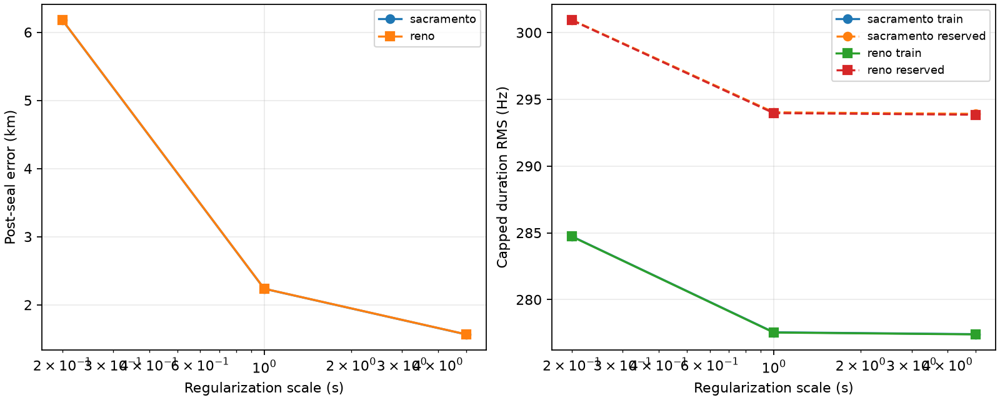

# Conditional full-eight-hour shared per-scan epoch fit

Across all 72 frozen TRAIN scans, shared per-scan epoch flexibility moves the
conditional fixed-identity solution substantially closer to the reference, but
the best reported arm remains 1.57 km away. Sub-300 m positioning remains
unproven, and no scale or prior is selected by geographic outcome.

| Prior | Scale | Train capped RMS | Reserved capped RMS | Error | Active scans | At ±5 s |
|---|---:|---:|---:|---:|---:|---:|
| Sacramento | 0.2 s | 284.73 Hz | 300.95 Hz | 6.179 km | 70 / 72 | 0 |
| Sacramento | 1.0 s | 277.55 Hz | 294.03 Hz | 2.236 km | 72 / 72 | 0 |
| Sacramento | 5.0 s | 277.41 Hz | 293.91 Hz | 1.566 km | 71 / 72 | 0 |
| Reno | 0.2 s | 284.72 Hz | 300.92 Hz | 6.181 km | 70 / 72 | 0 |
| Reno | 1.0 s | 277.53 Hz | 293.97 Hz | 2.237 km | 72 / 72 | 0 |
| Reno | 5.0 s | 277.39 Hz | 293.85 Hz | 1.568 km | 71 / 72 | 0 |

Fitted scan shifts range from about −0.88 to +0.35 s at 0.2 s scale and
−2.73 to +0.60 s at 5 s scale. No shift reaches ±5 seconds and no fixed identity
loses exact horizon visibility. These empirical nuisance terms can absorb orbit,
identity, track-shape, or timing mismatch; they are not calibrated receiver-clock
or physical orbit estimates.

Every arm satisfies the declared objective/step stopping rule in one to three
Schur-polish iterations. This is not KKT certification. The last pre-step raw
projected-gradient diagnostics remain large (roughly 9.6e3–5.7e5 in unnormalized
normal-equation units). All 72 scan identities are active above 0.01 s in most
arms, which also shows that the nuisance is broad rather than isolated.

The tau-zero conditional replay and every cache binding are checked against the
sealed blind baseline. Before fitting, all 72 receipt and NPZ hashes, receipt
session IDs, baseline scan IDs, and frozen cohort order must match exactly.
The recorded 214.4-second inference runtime includes selected-candidate state
materialization and fitting for both priors; it excludes post-seal evaluation.

Algorithmically, position, CFO, and tau fitting use training-mask rows only, and
held-row mutation tests leave the training objective unchanged. Strict input
isolation is weaker: the baseline `results.json` and cached measured arrays
contain complementary-row and reference fields in memory even though inference
does not consume them. A future run should derive a scrubbed fixed-identity input
artifact before fitting if strict unopened-evidence semantics are required.

This remains conditional on baseline-selected identities, altitude zero,
regional candidate filtering, capped-loss regularization scaling, interpolation,
and a local solver. It is not a new blind association result. No validation/test
or prospective evidence, deployment, or RF collection was used.



See the [protocol](PROTOCOL.md), [sealed inference](results/inference.json), and
[post-seal results](results/results.json) for all scan shifts, fixed identities,
solver traces, and bindings.

Reproduce with a fresh output directory:

```bash
.venv/bin/python reports/2026_09_23_long_full8h_shared_epoch_position/fit.py \
  --manifest reports/2026_09_23_long_training_cache_full8h/manifest.json \
  --cache-root /tmp/leo-long-training-cache-full8h \
  --baseline reports/2026_09_23_long_training_full8h_position/results/results.json \
  --single-tool reports/2026_09_23_long_training_search/search.py \
  --output /tmp/long-full8h-shared-epoch-reproduction
```
