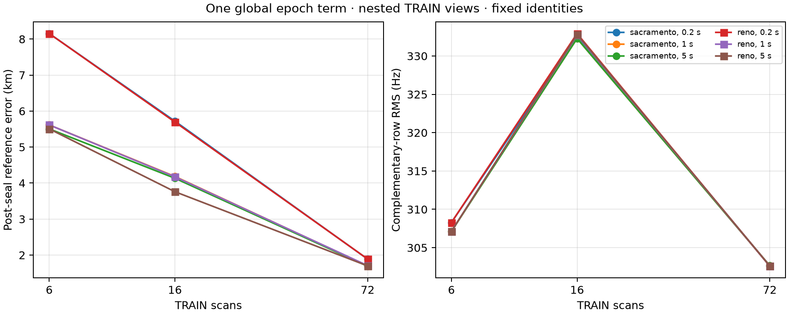

# Conditional global epoch position experiment

One global epoch term substantially improves the fixed-identity fit, and the
full 72-scan result is much better localized than the blind zero-epoch baseline.
This is a conditional TRAIN result and does not establish a physical clock
offset or validation generalization.

| Scans | Prior | Scale (s) | Global tau (s) | Train RMS (Hz) | Held RMS (Hz) | Reference error (km) |
|---:|:---|---:|---:|---:|---:|---:|
| 6 | Sacramento | 0.2 / 1 / 5 | -0.322 / -0.975 / -1.058 | 282.61 / 281.70 / 281.69 | 308.28 / 307.14 / 307.12 | 8.154 / 5.616 / 5.505 |
| 6 | Reno | 0.2 / 1 / 5 | -0.322 / -0.975 / -1.058 | 282.61 / 281.70 / 281.69 | 308.28 / 307.14 / 307.12 | 8.154 / 5.616 / 5.505 |
| 16 | Sacramento | 0.2 / 1 / 5 | -0.712 / -1.096 / -1.120 | 305.59 / 305.14 / 305.14 | 332.49 / 332.29 / 332.29 | 5.720 / 4.184 / 4.134 |
| 16 | Reno | 0.2 / 1 / 5 | -0.719 / -1.107 / -1.241 | 305.54 / 305.09 / 305.03 | 332.92 / 332.72 / 332.80 | 5.696 / 4.175 / 3.760 |
| 72 | Sacramento | 0.2 / 1 / 5 | -0.906 / -0.940 / -0.941 | 285.97 / 285.95 / 285.95 | 302.63 / 302.65 / 302.65 | 1.887 / 1.698 / 1.690 |
| 72 | Reno | 0.2 / 1 / 5 | -0.907 / -0.942 / -0.943 | 285.96 / 285.95 / 285.95 | 302.59 / 302.61 / 302.61 | 1.889 / 1.706 / 1.698 |

All 18 arms satisfied the declared stopping rule, had zero visibility failures,
and kept tau away from its ±5 s bound. Zero-tau training parity against the
three sealed baselines is exact to `1.14e-13 Hz`. Runtime was 317.72 seconds.

The fit used only TRAIN-mask rows in its objective and sealed all arms before
computing complementary-row or reference metrics. The baseline JSON documents
already contain held/reference fields and the prepared arrays contain all
measured rows; those values were present in memory but were not consumed by the
training score. The held-row perturbation test verifies objective invariance.
Candidate identities remain fixed from the blind baselines, so this is not a
full blind reassociation result. Regularization scales specify objective weights,
not calibrated clock uncertainties. The capped objective, finite-difference
Schur steps, and raw pre-step projected-gradient diagnostics do not certify a
global optimum or KKT solution.



Reproduce with a fresh output directory:

```bash
uv run python reports/2026_09_23_long_global_epoch_position/fit.py \
  --manifest reports/2026_09_23_long_training_cache_full8h/manifest.json \
  --cache-root /tmp/leo-long-training-cache-full8h \
  --baseline-multi reports/2026_09_23_long_training_search_multi/results/results.json \
  --baseline-full reports/2026_09_23_long_training_full8h_position/results/results.json \
  --single-tool reports/2026_09_23_long_training_search/search.py \
  --output /tmp/long-global-epoch-reproduction
```

Source SHA-256: `43ec3a090948e04ba2bd68a47f520cadc13dfee2f659b04c8c27ea78397b9096`.
Inference SHA-256: `c5e3ed55398ac687c9e74d023060d765549cf4805f7d08ab102cb2a1757a594d`.
