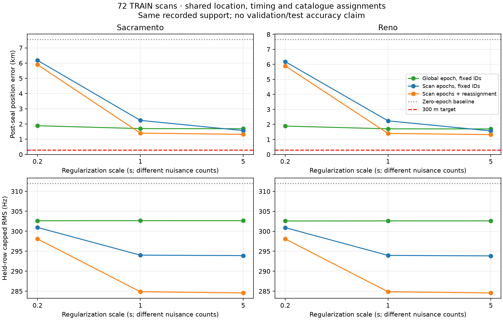

# Joint epoch and catalogue reassignment on eight-hour TRAIN

Reconsidering satellite assignments after timing corrections reduces the
full-group error from about 1.57 km to 1.32 km at the weakest tested
regularization. All six arms reach the declared identity-stability/small-gain
rule after five or six cycles. This is a local alternating fit, not certified
global convergence, true satellite identity recovery, or sub-300 m accuracy.

| Prior | Scale | Train capped RMS | Held-row capped RMS | Position error |
|---|---:|---:|---:|---:|
| Sacramento | 0.2 s | 282.462 Hz | 298.074 Hz | 5.895 km |
| Reno | 0.2 s | 282.462 Hz | 298.074 Hz | 5.895 km |
| Sacramento | 1 s | 270.286 Hz | 284.870 Hz | 1.399 km |
| Reno | 1 s | 270.286 Hz | 284.870 Hz | 1.399 km |
| Sacramento | 5 s | 270.053 Hz | 284.577 Hz | 1.320 km |
| Reno | 5 s | 270.053 Hz | 284.577 Hz | 1.320 km |

The two starts reach numerically matching final solutions. They are not
independent datasets. The fixed 3,587-track support covers 72 repeated captures,
about six captured hours across eight elapsed hours. Location is common; each
scan has one epoch term, and each track has a training-fitted constant CFO.
No observations are discarded by reassignment. Each candidate update searches
all retained causal candidates at that location and scan epoch, with the
original horizon rule and training-only CFO/RMS. The regularization penalty is
unchanged. The following continuous step uses the bound-aware conditional
solver. Both steps preserve the objective up to declared numerical tolerances.



The global-epoch model is included to show the tradeoff: it fits frequency less
closely but reaches similar kilometre-scale position errors using one timing
parameter instead of 72. The same numerical scale is not the same total penalty
when the nuisance count differs. No scale or method is selected here by error.

The original three-cycle run and exact executed sources remain under
`three_cycle_attempt/`. All arms hit that limit while changing identities, so
the same six arms were rerun with a ten-cycle ceiling. Their first three traces
reproduce the original attempt bit-for-bit. This extension was motivated by
training convergence diagnostics, after the original post-seal outcomes were
already visible; it was not applied selectively by geographic result. The
accepted inference took 398.78 s, excluding the original 242.11-second run and
post-seal evaluation. `comparison.json` records the prefix check, net assignment
changes, exact fitted GPS coordinates, all errors and objective gains.

All inference starts from the sealed conditional artifact and uses training
frequency masks. Cache arrays contain complementary frequencies, but these do
not enter assignment or continuous fitting. All six arms are sealed before a
separate script calculates held-frequency and reference-position metrics.
Final evaluation preserves assignments and profiles CFO only on training rows.
It checks numerical sources, protocol, sealed inputs, cache hashes and training
objective replay. No validation/test evidence, RF collection or deployment was
used. This remains conditional on the initial blind search basin, regional
catalogue, altitude zero, frequency model and bounded local solver.

From the repository root, reproduce into a fresh output directory:

```bash
.venv/bin/python reports/2026_09_23_long_joint_epoch_association/refine.py \
  --inference reports/2026_09_23_long_full8h_shared_epoch_position/results/inference.json \
  --helper reports/2026_09_23_long_full8h_shared_epoch_position/fit.py \
  --single reports/2026_09_23_long_training_search/search.py \
  --manifest reports/2026_09_23_long_inventory_complete/manifest.json \
  --cache-root /tmp/leo-long-training-cache-full8h \
  --output /tmp/long-joint-epoch-reproduction
.venv/bin/python reports/2026_09_23_long_joint_epoch_association/evaluate.py \
  --inference /tmp/long-joint-epoch-reproduction/inference.json \
  --conditional-inference reports/2026_09_23_long_full8h_shared_epoch_position/results/inference.json \
  --helper reports/2026_09_23_long_full8h_shared_epoch_position/fit.py \
  --single reports/2026_09_23_long_training_search/search.py \
  --cache-root /tmp/leo-long-training-cache-full8h \
  --output /tmp/long-joint-epoch-reproduction/results.json
```

`report.py` verifies and plots the checked-in artifacts. Four focused tests cover
known fractional-epoch assignment, held-frequency invariance, explicit invisible
support failure, outer termination labels and changed-source rejection.
