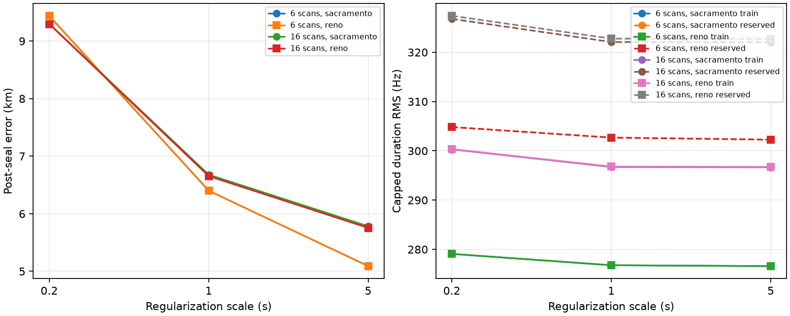
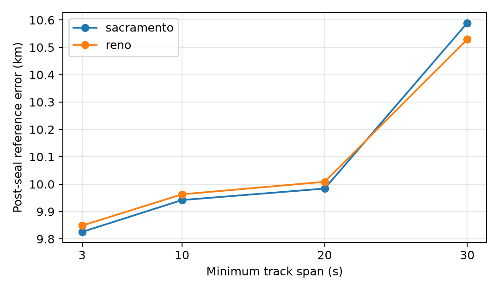
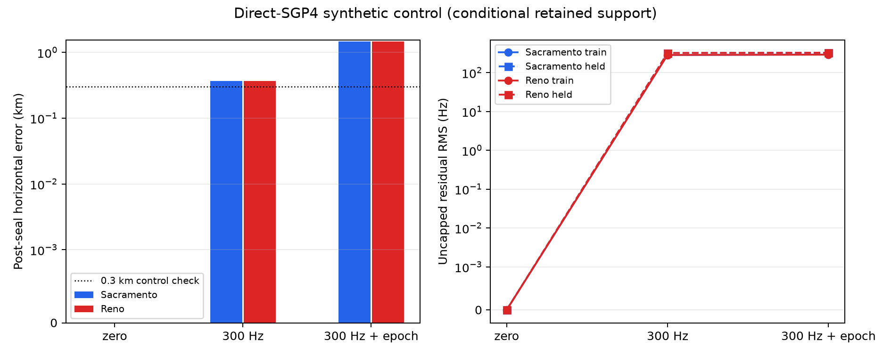
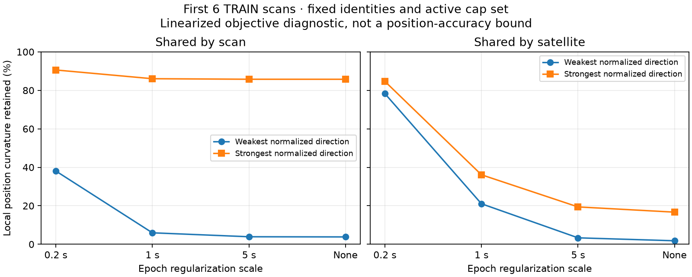

# Long-cohort model experiments: timing helps, short-track removal does not

The frozen blind TRAIN baseline remains about 10 km from the reference after
six or sixteen scans. A conditional fit of shared per-scan epoch shifts reduces
the reported errors to about 5–6 km at the weakest tested regularization. This
is meaningful development progress, but it does not establish sub-300 m accuracy
or validation generalization. Validation/test track outcomes remain closed.

| TRAIN view / model | Sacramento error | Reno error | Common held capped RMS, Sac / Reno |
|---|---:|---:|---:|
| 6 scans, blind zero-epoch baseline | 9.825 km | 9.849 km | 309.26 / 309.27 Hz |
| 6 scans, fixed identities + epoch scale 0.2 s | 9.435 km | 9.439 km | 304.83 / 304.83 Hz |
| 6 scans, fixed identities + epoch scale 1 s | 6.400 km | 6.400 km | 302.69 / 302.69 Hz |
| 6 scans, fixed identities + epoch scale 5 s | 5.091 km | 5.090 km | 302.27 / 302.26 Hz |
| 16 scans, blind zero-epoch baseline | 10.039 km | 9.909 km | 334.71 / 335.04 Hz |
| 16 scans, fixed identities + epoch scale 0.2 s | 9.301 km | 9.296 km | 326.78 / 327.40 Hz |
| 16 scans, fixed identities + epoch scale 1 s | 6.678 km | 6.654 km | 322.09 / 322.77 Hz |
| 16 scans, fixed identities + epoch scale 5 s | 5.782 km | 5.754 km | 322.04 / 322.72 Hz |

All settings are reported; no setting was selected by geographic error. These
are nested views of TRAIN, not independent validation. The epoch fit fixes each
identity from the blind baseline and profiles its constant CFO on training rows.
It is therefore conditional inference, not a new full-catalogue association
search. Its fitted shifts may absorb clock, orbit, association or track-model
errors and are not physical clock estimates. The regularization scales are not
calibrated timing uncertainties. Ten of twelve numerical polish runs converged;
eleven arms converged in at least one optimization stage. One scale-5 Sacramento
arm remains line-search limited, with a converged Reno counterpart in the same
basin. No visibility or timing-boundary violations occurred.

## What the other experiments tell us

Increasing minimum track span from 3 seconds to 10, 20 or 30 seconds does not
improve the six-scan result. Reference errors remain 9.94–10.59 km, while held
prediction on the fixed all-3s support stays near 309–310 Hz. Scores on the
changing duration subsets are reported separately and must not be compared as
the same population. The fixed-location audit agrees: 3–10 s tracks carry only
1–2% of capped training loss. Their removal is not a supported remedy here.

The two priors agree on all 476 six-scan identities and 1,124/1,130 sixteen-scan
identities. This is stability between nearby selected solutions, not evidence
that the identities are true. Only one selected ID recurs across two scans in
the first sixteen; none spans three. Consequently persistent satellite effects
have little cross-scan support. Within-scan relative satellite epoch effects
remain a possible regularized model, but require a correct gauge and an actual
Jacobian/geometry-confounding check.

The packed-vector score prototype was equivalent in its checks but 31% slower,
so it is not used. A separate cache-loading fix avoids decompressing the same
NPZ arrays for every track: it produced exactly equal prepared data and reduced
one-scan preparation from 3.171 s to 0.092 s in the recorded benchmark. This is
a loading improvement, not an end-to-end fitting speed claim.

## Synthetic controls and identifiability

The completed direct-SGP4 synthetic control uses the first six TRAIN scans'
476 track supports and 8,285 timestamps with known generating identities. Both
initializations recover a planted noiseless position to numerical precision.
One independent 300 Hz Gaussian noise draw gives 370 m error. Adding one seeded
satellite-specific epoch perturbation draw raises error to 1.48 km while held
RMS changes only from 321 to 326 Hz. These are conditional sensitivity examples,
not measured receiver accuracy or a noise-distribution accuracy guarantee.
The shared generator/fitter cannot detect common-mode physical-model errors.

A separate TRAIN-only local curvature audit explains a risk of adding timing
freedom. At the sealed zero-epoch baseline, profiling per-satellite epoch terms
with scale 5 s retains only 3.3% and 19.4% of the two normalized position
curvature directions; scale 0.2 s retains 78.3% and 84.7%. This is a local
Gauss–Newton objective diagnostic with fixed identities and cap membership,
not a calibrated position covariance and not a measurement at later fitted
optima. Lower residuals can accompany weaker localization.

## Next evidence required

The complete first eight-hour TRAIN group now has 72 verified causal caches,
with zero export failures. The full-group baseline is the next duration test;
the completed six/sixteen views cover only about 35/107 minutes elapsed.
Synthetic success will not count as achieving the real-data accuracy objective.

The current experiment priorities are:

| Approach | Question it answers | Acceptance evidence |
|---|---|---|
| Full eight-hour joint blind baseline | Does more orbital diversity reduce the short-view bias? | Same fixed track policy and complete candidate search; both prior results sealed before reference evaluation |
| Regularized scan versus satellite epoch terms | Which structured mismatch explains residuals without absorbing position? | Bound-aware solver diagnostics, training-only fits, regularization sensitivity, and local curvature |
| Repeated synthetic noise controls | Was the single 370 m result representative under the assumed noise model? | Predetermined seeds, median/tail errors, both starts, no parameter selection by error |
| Joint identity reassignment after structured correction | Are fixed baseline IDs limiting the conditional models? | Full retained causal candidate pools, unchanged support, training-only reassignment and held checks |
| Frozen model comparison on independent groups | Do development gains generalize to different recording conditions? | All failures retained; group-level position error and residual metrics across 1/6/16/all-scan views |

The last two steps require completing the preceding TRAIN experiments first.
The final test must not become another model-development loop. Prior centres
are initialization/search constraints, not independent repeated datasets.

Before validation access, compare a small frozen set of complete model families
on TRAIN, including failures and convergence limits. A smaller frequency RMS
alone is insufficient evidence of geographic accuracy. Keep the final 64-scan
test group closed until model selection is complete.

## Reproducible evidence

- [Conditional epoch protocol, numerical results and source](../2026_09_23_long_shared_epoch_position/README.md).
- [Duration ablation, sealed outputs and plots](../2026_09_23_long_training_duration_ablation/README.md).
- [Association gap and loss audit](../2026_09_23_long_training_association_audit/README.md).
- [Satellite recurrence and gauge design](../2026_09_23_long_training_shared_satellite_epoch_design/README.md).
- [Loading and scoring performance checks](../2026_09_23_long_training_fast_score/README.md).
- [Full eight-hour cache manifest and receipts](../2026_09_23_long_training_cache_full8h/README.md).
- [Frozen train/validation/test manifest](../2026_09_23_long_inventory_complete/manifest.json).
- [Synthetic known-position control](../2026_09_23_long_position_synthetic_control/README.md).
- [Epoch versus position-curvature audit](../2026_09_23_long_epoch_identifiability/README.md).

SOL implemented the epoch model; Terra audited associations, recurrence and
cache provenance. Root implemented the corrected duration inference and loading
equivalence check, reviewed the scientific invariants, and integrated reports.
All work uses existing recordings. No production deployment or RF collection is
part of these experiments.
