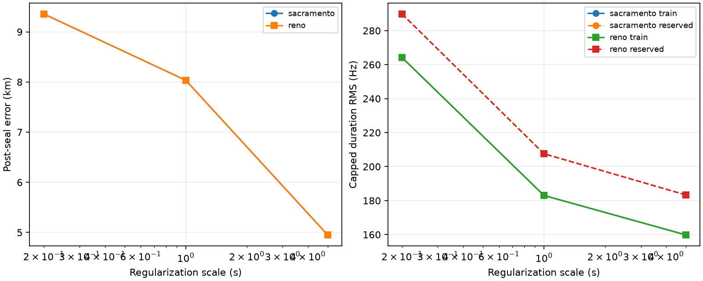

# Conditional per-satellite epoch effects on first-six TRAIN

Per-satellite epoch flexibility sharply lowers frequency residuals but does not
recover accurate position. The loosest 5-second scale reaches 159.80 Hz training
and 183.3 Hz complementary-row capped RMS, yet remains about 5.0 km from the
reference. Sub-300 m positioning remains unproven.

| Prior | Scale | Train capped RMS | Reserved capped RMS | Error | Active / total satellites | At ±5 s |
|---|---:|---:|---:|---:|---:|---:|
| Sacramento | 0.2 s | 264.18 Hz | 289.82 Hz | 9.356 km | 71 / 118 | 0 |
| Sacramento | 1.0 s | 183.02 Hz | 207.57 Hz | 8.035 km | 107 / 118 | 0 |
| Sacramento | 5.0 s | 159.80 Hz | 183.32 Hz | 4.951 km | 115 / 118 | 3 |
| Reno | 0.2 s | 264.18 Hz | 289.82 Hz | 9.356 km | 71 / 118 | 0 |
| Reno | 1.0 s | 183.02 Hz | 207.57 Hz | 8.035 km | 107 / 118 | 0 |
| Reno | 5.0 s | 159.80 Hz | 183.32 Hz | 4.951 km | 115 / 118 | 3 |

Tau-zero fixed-identity replay exactly matches both sealed blind baselines:
283.561948 Hz for Sacramento and 283.560993 Hz for Reno. All six arms were fit
and reported; geographic error did not select a scale or prior. Complementary
rows and reference coordinates were opened only after inference was sealed.

The solver first alternates bounded scalar satellite updates with a two-dimensional
position update, then applies the predeclared bound-active Schur Gauss–Newton
polish. All arms satisfy an objective/step stopping rule; this is not optimizer
certification. The last pre-step projected-gradient infinity diagnostics remain large
(about 7,780–24,655 in unnormalized normal-equation units), so the fits do not
demonstrate KKT stationarity. Bound-active recomputation freezes the same three
outward eta directions in both loose-scale arms. Runtime is 26.1 seconds. No
fitted identity loses horizon visibility.

The recorded aggregate scalar-search failure count is zero in every arm; total
scalar evaluations per arm are 2,538 at 0.2 s, 4,647 at 1 s, and 5,036–5,039 at
5 s. Individual scalar status messages were not retained. The polish declares
its stopping rule satisfied below 0.001 Hz exact-objective gain, or jointly below
0.01 km position and 0.002 s maximum eta step. Projected-gradient values use the
raw duration-weighted residual normal equations plus the `800²/scale²` eta
penalty, without division by total duration; they are diagnostic values rather
than a dimensionless convergence norm.

An earlier coupled polish clipped eta after solving an unconstrained Schur step.
Independent review identified that this does not enforce active-bound KKT
directions. That source and run are preserved as
`fit_superseded_schur_unprojected.py` and
`results_superseded_schur_unprojected`. Before the accepted rerun, the solver was
revised for all six arms to freeze outward directions at active eta bounds and
recompute the position/free-eta Schur system.

The large residual gains come with strong identifiability loss. The independent
local Gauss–Newton audit reports that satellite profiling retains roughly
78–85% of local position curvature at 0.2 s, 21–36% at 1 s, and only 3–19% at
5 s. Those figures are local objective curvature, not Fisher information or a
CRLB, and it was measured around the baseline rather than these final fits. The
boundary hits, large projected-gradient diagnostic, and weak loose-scale
curvature make the 5-second result especially unsuitable as evidence of physical
epoch or orbit corrections.

This experiment freezes identities from the sealed baseline and is not full
blind reassociation. Each satellite eta is an empirical nuisance shared across
its selected tracks; the model does not establish a physical orbit error. The
regularization scales are not calibrated uncertainties. Results also remain
conditional on altitude zero, cached linear interpolation, capped loss, regional
candidate filtering, local block optimization, and the nested first-six TRAIN
view.

No long validation/test or prospective evidence, deployment, or RF collection
was accessed. See the [protocol](PROTOCOL.md),
[sealed inference](results/inference.json), and
[post-seal results](results/results.json) for all eta values, tracks, traces,
visibility checks, and source bindings.
