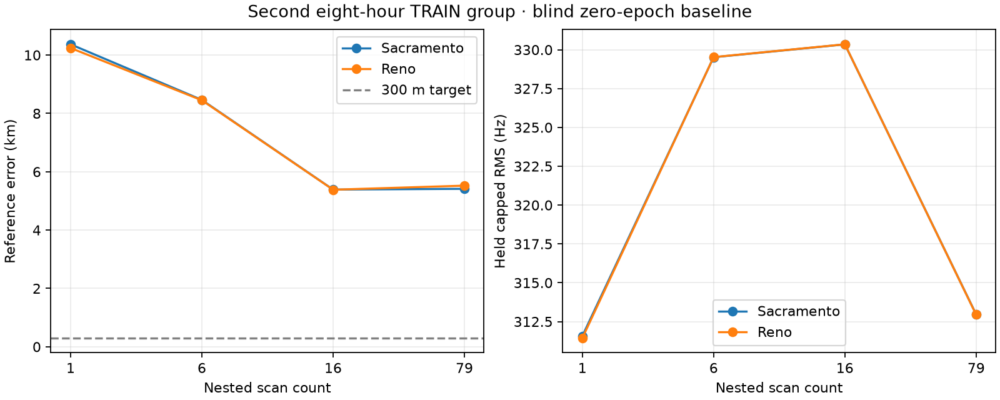

# Second eight-hour TRAIN baseline replication

The second TRAIN group reproduces kilometre-scale error: 5.41–5.52 km using
all 79 scans and 3,401 tracks. Its 16-scan view is already about 5.38 km away;
adding the remaining scans lowers held frequency RMS without improving location.
This is evidence against treating a lower residual or more scans alone as proof
of geographic accuracy. The two priors are starts on the same data, not separate
trials. This is TRAIN replication, not validation or final test.

| Scans | Tracks | Sacramento error | Reno error | Held capped RMS, Sac / Reno |
|---|---:|---:|---:|---:|
| 1 | 50 | 10.368 km | 10.242 km | 311.57 / 311.44 Hz |
| 6 | 298 | 8.462 km | 8.450 km | 329.52 / 329.53 Hz |
| 16 | 771 | 5.388 km | 5.384 km | 330.34 / 330.35 Hz |
| 79 | 3,401 | 5.414 km | 5.523 km | 312.96 / 312.95 Hz |



The frozen Sep 21 16Z group is exactly TRAIN[72:], disjoint from VAL/TEST.
All tracks spanning at least 3 s are retained. Each location searches all
retained causal candidates, profiling per-track CFO on the existing randomized
training mask. The objective weights occupied seconds and caps track RMS at
800 Hz. Timing shift and altitude remain zero. Sacramento's disk is 250 km;
Reno's is 500 km. The 100-to-0.1953125 km adaptive grid uses a three-candidate
diverse beam, not a certified global search. No reference position or held
frequency enters the search.

Four workers completed the eight prior/view tasks in 1,207.64 s, following
7.84 s preparation. All eight inferences were sealed before complementary-row
and reference scoring. `report.py` verifies the seal, bound numerical sources
and unchanged fitted coordinates/objectives before generating this figure and
`summary.json`. Cache receipts/hashes were independently checked against the
79-session export report. The baseline inference contains locations but not
per-track assignments; subsequent timing replication reconstructs assignments
at those locations with the original training-only scorer and checks parity.

Reproduce from the repository root into a fresh output directory:

```bash
OPENBLAS_NUM_THREADS=1 OMP_NUM_THREADS=1 .venv/bin/python \
  reports/2026_09_23_long_second8h_training_baseline/search.py \
  --manifest reports/2026_09_23_long_training_cache_second8h/manifest.json \
  --cache-root /tmp/leo-long-training-cache-second8h \
  --single-tool reports/2026_09_23_long_training_search/search.py \
  --fast-loader reports/2026_09_23_long_training_fast_score/loader.py \
  --output /tmp/leo-second8h-baseline-reproduction
.venv/bin/pytest -q tests/tools/test_long_second8h_training_baseline.py
```

The test checks pooled versus serial objective equivalence. No production code
was changed, no radio collection occurred, and VAL/TEST evidence stays closed.
