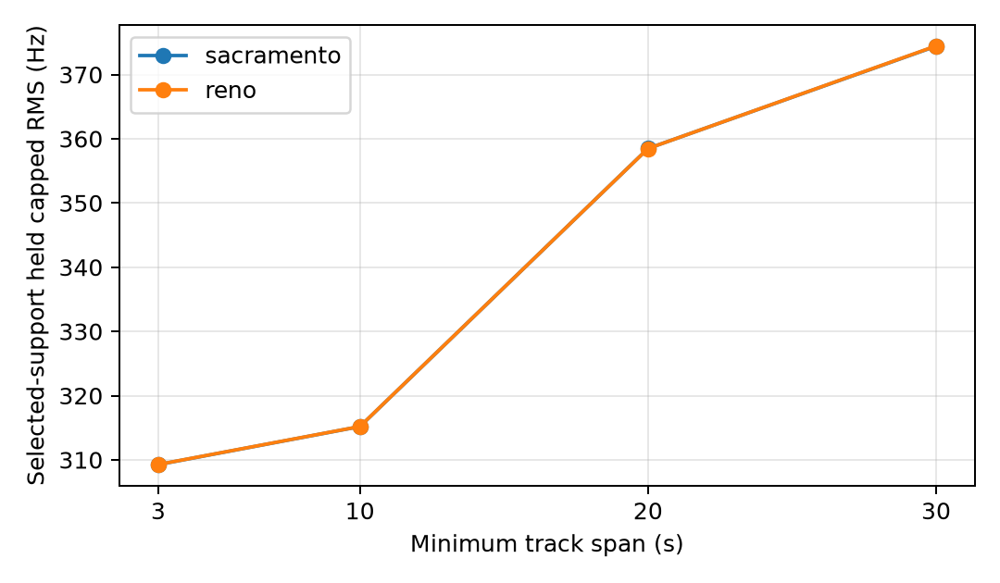
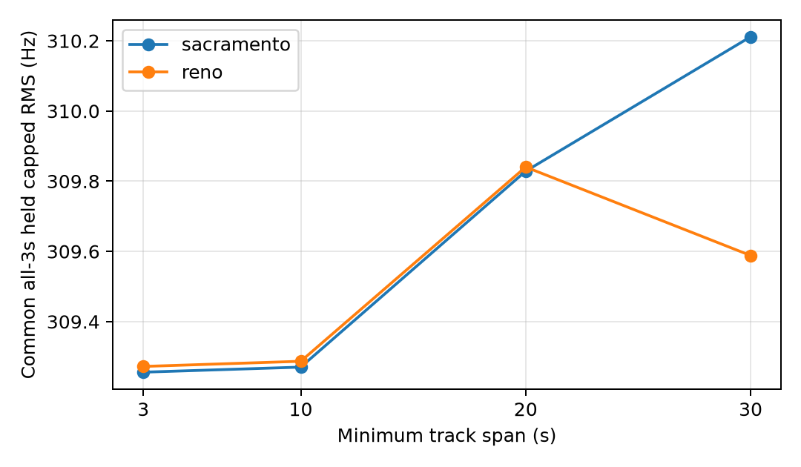

# First-six TRAIN duration ablation

The frozen first-six TRAIN sessions were searched at 10, 20, and 30 second
minimum track spans under the unchanged Sacramento-250 and Reno-500 priors.
All fitting used randomized training rows only. Reserved frequency rows and the
reference coordinate were evaluated only after all six inferences were sealed.

| Span | Prior | Tracks / observations | Train RMSE Hz | selected-support held Hz | common all-3s held Hz | reference error km |
|---:|---|---:|---:|---:|---:|---:|
| 3 (published baseline) | Sacramento | 476 / 8285 | 283.56 | 309.26 | 309.26 | 9.83 |
| 3 (published baseline) | Reno | 476 / 8285 | 283.56 | 309.27 | 309.27 | 9.85 |
| 10 | Sacramento | 407 / 7779 | 291.19 | 315.18 | 309.27 | 9.94 |
| 10 | Reno | 407 / 7779 | 291.19 | 315.19 | 309.29 | 9.96 |
| 20 | Sacramento | 171 / 4557 | 339.03 | 358.48 | 309.83 | 9.98 |
| 20 | Reno | 171 / 4557 | 339.03 | 358.48 | 309.84 | 10.01 |
| 30 | Sacramento | 50 / 1773 | 358.35 | 374.42 | 310.21 | 10.59 |
| 30 | Reno | 50 / 1773 | 358.35 | 374.46 | 309.59 | 10.53 |

Thresholds change support, so selected-support held scores are not directly
comparable as a common population. The all-3-second held score applies each
sealed point to the same baseline support. Neither it nor the post-seal
reference error was used to choose a threshold; all positions remain about
10 km from reference in this bounded sample.

The sealed inference SHA-256 is `39b7ff6ccab8ef0f1bb5d91ac891168a2e49dbbfb7b40730491391bef98d7814` and results SHA-256 is `8fa843c2f9f8ed6d3adad97a907d29b7f6bc3fbbfe0228ad6ace89a9e3a13af9`.
Reproduce from a fresh `sealed/` directory with `.venv/bin/python reports/2026_09_23_long_training_duration_ablation/run.py`.

The initial wrapper was stopped before it produced a valid sealed artifact. The corrected source produced this receipt. Focused `restrict` and held-summary tests pass (2 tests).

The exact source bound by the sealed inference is preserved as
`run_as_executed.txt`. The readable `run.py` was formatted after execution;
`source_formatting.json` records both hashes and verifies identical Python ASTs.
No numerical result was regenerated or changed for formatting.
