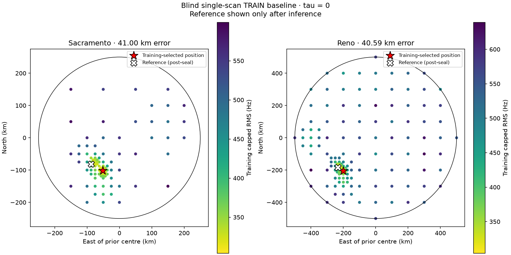

# First long-TRAIN blind tau-zero position search

The response-free full causal candidate path is practical, but this first-scan
tau-zero baseline is not accurate. Both independently retained priors converge
to the same broad basin roughly 40–42 km from the reference coordinate.

| Prior | Evaluations | Training capped RMS | Reserved capped RMS | Reserved uncapped RMS | Post-seal error |
|---|---:|---:|---:|---:|---:|
| Sacramento 250 km | 132 | 303.93 Hz | 346.05 Hz | 505.30 Hz | 41.00 km |
| Reno 500 km | 197 | 304.15 Hz | 345.86 Hz | 503.50 Hz | 40.59 km |

The Sacramento result is 37.666759°, −122.080186°; the Reno result is
37.666401°, −122.085842°. The priors remain separate inference results even
though their disks overlap and their selected basins are close. Reference error
and reserved frequency rows were appended only after `inference.json` was
sealed. They did not select between the priors or change the search.

The run consumes all 93 eligible tracks and 880 causal, response-free candidates
from the compact cache. Every track finds an exactly visible candidate at both
selected points. Identity and constant CFO are profiled solely on each track's
fixed training mask. Timing is fixed at zero and the receiver altitude is fixed
at zero. The capped duration-weighted objective applies an 800 Hz penalty to an
unmatched track.

The deterministic search starts on a 100 km grid and retains three
spacing-diverse cells before 3-by-3 refinement at 50, 25, 12.5, 6.25, 3.125,
and 1.5625 km. It completes both priors in 17.2 seconds. This establishes a
practical cached inference path; the beam is a bounded heuristic and does not
certify a global minimum or sub-kilometre coordinate resolution. The direct
regular-grid adapter ignores the obsolete exact-query lookup structure removed
from the corrected receipt.

An initial implementation used a planar east/north approximation. Four Reno
edge trials exceeded the cache's conservative normal cap by at most 0.52%. That
run is preserved in `results_superseded_planar`; none of its outcomes changed
the declared beam or score. The accepted run uses great-circle destinations,
checks every trial against its prior disk, and rejects interpolation queries
even one nanosecond beyond either cache endpoint.

The result is conditional on one TRAIN scan, the regional conservative candidate
filter, tau zero, altitude zero, linear one-second state interpolation, and the
coarse beam. The interpolation benchmark reports about 0.021 Hz CFO-removed RMS
at four fixed sites, far below the observed model residual, but is not a global
error bound. No published identities or prior position outputs were used.

This negative single-scan result should not be selected or tuned by its 40 km
reference error. The frozen next step is to apply the same response-free cache
and search contract to fixed first-six and first-sixteen TRAIN views before any
long-cohort validation access. No long validation/test, prospective evidence,
deployment, or RF collection was accessed.

The [protocol](PROTOCOL.md), [sealed inference](results/inference.json), and
[post-seal results](results/results.json) contain the search trace, selected
identities and offsets, fixed masks/cache bindings, and exact coordinates.

