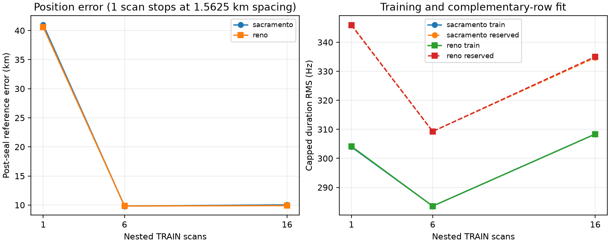

# Fixed first-6/first-16 blind long-TRAIN searches

Adding fixed TRAIN scans stabilizes the two prior searches into the same basin,
but does not approach sub-300 m accuracy. Both first-six results are about
9.8 km from the post-seal reference; both first-sixteen results are about 10 km
away. These are development results, not independent validation.

| View | Prior | Train capped RMS | Reserved capped RMS | Reserved uncapped RMS | Post-seal error |
|---|---|---:|---:|---:|---:|
| First 6 | Sacramento | 283.562 Hz | 309.256 Hz | 364.869 Hz | 9.825 km |
| First 6 | Reno | 283.561 Hz | 309.272 Hz | 364.903 Hz | 9.849 km |
| First 16 | Sacramento | 308.370 Hz | 334.705 Hz | 394.755 Hz | 10.039 km |
| First 16 | Reno | 308.371 Hz | 335.044 Hz | 395.167 Hz | 9.909 km |

The Sacramento and Reno priors were retained as distinct searches. Their close
final positions are an outcome of the overlapping prior disks and common
training objective; no reference coordinate selected between them. Candidate
identity and constant CFO are independently profiled per track and scan using
training rows only. Timing and altitude remain fixed at zero.

The 1.5625 km coarse-control objectives versus final 0.1953125 km objectives are
283.721→283.562 and 283.593→283.561 Hz for first-six, and 308.371→308.370 and
308.597→308.371 Hz for first-sixteen. The extra levels were declared before the
run to remove the coarse grid floor, not chosen from geographic error. They do
not rescue this model.

All caches correspond exactly to frozen TRAIN[:16]: 16/16 verified, with no
validation or test sessions and no export failures. Each inference binds every
receipt and NPZ digest. The common objective duration-weights all eligible
tracks across scans with a capped 800 Hz unmatched penalty. There is no shared
identity, CFO, timing, or receiver parameter across scans.

The first-six view contains 6 captures, 476 eligible tracks, and 8,285
observations over 2,100.5 seconds from the first capture start through the last
nominal end. First-sixteen contains 16 captures, 1,130 tracks, and 19,903
observations over 6,421.5 seconds. The single-scan control contains 93 tracks and
1,356 observations over 300 seconds.

The complete four-search run used 502.7 seconds: 181/245 evaluations for the
first-six Sacramento/Reno searches and 184/249 for first-sixteen. This exceeded
the anticipated few-minute aggregate runtime but remained a bounded, completed
existing-data run. No settings were changed while it ran.

The result remains conditional on the response-free regional candidate filter,
coarse beam width three, tau zero, altitude zero, regular-grid interpolation,
and two nested TRAIN views. The first-six view is contained in first-sixteen and
is not an independent replicate. Neither result supports promotion or access to
long validation/test evidence. No prospective evidence, deployment, or RF
collection was used.

See the [frozen protocol](PROTOCOL.md), [sealed inference](results/inference.json),
and [post-seal results](results/results.json) for full traces, identities,
offsets, fixed masks, and source bindings.
