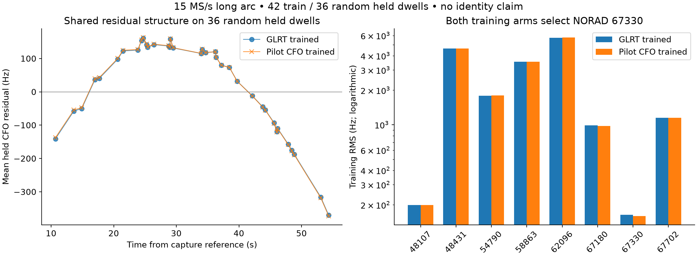
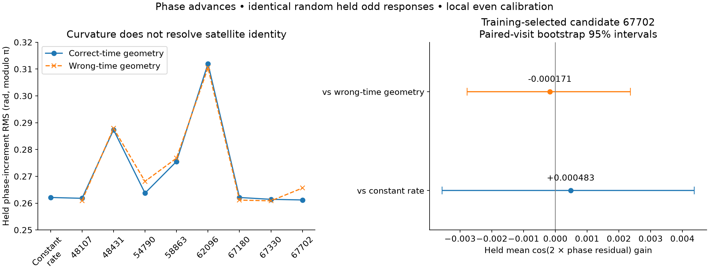

# Long-arc phase, satellite candidates, and motion

**The phase measurements contain a repeatable local frequency-rate signal, but
this experiment does not demonstrate stronger satellite association or a better
position.** On identical random held responses, pilot-derived CFO is slightly
worse than archived GLRT. Frame-to-frame phase advances barely improve on a
constant-rate control, and wrong-time satellite geometry performs slightly
better. These results do not justify adding a phase likelihood to production
association or reporting a new navigation fix.

This extends the [2.5 / 10 / 15 MS/s source-seeded comparison](2026_09_23_source_seeded_phase.md)
with an accessible 50-second arc. It does not replace that multirate comparison
or establish that one sample rate is intrinsically better.

## Data and random validation

The [binding](figures/2026_09_23_longarc_phase/binding.json) identifies all
78 historical observations of tracklet
`sha256:2807453f686c4475c19b1ddec248184f049acfaa3d2d3d0fbcfee5c62958846d`
in `scan-fw-f0af018448538a4c`. It binds each observation to the public saved-IQ
source, receiver 0, channel 4 lower edge, 15 MS/s, and native RF
11,459,687,500 Hz. Observation times span 49.962768205 seconds. It preserves
historical identities while checking receiver/channel, source times, and CFO
reconstruction; newer projection IDs are not asserted identical.

All 78 dwells were replayed from saved IQ. Each uses four adjacent full-pilot
frames nearest the center of each of six 20 ms groups: 24 fixed opportunities
per dwell. There was no new RF acquisition. The
[canonical replay](figures/2026_09_23_longarc_phase/replay/frames.json.gz)
retains all three source CFO hypotheses, complex vectors, and source hashes.

The outer split uses seed **20260923**: 42 training and 36 held whole dwells,
randomized within six time strata so both sides cover the arc. It is not a
chronological holdout. Every frame follows its parent dwell's outer assignment.
The historical randomized point split is provenance only.

Within every dwell, including an outer-held dwell, groups 0, 3, and 5 provide
even-symbol local calibration. Groups 1, 2, and 4 provide odd-symbol responses.
These group assignments are the previously frozen random inner partition;
symbol parity is an independent waveform split. Local calibration chooses
among acquired, refined, and historically lifted source CFO seeds using
even-symbol coherence minus the rolled-pilot control. Global candidate and
receiver-rate choices use only outer training dwells. This is a **conditional
test given local calibration**, not prediction of an entirely unseen dwell.
Odd response quality never selects a branch or tunes the estimator. Eligibility
uses the existing even-symbol support at the response frame.

All candidate comparisons retain the same eight frozen candidates and causal
TLE evidence. The receiver reference is the previously frozen RF-derived fit
(37.8547134, -122.4635630), not receiver truth. It was not refitted here and is
not an independently held position estimate. Historical shortlist construction
and source selection also precede this replay; the experiment is retrospective
development evidence, not a newly sealed blind identification test.

## CFO comparison

Both arms fit an exact nominal SGP4 Doppler trajectory plus one common receiver
frequency offset and linear drift on training dwells. One arm uses archived
GLRT CFO; the other uses local even-pilot CFO. Predictions are evaluated at
each held odd frame's actual reference time, rather than the dwell center.

| Training observations | Training-selected candidate | Held odd CFO RMS, equal dwell weight |
|---|---:|---:|
| Archived GLRT | 67330 | 144.254 Hz |
| Even-pilot CFO | 67330 | 145.166 Hz |

All 36 held dwells contribute. GLRT wins 29 of 36 individual dwell RMS
comparisons. The two arms' per-dwell mean residuals correlate at approximately
0.99996; the shared trajectory mismatch dominates the difference between the
CFO estimators. Held exact/control coherence is 0.07377 / 0.01071, so the
negative association result does not mean that the pilot extraction found no
waveform evidence.

The CFO response uses the binding-frozen +1 native pilot alias for every dwell,
followed by RF normalization. It does not use a held GLRT CFO to choose the
response alias. This remains conditional on the historical alias convention;
it does not resolve the physical carrier alias independently. The
[evaluation](figures/2026_09_23_longarc_phase/evaluation.json) records the
candidate-bank assertions, all training scores, and all 36 held residual rows.

## Phase increments and motion

The [phase transport derivation](2026_09_23_longarc_phase_transport.md) and
synthetic shifted-origin test verify that the saved complex vectors already
retain physical carrier phase. Applying another frame-origin phase rotation
would double-count it. We form disjoint adjacent pairs inside each group, never
across retunes or long gaps, and compare the modulo-pi phase of their complex
inner product. At 15 MS/s these pairs are exactly 20,000 samples apart.

Each candidate predicts the phase integral over a pair from its **native-RF**
Doppler at the pair midpoint. A per-dwell circular phase-advance intercept is
fit only on its calibration-even pairs; this absorbs constant carrier offset
without absorbing the frequency rate. One receiver frequency-rate nuisance,
shared across training dwells, is searched on the fixed -5000 to +5000 Hz/s
grid in 25 Hz/s steps. The same choices are frozen for held odd scoring. The
constant-rate control has the same local intercepts and one global rate.

| Model | Training-selected candidate | Held phase RMS | Held mean cos(2 residual) |
|---|---:|---:|---:|
| Constant-rate control | — | 0.262125 rad | 0.871429 |
| Correct-time candidate geometry | 67702 | 0.261200 rad | 0.871911 |
| CFO-preferred candidate, shown for comparison | 67330 | 0.261432 rad | 0.871679 |
| Wrong-time geometry control | 48107 | 0.260967 rad | 0.872083 |

The constant-rate fit selects **-3600 Hz/s at native RF** from training phase
alone. This is a conditional common carrier-rate measurement, not satellite
acceleration: transmitter/receiver frequency variation can contribute. Candidate
geometry adds little validated information. The phase-selected candidate differs
from the CFO-selected one; neither label is a decoded or externally confirmed
source identity.

The correct-time model's paired held score gain over constant rate is
0.000483, with a descriptive 95% whole-dwell bootstrap interval
[-0.003561, 0.004369]. Its gain over wrong-time geometry is -0.000171
[-0.002778, 0.002358]. Both intervals include zero. The bootstrap freezes every
trained model and jointly resamples 36 held dwells, seed 20260924, 4000 draws;
temporally correlated dwells can make these intervals optimistic.

The wrong-time control mirrors each dwell's location along the arc while
preserving its internal forward time. It refits every candidate and common
receiver rate on training dwells, then selects the training winner. It uses the
same held measurements and masks. Its competitive score is evidence against
treating the small correct-time gain as satellite-specific information.
All 78 dwells retain phase pairs; no dwell is excluded, and no selected rate
hits a search boundary. Full candidate and control results are in
[phase-advances.json](figures/2026_09_23_longarc_phase/phase-advances.json).

## What this means for speed, direction, and position

Phase plus geometry can constrain motion when the relevant electrical phase,
source continuity, and frequency nuisances are known. Here, the single-source
carrier phase rate adds a conditional Doppler-rate measurement. A calibrated
RX1/RX0 phase rate could add a transverse direction-of-motion projection, as
explained in the [geometry audit](2026_09_23_phase_geometry_observability_audit.md).
The current fixture has no calibrated world-frame RF baseline or shared
receiver-phase reference, so these are not yet measured speed/direction vectors.

The exact candidate rate calculation also exposed a numerical pitfall: changing
satellite orbital phase at fixed receive-time Earth rotation is not the same
as differentiating Doppler with elapsed time. This experiment uses exact SGP4
at receive UTC +/-0.1 s, advancing Earth rotation. The
[feasibility artifact](artifacts/2026_09_21_shared_identity_orbit/episode443-phase-rate-feasibility.json)
records candidate differences. After profiling a constant rate difference,
48107 and 67330 differ by only about 24.8 Hz/s RMS in the normalized convention,
illustrating a difficult nearby alternative.

Integer frame timing is retained without fractional interpolation. A constant
fractional epoch cancels from same-dwell pair durations, but timing error can
still bias extracted complex tone responses. We therefore do not claim
fractional-timing robustness or cross-dwell phase continuity. A free frequency
rate for every dwell would absorb the proposed geometric signal and must not
be introduced as a way to obtain a good fit.

The next useful experiment is a bounded saved-IQ timing-sensitivity replay,
with the same random dwell assignments and controls, followed by a source-bound
dual-receiver test if continuity and electrical calibration can be established.
Position improvement remains unproven. Production association is unchanged.

## Reproduction and validation

Research entry points are `bind_longarc_phase_sources.py`,
`extract_longarc_phase.py`, `evaluate_episode443_phase_rate_feasibility.py`,
`evaluate_longarc_phase.py`, `evaluate_longarc_phase_advances.py`, and
`plot_longarc_phase.py` under `tools/research/`. Run from the repository with
`PYTHONPATH=src:tools:.` and the numerical environment. Extraction uses read-only
saved-capture adapters and is bounded to 78 dwells; per-visit checkpoint files
are optional and not part of the published canonical replay.

Owned tests cover random whole-dwell separation, complete/nonoverlapping frame
opportunities at 2.5/10/15 MS/s, held-response isolation, equal-group/dwell
weighting, native carrier phase transport, synthetic rate recovery after
nuisance fitting, and rejection of malformed ECEF geometry. Source and input
hashes accompany the numerical artifacts. The focused suite passes all 30 tests;
Ruff and diff checks pass.
