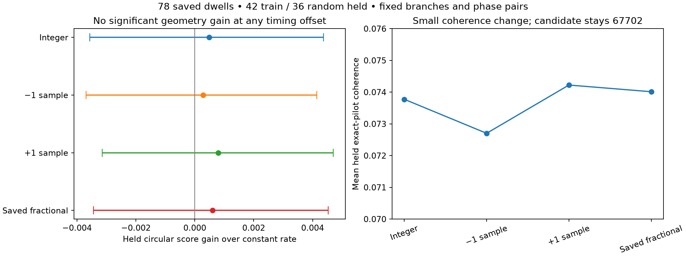

# Does timing alignment hide useful satellite phase information?

**The tested timing corrections do not recover a satellite-specific phase
constraint.** Replaying all 78 saved dwells with a one-sample shift in either
direction or the saved fractional epoch leaves the training-selected phase
candidate unchanged. Every held gain over constant rate remains consistent
with zero. This rules out these small frame-alignment changes as an explanation
for the negative [long-arc association result](2026_09_23_longarc_phase.md).

## Frozen comparison

The recording is `scan-fw-f0af018448538a4c`, receiver 0, channel 4 lower edge,
15 MS/s. The outer split remains seed 20260923: 42 training and 36 random held
whole dwells. All 24 frame opportunities per dwell, source CFO branches, and
baseline even-symbol eligibility are frozen. No variant can select a better
source branch, drop a difficult odd response, or change its phase-pair weights.

The variants are integer alignment, -1 sample, +1 sample, and the original
GLRT fractional epoch. Fractional interpolation uses the existing normalized
16-tap Lanczos sampler. Interpolation support remains inside each assigned
20 ms group and the saved dwell. Physical reference times include the applied
shift; no additional carrier rotation is introduced. The original integer
frame label remains an identity, not a claim that the shifted vector was
measured at that integer coordinate.

Every variant has exactly the original even and odd endpoint-pair lists.
Evaluation now asserts that equality, so a missing fold fails rather than
silently changing the comparison population. Local phase-advance intercepts
use calibration-even frames only. Candidate choice and the common receiver
frequency rate use only outer training dwells. Held odd data are used only for
scoring. The comparison retains the same conditional local-calibration scope
as the preceding report.

## Results

| Alignment | Training-selected candidate | Held exact coherence | Held circular gain over constant rate | Descriptive 95% interval |
|---|---:|---:|---:|---|
| Integer | 67702 | 0.073774 | +0.000483 | [-0.003561, +0.004369] |
| -1 sample | 67702 | 0.072703 | +0.000281 | [-0.003687, +0.004142] |
| +1 sample | 67702 | 0.074223 | +0.000794 | [-0.003142, +0.004699] |
| Saved fractional | 67702 | 0.074013 | +0.000599 | [-0.003442, +0.004533] |

Scores are mean cos(2 × phase residual), with equal group and then equal dwell
weight. The intervals jointly resample held dwells with seed 20260924 and 4000
draws while freezing trained models. Temporal correlation can make the intervals
optimistic. All intervals include zero, and no variant is selected from its
held result. The slightly higher coherence at +1 sample is a sensitivity
observation, not a newly chosen timing rule.

The [evaluation](figures/2026_09_23_longarc_timing/evaluation.json) retains every
candidate's rate, training score, held score, and per-dwell held scores. The
[replay](figures/2026_09_23_longarc_timing/frames.json.gz) retains the measured
folds, timing shifts, visit-relative and session-relative sample coordinates,
input hashes, and pilot/template/interpolation source hashes. A repeat with
the final provenance checks reproduces the first pass's numerical results.

## Implications for motion and position

This is an extraction-timing test, not an absolute-UTC or receiver-location
test. A constant within-dwell epoch shift cancels from adjacent pair durations.
It can still change the extracted tone vectors, which is why the re-extraction
was necessary. Larger timing errors, sample-clock drift, multipath, and errors
in source association are outside this particular test.

The geometry authority review also remains unchanged: the available nominal
8 cm mechanical spacing has no calibrated world-frame RF phase-center vector,
and differential receiver phase/delay stability has not been established.
The [receiver-identity reconstruction](2026_09_23_receiver_identity_mapping/README.md)
qualifies one RX1-only scan; it does not establish simultaneous source-bound
RX0/RX1 pairs across the long-block corpus. The
[long-block qualification](2026_09_23_long_block_qualification/README.md)
establishes input usability, not interferometric calibration. These records
therefore do not yet support a measured satellite direction/speed vector.

A separate [measurement-reliability test](2026_09_23_longarc_phase_reliability.md)
asks whether calibration-only phase instability predicts larger held CFO error
better than ordinary CFO scatter and control-pilot evidence. With a matched
uncertainty baseline and random inner validation, that test is also negative
on this arc. Position improvement remains unproven.

## Reproduction

Run `tools/research/replay_longarc_timing.py --limit 78` with
`PYTHONPATH=src:tools:.` in the numerical environment, bounded by `timeout 180s`.
Then run the same script with `--evaluate`, followed by
`tools/research/plot_longarc_timing.py`. Only existing IQ is read. Checkpoints
are keyed by the extraction source hash and are not part of the canonical
published replay.

Seven owned tests verify exact integer sample selection, fractional-shift sign
and carrier phase, interpolation support, immutable baseline eligibility, and
fail-closed pair population checks. Ruff and diff checks pass.
