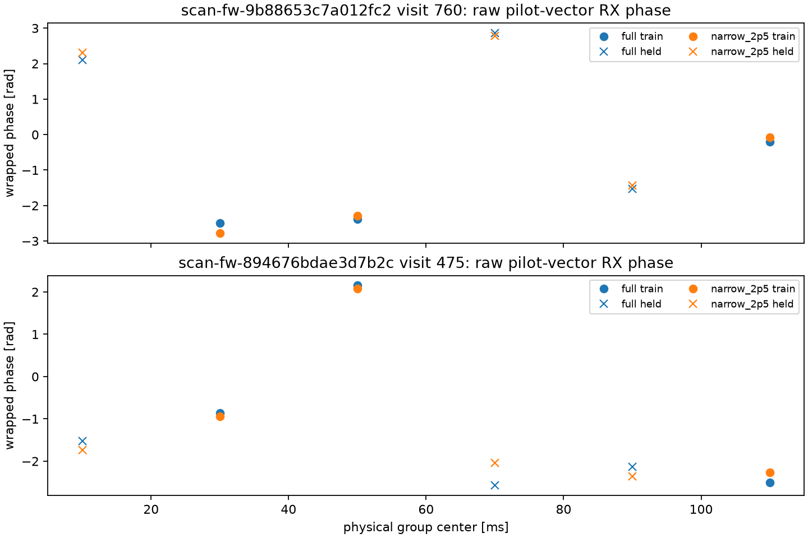

# Matched-bandwidth high-rate pilot replay

This bounded saved-IQ check used the existing 10 MS/s visit 760 of
`scan-fw-9b88653c7a012fc2` and 15 MS/s visit 475 of
`scan-fw-894676bdae3d7b2c`.  Both visits and their probe-0 rank-0 GLRT source
hypotheses were fixed by the earlier multirate inventory.  The replay reads
0.24 seconds total: two dual-RX 120 ms visits.

The 10/15 MS/s arm and an anti-aliased 2.5 MS/s version use the same physical
20 ms groups, each filtered separately after the prebound acquired-CFO NCO.
The NCO centres the fixed eight-tone 1.640625 MHz Qin pilot before decimation.
A 0.25 ms guard at each group edge prevents the filter from moving IQ across a
training/held boundary.  The full-rate arm has more samples in the same
physical interval; it does not have more known pilot tones.

## Retrospective development results

The initial seeded permutation was accidentally chronological and was viewed.
The nonchronological seeded split (`train=[1,2,5]`, `held=[0,3,4]`) was run
afterward, so the table is **retrospective development only**, not an
independent random-held-out validation.  Each held metric contains only three
whole groups; it has no useful uncertainty estimate or population conclusion.

| Visit | Arm | v1 held RMS / resultant (degrees) | v2 held RMS / resultant (degrees) | median exact projection RX0 / RX1 | median broadband RX coherence |
|---|---|---:|---:|---:|---:|
| 10 MS/s 760 | full | 85.8 / 0.828 | 73.0 / 0.848 | 0.0219 / 0.0070 | 0.00127 |
| 10 MS/s 760 | filtered 2.5 MS/s | 79.3 / 0.753 | 71.0 / 0.766 | 0.0429 / 0.0136 | 0.00331 |
| 15 MS/s 475 | full | 101.4 / 0.203 | 123.1 / 0.271 | 0.0168 / 0.0052 | 0.00207 |
| 15 MS/s 475 | filtered 2.5 MS/s | 110.2 / 0.077 | 109.6 / 0.327 | 0.0393 / 0.0120 | 0.00593 |

The original scorer incorrectly treated this complex-vector phase as modulo π.
It is ordinary modulo 2π: `angle(vdot(a0, a1))` distinguishes a π change.  The
table and the [rescored residual figures](figures/2026_09_23_matched_bandwidth_phase/v3-2pi-rescore/)
use the corrected scorer only; the original outputs remain unchanged for audit.

V1 used the preserved accidental chronological assignment; V2 is the later
nonchronological random assignment.  The comparison is not directionally
concordant: 10 MS/s favours narrow RMS in both views but full resultant in both;
15 MS/s reverses the RMS ordering and has very low, split-sensitive resultants.
The filtered arm has larger fitted pilot projection energies in these two
examples, while the phase metrics are mixed and weak.  The unmodelled
broadband RX coherence is very small in both arms; it is only a mixture/content
diagnostic and cannot be interpreted as source-isolated payload phase.  Neither
result supports a claim that high sample rate improves phase measurement, nor
that filtering improves it generally.  Frequency-dependent response and a
different phase reference after NCO/filtering also prevent interpreting the
full-vs-narrow phase offsets physically.

The [corrected scores](figures/2026_09_23_matched_bandwidth_phase/v3-2pi-rescore/results.json)
were generated only from the preserved rows; no IQ was reread.  The complete rows, including both arms, exact and rolled-template projection
energies, group IDs, usable samples, hashes, and all six group outcomes per
visit, are in [results.json](figures/2026_09_23_matched_bandwidth_phase/v2/results.json).
The original chronological realized split is retained at
`reports/figures/2026_09_23_matched_bandwidth_phase/results.json` for audit.
