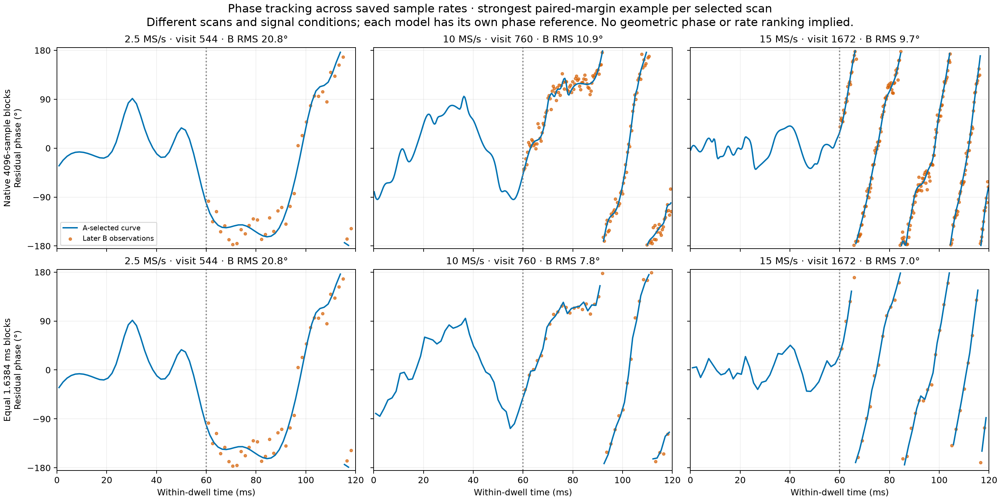
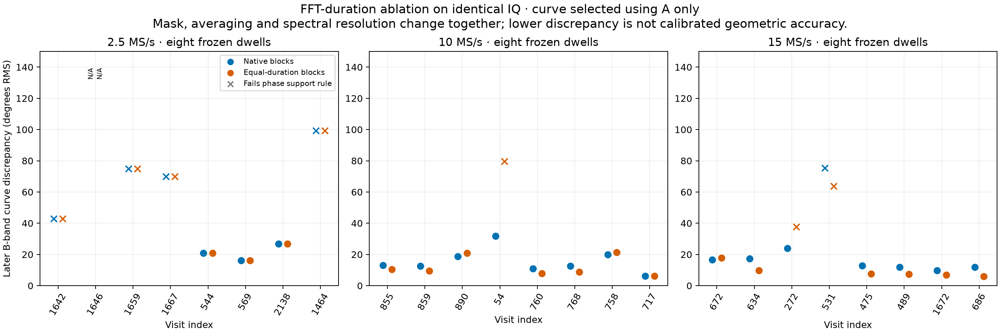

# Using phase for satellite association and motion constraints

Status: saved-IQ investigation and a proposed validation path. This does not
promote a named-satellite association, deploy a tracker, or claim a measured orbit.
The [scan-1aa phase report](2026_09_23_scan_1aa_phase_methods.md) is the starting
point. The numerical cross-rate findings below come from a frozen saved-IQ replay.

**Phase plus geometry can constrain satellite direction and motion.** The most
promising combination is calibrated differential phase for baseline-projected
direction/angular motion, per-receiver Doppler for radial motion, and a candidate
orbit for range and dynamics. The saved data support local phase extraction at
all three rates; they do not yet isolate the geometric component of that phase.

## Measured 2.5 / 10 / 15 MS/s examples

All five scans are 300-second pre-rotation recordings from the same radio. The
anchor is the user-requested scan. The nearest preceding 10 and 15 MS/s recordings
are included even though their receiver overlap is poor. To examine actual
high-rate phase behavior, one additional scan at each high rate was selected by
the largest `min(RX0 detections, RX1 detections)` in the **previously frozen**
[eight-hour table](figures/2026_09_23_eight_hour_glrt/per-recording.csv), among scans
complete in that table. No phase result entered that capture selection.

| Scan suffix | Rate | Capture start UTC | Analyzed visits | RX0 / RX1 passing candidates | Paired visits | Existing phase support |
| --- | ---: | --- | ---: | ---: | ---: | ---: |
| `1aa1d50103d97388` | 2.5 MS/s | 14:30:28 | 2,215 | 639 / 2,414 | 186 | 26 / 64 |
| `25454cd8b0e8d9d1` | 10 MS/s | 14:10:02 | 2,225 | 4 / 2,412 | 0 | No selected pairs |
| `ef23302fda59d403` | 15 MS/s | 14:00:02 | 1,623 | 1 / 1,454 | 0 | No selected pairs |
| `9b88653c7a012fc2` | 10 MS/s | 10:50:29 | 2,227 | 2,109 / 785 | 189 | 57 / 64 |
| `894676bdae3d7b2c` | 15 MS/s | 08:52:29 | 1,622 | 1,390 / 421 | 112 | 57 / 64 |

Every suffix has the prefix `scan-fw-`. Existing phase support is conditional on
the strongest-64 selection, not all scan visits. The 15 MS/s inventories cover
1,623 of 2,234 and 1,622 of 2,228 device-started visits respectively; the table's
counts describe available analyzed visits, not equal complete observation time.
Their device terminal reports zero dropped events, which does not by itself
establish full saved-IQ coverage. No unseen visit is counted as a failed detection.
The nearby high-rate scans have no accepted receiver pairs, so their phase
comparison is unavailable, not zero error. The newer inventory also resolves
the two analyses that were still incomplete in the earlier eight-hour report.

For each scan with pairs, freeze the two highest paired GLRT margins per RF
channel: eight dwells per scan, 24 total. Reuse the original 2.5 MS/s evidence;
replay the same complete method pipeline on the 16 high-rate dwells. There are
2.88 seconds of selected IQ per receiver across the three scans, not a replay
of all 1,500 seconds of recording. The original one-dwell abstention is retained.
All eight anchor dwells use upper channel edges; all sixteen selected high-rate
dwells use lower edges. This is an additional RF-band/edge confound, not an
equal-signal sampling-rate experiment.

| Rate / paired example | Native supported / selected | Median supported spline B RMS | Median refined pilot/scalar RMS | Pilot-comparable supported dwells |
| --- | ---: | ---: | ---: | ---: |
| 2.5 / `1aa1…` | 3 / 8 | 20.8° | 4.4° | 3 |
| 10 / `9b88…` | 8 / 8 | 12.8° | 2.7° | 7 |
| 15 / `8946…` | 7 / 8 | 12.9° | 3.3° | 6 |

These are internal discrepancies, not angle, position, or speed errors. The
phase-support gate is unchanged: B coherence exceeds both 0.05 and three times
the wrong-time control, and B residual resultant exceeds 0.8. The pilot check
is separate and does not select support. For example, 10 MS/s visit 758 passes
broadband support but has 32.3° pilot discrepancy from only one later probe;
10 MS/s visit 54 and 15 MS/s visit 272 have no later pilot comparison. Small
medians must not hide these failures or scarce pilot support.

### Equal-duration block ablation

The native pipeline fixes 4096 samples, corresponding to **1.6384 / 0.4096 /
0.2731 ms** at 2.5 / 10 / 15 MS/s. On the same selected IQ, a second run used
4096 / 16384 / 24576 samples so every block spans 1.6384 ms. All dwell selections,
60 ms training boundaries, numerical functions and support thresholds stayed
fixed. The longer FFT also changes bin spacing, smoothing bandwidth, masks and
A/B groups; this is an algorithm-configuration ablation, not an isolated SNR test.

| Rate | Native support | Equal-duration support | Same-support subset | Median spline B RMS on that identical subset: native → equal duration |
| --- | ---: | ---: | ---: | ---: |
| 2.5 MS/s | 3 / 8 | 3 / 8 | 3 dwells | 20.8° → 20.8° |
| 10 MS/s | 8 / 8 | 7 / 8 | 7 dwells | 12.6° → 9.5° |
| 15 MS/s | 7 / 8 | 6 / 8 | 6 dwells | 12.4° → 7.5° |

The same-subset medians avoid claiming an improvement merely by dropping the
hardest dwell. There is still a coverage tradeoff: 10 MS/s visit 54 changes
31.8° → 79.7° and loses support; 15 MS/s visit 272 changes 23.9° → 37.7° and
loses support. Other individual discrepancies increase as well. Longer blocks
are therefore a promising option, not a universally better replacement.



The displayed visit at each rate has the highest phase-blind paired margin in
its selected scan. Each row/model has its own carrier and response reference;
compare its B agreement, not absolute phase offsets between models or captures.



**Rate conclusion:** both 10 and 15 MS/s can produce strong local phase tracks;
the 2.5 MS/s anchor also contains useful tracks. These selected high-rate scans
perform better internally than the anchor, but sky, channel mixture, receiver
imbalance, retained coverage and selection differ. There is no measured causal
ranking of sampling rate, and 15 MS/s does not establish an advantage over
10 MS/s in the native comparison. The nearby scans show that simultaneous
receiver signal support can be the limiting factor. A genuine rate comparison
should additionally filter/decimate the same retained high-rate IQ to common
physical RF bands, with an alias-free overlap and explicitly matched estimator
durations; that controlled bandwidth experiment was not performed here.

## Which measurement answers which question?

The current plots measure **receiver-differenced phase**, RX1 − RX0, after a
fitted relative carrier and spectral response have been removed. For the same
signal observed at two nearby antennas, most propagation Doppler and transmitter
phase cancel in this difference. It is valuable evidence about common waveform
support and, after calibration, differential path geometry. Its derivative is
not the satellite's radial speed.

Let `b = r1 − r0` be the baseline, `u` the receiver-to-satellite unit vector, and
`k = 2π fRF/c`. With received propagation phase `−k ρ`, the leading far-field
model for RX1 × conj(RX0) is

```
φ10,s(t) = k_s b·u_s(t) + ψ10(t, f_s) + ε_s(t)        modulo 2π
dφ10,s/dt / (2π) = (f_s/c) b·du_s/dt + receiver/channel terms
```

Here `ψ10` includes differential receiver/LO phase and the frequency-dependent
electrical path. For moving antennas, the derivative also contains `db/dt·u`.
The fixture's 8 cm **mechanical** separation is not a measured RF phase-center
baseline, and the recorded receiver mapping is provisional.

There is an additional identifiability issue in the current implementation:
independently fitting the spectral response per dwell can absorb constant
geometric phase, while the relative-carrier fit can absorb its slope. The plotted
residual spline is not a preserved absolute interferometric observable. A
geometry-aware estimator must retain the original complex phase reference and
every applied carrier/response rotation, and constrain the instrumental response
jointly across sources/times or calibrate it independently. Giving every
candidate a free phase offset and phase rate erases the very direction and
motion information we want to test.

The complementary per-receiver carrier observable is

```
fobs,r,s(t) = −(f_s/c) dρ_s/dt + ftx,s(t) − flo,r(t) + alias + ε
```

Only after estimating or constraining the transmitter/receiver frequency terms
can `−(c/f_s) fDoppler` be interpreted as line-of-sight range rate. That is one
component of relative velocity, not total orbital speed. A receiver-difference
phase curve and a per-receiver carrier-phase/frequency curve are different
observables and must remain separate in reports and contracts.

## Turning geometric phase into direction and speed

For known electrical calibration and a chosen wrap branch, phase measures
`b·u = (φ10 − ψ10)/k`. Its time derivative supplies a second observable. With
range `R` and relative satellite/receiver velocity `vrel`,

```
du/dt = (I − u uᵀ) vrel / R
fΔ,geometry = (1/2π) dφ10/dt
            = (fRF/cR) bᵀ (I − u uᵀ) vrel.
```

Thus the measurement constrains **transverse velocity projected along the
baseline's tangent-plane component**. Per-receiver Doppler independently
constrains `uᵀ vrel`, once its frequency biases are accounted for. At one instant,
one baseline plus radial Doppler gives at most two velocity projections. A
second nonparallel calibrated baseline or changes in geometry over a dynamic
arc can supply the missing information. An orbit prior also links direction,
range, speed and acceleration rather than treating each sample independently.

For illustration only, use the channel-3 RF center 11.4403125 GHz, an 8 cm
baseline entirely perpendicular to the line of sight, and 500 km range. A
**0.04 Hz geometric differential frequency** would mean about **6.55 km/s**
projected transverse speed. This is a sensitivity calculation, not a measured
speed from these scans. Changing the assumed range or baseline projection
changes the inferred speed proportionally.

Under the illustrative bounds `|vrel| ≤ 8 km/s` and `R ≥ 500 km`, that geometry
allows about **0.049 Hz**, or **2.11° over 120 ms**, of differential geometric
phase change. Those assumptions are not universal bounds for all possible
orbits. The observed residual excursions are much larger, and the fitted
receiver offsets are approximately −674 to −678 kHz. Neither can be substituted
for the geometric differential frequency without removing receiver/channel and
ambiguity terms.

This also explains why time span matters. If two independently calibrated phase
endpoints each had 10° standard error, the same illustrative geometry would
give projected-speed uncertainty about **53.6 km/s at 0.12 s**, **6.43 km/s at
1 s**, and **0.643 km/s at 10 s**. These are assumed-error propagation examples,
not uncertainty estimates for our spline or pilot measurements. Longer *verified*
phase arcs, simultaneous double differences, and tighter electrical calibration
are more directly useful for this motion observable than sample rate alone.

## The strongest near-term association use

1. **Verify a shared waveform before linking receiver detections.** Start with
   the existing phase-blind timing/frequency pair candidates. Fit carrier and
   response on an initial temporal partition, track on A frequency groups, and
   check B groups and wrong-time controls. Preserve abstentions. This tests
   whether a coherent common signal exists; it does not identify a NORAD object.
2. **Require evidence beyond a shared pilot pattern.** The known edge pilots
   repeat across satellites. Evaluate withheld non-pilot occupied bins, wrong
   candidate pairs, and same-channel different-dwell controls. A flexible tracker
   can follow unrelated mixtures; positive waveform coherence alone must not be
   mislabeled as a satellite ID. Multiple signals also require source-specific
   isolation before a broadband phase can be attached to one source.
3. **Use relative frequency to expose alias or receiver-pair mistakes.** A
   common broadband offset authority makes the pilot reference more consistent
   in scan 1aa. Build a joint receiver-offset model from qualified pairs, with
   explicit uncertainty and retune boundaries; retain competing integer alias
   branches. Do not fit an independent unrestricted offset to every proposed
   satellite and then count its good fit as association evidence.
4. **Add geometric phase only after calibration.** Score candidate ephemeris
   directions with a circular likelihood. Fit calibration on other dwells and
   validate on unseen times/sources. Marginalize wrap/π branches rather than
   selecting whichever branch makes the preferred candidate fit. Use the known
   receiver position for initial association validation; do not simultaneously
   let receiver position, satellite orbit, clock, and phase calibration move
   freely to explain the same short arc.

For a truly simultaneous two-source observation, form

```
Dsq = φ10,s − φ10,q
    ≈ (2π/c) [f_s b·u_s − f_q b·u_q] + differential frequency calibration.
```

The common receiver phase cancels only to the extent that both measurements
share time and receiver electronics. Frequency-dependent delay does not cancel
between arbitrary frequencies. Correct asynchronous centers with local measured
rates and propagate their uncertainty. The three existing scan-1aa double
differences share no direct frames and retain π ambiguity; they are local
hypotheses, not connected satellite tracks. With three sources, closure can
detect inconsistent measurements but is an algebraic consistency check, not
independent proof of satellite identity.

## Orbit and relative-speed information

**First improve the source-bound frequency observations.** Within-frame pilot
phase slopes can estimate per-RX CFO without requiring phase continuity between
frames. The existing repository's
[frame-phase investigation](2026_08_25_frame_phase_rate_investigation.md) found
that independent frame CFO was more reliable than general phase feedback.
Its [Doppler/linking review](2026_08_25_doppler_rate_and_satellite_linking_method_review.md)
also separates local measurements from counterless legacy arcs. Use the current
device-counter timing, not concatenated stored samples across retunes.

For a short verified coherent arc, combine frequency and phase with a local
model `φ(t)=φ0+2π[f0 Δt+0.5 fdot Δt²]`. A spline is useful for describing residual
receiver phase and detecting discontinuities; differentiating a flexible spline
does not turn it into an orbital-speed measurement. Any phase-derived correction
must improve withheld per-frame CFO prediction over the frequency-only baseline.
Retain a free phase intercept per proven continuity segment and terminate phase
connection on a slip, frame-reference change, or retune.

Once several source-associated observations span enough physical time, compare
their CFO/rate/curvature with propagated candidate orbits. Estimate receiver
frequency bias/drift jointly across sources; allow transmitter steps only under
a predeclared change model. Keep clock/timing priors explicit. Fit a small orbit
correction around a catalog prior only when the measurement Jacobian supports it
(for example an along-track/time correction), rather than fitting six orbital
elements plus station position and clocks to one short arc. Assess singular
values after eliminating nuisance parameters and report unobservable directions.

A calibrated baseline projection constrains direction on a cone with spatial
phase ambiguities. It cannot by itself determine azimuth, elevation, range, and
velocity. Combine it with Doppler evolution, timing evidence where qualified,
multiple satellites, and additional independently calibrated baseline directions.
Receiver-position refinement should fix or tightly constrain satellite orbits;
orbit refinement should first fix the station. A joint solution needs additional
information, not merely more optimizer iterations.

The five capture UTC anchors are host-bracketed to approximately **±0.182 s**;
their device counters preserve sample continuity and relative elapsed time at
the nominal sample rate, not a sub-millisecond absolute UTC epoch. Sample-clock
scale uncertainty still needs calibration. Treat each scan's UTC shift as a
bounded shared nuisance.
At 8 km/s, 0.182 s corresponds to about 1.46 km of along-track propagation;
that is a timing sensitivity, not an estimated position error. Arbitrary per-track
time shifts would hide association/orbit errors and must not be silently fitted.

## The 180° rotation experiment

For the same source direction at comparable time, an ideal reversal of the
world-frame baseline reverses geometric differential phase. Tomorrow's sky,
satellite identity, and direction will differ, so comparing raw phases across
days is not this test. Use propagated directions and the actual rotation axis
to predict the changed baseline projection. An arbitrary 180° rotation need not
negate all baseline components. Separate pre/post electrical offsets and preserve
the documented transition exclusion.

First establish whether the weak detection stream stays attached to RX0 or
follows the physical pointing side, using the existing GLRT-count protocol.
Record cable continuity, physical receiver mapping, and array orientation. For
phase, compare geometry-conditioned circular residuals after those checks.
A changed count distribution can diagnose coverage/hardware but cannot itself
calibrate phase or prove an orbit association.

## Concrete promotion experiment

Freeze complete scans into development and unseen-day evaluation sets, stratified
by rate, RF channel, receiver imbalance, and rotation state. The five scans in
this report are development examples, not a random sample or independent truth.

| Candidate change | Baseline | Required evaluation |
| --- | --- | --- |
| Phase-supported receiver pairing | Timing/CFO pair rules | Correct-pair retention versus wrong-pair and wrong-time acceptance; abstentions included |
| Joint receiver-offset/alias constraint | Independent alias decisions | Withheld pilot/CFO residuals, branch stability, false-pair controls |
| Equal-duration phase blocks | Fixed 4096 samples | Same-dwell support, B discrepancy, bandwidth and runtime; no retuning on B results |
| Phase-aided local frequency | Independent frame CFO | Future/withheld-symbol CFO prediction, slip rate, coverage, bias under synthetic known motion |
| Calibrated phase candidate score | Existing Doppler-only candidate score | Held-out candidate ranking and null separation; independently known IDs where available |
| Position/orbit refinement | Frozen Doppler-only search and orbit prior | Held-out time/frequency fit, receiver-position reference error, nuisance/geometry rank, sensitivity to catalog epoch |

Keep the Doppler search candidate set, initial grids, and computation budget fixed
for the phase ablation. Otherwise better coarse-cell coverage can masquerade as
a benefit from phase. Count both conditional accuracy and overall retained
coverage; a method must not win by discarding difficult scans. A lower residual
against the candidate used to fit phase calibration is not an independent test.

## Artifacts and verification

The [evidence directory](figures/2026_09_23_phase_multirate/) contains the frozen
[capture/visit selection](figures/2026_09_23_phase_multirate/selection.json),
[summary](figures/2026_09_23_phase_multirate/summary.json),
[all-dwell CSV](figures/2026_09_23_phase_multirate/per-dwell.csv), and
[validation receipt](figures/2026_09_23_phase_multirate/validation.json).
The renderer regenerates the PNGs from frozen evidence. Source digests and
saved-IQ hashes accompany the numerical replay; equal-duration replay verifies
the same IQ hashes. Nineteen overlapping successful native replay rows exactly
match existing production phase evidence. The two new full-method runs took
approximately 146 and 282 seconds; equal-duration replay took 21 seconds.
Twenty existing numerical tests passed again after the cross-rate replay.
Compressed artifact hashes, JSON decoding, report links, PNG signatures, frozen
selection counts and equal physical FFT durations were verified; both new PNGs
were visually inspected. Large numerical evidence is committed losslessly
compressed, with reproduction instructions in the evidence directory.
No new RF was collected, no production estimator was changed, and no claimed
satellite identification or measured speed was fabricated from a conditional fit.

## External checks

Qin and colleagues' signal model distinguishes frame, carrier, and sample clocks,
and retains a frame-specific phase term that is not successfully modeled across
all frames and satellites. It also describes edge pilots shared across frames
and satellites. These points support using local phase without assuming a
globally continuous satellite-specific carrier reference.
[Primary paper](https://www.nature.com/articles/s44459-026-00075-6).

Kozhaya, Saroufim and Kassas report corrections in OFDM navigation observables
and substantial carrier-phase slips; their Doppler treatment explicitly handles
frequency corrections. Our shared-residual agreement does not remove those
physical nuisance terms.
[Authors' ION presentation summary](https://www2.ion.org/publications/webinar-kozhaya.cfm).

Stock, Schwarz and Knopp's error analysis identifies orbit errors as a major
limitation and relates short-term clock effects to integration duration. This
reinforces testing equal physical durations and propagating ephemeris uncertainty.
[Primary conference abstract](https://www.ion.org/publications/abstract.cfm?articleID=20093).
