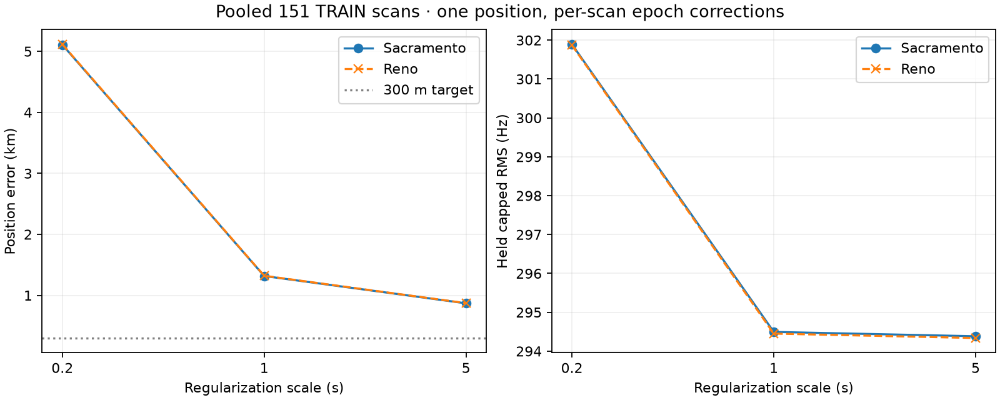

# Pooled TRAIN position: more diversity still does not establish 300 m

Fitting one position across both frozen TRAIN groups gives 869–872 m error at
the weakest tested regularization. All six fits satisfy the declared stopping
rule and have no timing-boundary or visibility failures. None reaches 300 m.

| Per-scan epoch scale | Sacramento error | Reno error | Held capped RMS, Sac / Reno |
|---|---:|---:|---:|
| 0.2 s | 5.109 km | 5.116 km | 301.89 / 301.87 Hz |
| 1 s | 1.317 km | 1.321 km | 294.50 / 294.45 Hz |
| 5 s | 0.869 km | 0.872 km | 294.38 / 294.34 Hz |



The fit includes all 151 TRAIN scans and 6,988 tracks from the two disjoint
eight-hour groups. These groups are separated in wall-clock time and do not
represent sixteen continuous captured hours. It retains the original blind
baseline identities, one CFO per track, original randomized frequency masks,
duration weighting, capped loss, zero altitude and one bounded epoch nuisance
per scan. No catalogue reassignment occurs. Starting position is the arithmetic
mean of the sealed group coordinates expressed relative to the same prior;
starting epoch terms come from each sealed group fit at the same scale.
No reference coordinate is used for initialization or fitting.

At scale 5 s, the separate groups were about 1.57 and 1.10 km away; pooling
reduces this to about 0.87 km. At scale 1 s, pooling gives about 1.32 km versus
2.24 and 0.887 km separately. All settings remain reported; no winner is selected
by known location. Two starts on the same data are not independent trials.

The fit reuses the existing bounded Schur solver. Exact full TRAIN membership,
exclusion of VAL/TEST, numerical sources, input seals, cache hashes and globally
unique track IDs are checked. Inference took 22.32 s with four workers, excluding
post-seal scoring. All arms are sealed before complementary-frequency and
reference evaluation. This is a local conditional fit, not a new blind global
search or an independent validation result. Timing terms remain empirical model
corrections, not calibrated capture-clock measurements.

Reproduce after preserving the existing `results` directory (fresh output is
required), from the repository root:

```bash
OPENBLAS_NUM_THREADS=1 OMP_NUM_THREADS=1 .venv/bin/python \
  reports/2026_09_23_pooled_train_position/run.py
.venv/bin/python reports/2026_09_23_pooled_train_position/plot.py
.venv/bin/pytest -q tests/tools/test_pooled_train_position.py \
  tests/tools/test_long_full8h_shared_epoch_position.py
```

Three tests pass, including rejection of duplicate track IDs that could alias
the solver's active-set bookkeeping. Machine-readable `summary.json` and sealed
inference/results preserve all six configurations and diagnostics. No validation
or test evidence was opened, no production change deployed and no RF collected.
