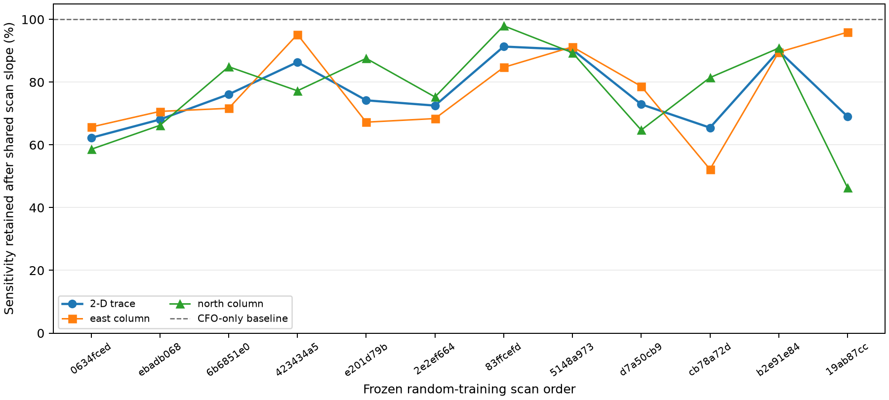

# Position sensitivity under CFO and scan-slope nuisance

This bounded, training-only audit asks a narrow structural question: after a
separate constant CFO is allowed for every track, how much local east/north
Doppler sensitivity is also explained by one shared linear frequency slope per
scan? It uses the first 12 sessions in the frozen random-group training order,
the existing conditional caches, and the public research `prediction_for_track`
function. No reference coordinate, position error, validation, test, or
prospective recording is read.

At each scan's published lower-residual Sacramento-or-Reno seed, each track's
candidate, integer tau, and training-row CFO are selected from randomized
training rows only. The candidate and tau are then held fixed. Central finite
differences at plus/minus 100 m east and north provide two local Doppler
derivative columns in Hz/m. This is conditional local sensitivity: it does not
average over candidate or timing switches. Selected taus cover the full
`[-5, +5]` s support; 6.70% of derivative rows use a boundary tau.

For each scan, the calculation first removes a track indicator (one free CFO
intercept per track). It then removes one scan-wide time column, with time
centred within each track, which is equivalent to profiling a common frequency
slope after the CFOs. The reported information is the unweighted matrix
`D' M D`, in Hz²/m², where `M` performs those projections. It is descriptive
linear algebra, with no residual-variance model, so it is **not a CRLB** and
does not imply a metre-level accuracy or a sub-300-m guarantee.

| Aggregate, 12 scans / 442 tracks / 6,817 training rows | CFO only | CFO + one slope per scan |
|---|---:|---:|
| Smallest information eigenvalue (Hz²/m²) | 2.4312 | 1.9261 |
| Largest information eigenvalue (Hz²/m²) | 3.1215 | 2.3850 |
| Condition number | 1.284 | 1.238 |
| Trace (Hz²/m²) | 5.5527 | 4.3111 |

Profiling the shared slopes retains 77.64% of aggregate trace sensitivity, so
the slope absorbs 22.36% in this conditional design. By scan, retained trace
sensitivity ranges from 62.25% to 91.34% (median 73.57%). The weakest direction
retains 47.14% to 98.93% of its CFO-only eigenvalue across scans (median
73.13%). Thus a scan slope can materially remove local geographic signal,
though the two-dimensional aggregate remains numerically balanced in this
sample rather than collapsing into a single weak direction.

This does not identify physical receiver drift. A fitted slope can also absorb
timing error, orbit error, mistaken conditional identity, and within-track
curvature. Moreover, the frozen discrete candidate/tau choices omit switch
boundaries and their uncertainty. These effects limit the conclusion to whether
the stated nuisance model can locally reduce geographic derivative content;
they do not quantify generalization under drift.

The full row-level derivatives, per-scan matrices/eigensummaries, source
digests, frozen partition digest, cache/scans-manifest digests, and tool/helper
digests are in [results/drift_identifiability.json](results/drift_identifiability.json).



The plot's vertical axis is retained sensitivity as a percentage of the
CFO-profiled value; it is not an accuracy or confidence scale. It is reproduced
from the saved JSON alone with [render_retention.py](render_retention.py), and
[results/render_manifest.json](results/render_manifest.json) binds the input,
renderer, and PNG digests.

The audit helper is [helper/drift_information.py](helper/drift_information.py),
with a focused algebraic test at
[tests/tools/test_position_drift_identifiability.py](../../tests/tools/test_position_drift_identifiability.py).

Reproduce into a fresh directory:

```bash
OPENBLAS_NUM_THREADS=1 OMP_NUM_THREADS=1 MKL_NUM_THREADS=1 \
  .venv/bin/python reports/2026_09_23_position_drift_identifiability/audit_position_drift_identifiability.py \
  --manifest reports/2026_09_23_position_random_group_split/manifest.json \
  --replication-root reports/2026_09_23_day_position_validation/replication \
  --joint-tool tools/research/sixteen_joint_compare.py \
  --output <fresh-output-directory>
```
