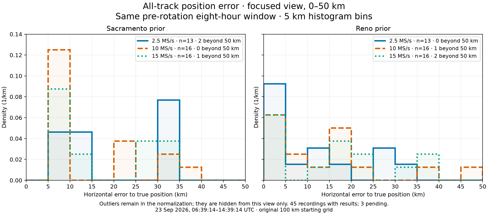
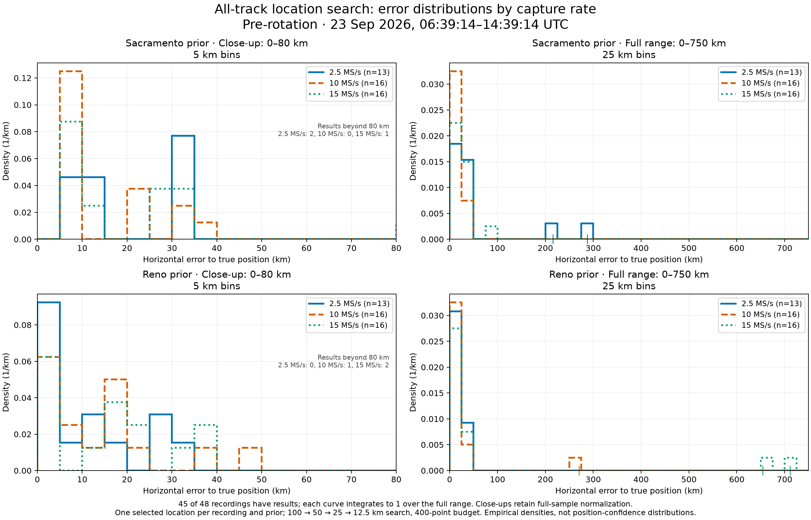

# All-track position error by capture sample rate

Date: 2026-09-23. Radio: `radio_pluto_19f2` (r21).
Capture-start window: **2026-09-23 06:39:14 UTC inclusive to 14:39:14 UTC exclusive**.
This is the same pre-rotation cohort as the
[eight-hour GLRT baseline](2026_09_23_eight_hour_glrt_rotation_baseline.md).
No new RF was collected, no localization was rerun for these histograms, and
production settings are unchanged.

## Conclusions

**Higher capture sample rate did not consistently produce lower location error
in this cohort. The ranking depends on the search prior.**

- **Sacramento: 10 MS/s performed best on the reported summaries.** Its median
  error was 6.7 km, compared with 14.0 km at 15 MS/s and 31.2 km at 2.5 MS/s.
  All 16 of its results were within 50 km; 10 were within 10 km. Its largest
  error was 39.8 km, compared with 84.8 km at 15 MS/s and 287.8 km at 2.5 MS/s.
- **Reno: 2.5 MS/s performed best on those summaries.** Its median error was
  9.4 km, compared with 13.0 km at 10 MS/s and 18.9 km at 15 MS/s. All 13
  results were within 50 km. The 10 MS/s group had one error above 50 km;
  the 15 MS/s group had two, at approximately 654 and 711 km.
- **15 MS/s shows no demonstrated localization advantage over 10 MS/s here.**
  Both priors have higher median and mean error at 15 MS/s, and fewer results
  within 10 km or 50 km. This describes the observed recordings; it does not
  prove that increasing the rate caused the degradation.
- **These data do not support choosing one universally best rate.** The
  Sacramento result favors 10 MS/s, while Reno favors 2.5 MS/s. Resolve the
  search's sensitivity to initial grid coverage before interpreting this as
  a hardware or estimator sample-rate ranking. Keep both 2.5 and 10 MS/s in
  follow-up comparisons; this cohort alone does not justify prioritizing
  15 MS/s for better position accuracy.

## Focused density histograms



The display is truncated to **0–50 km**, with identical 5 km bins and matched
axes for both priors. Each rate has its own curve. An observation is the
**selected location for one recording under one prior**, not an individual
track, a grid evaluation, or the finest-resolution candidate.

Density is `bin count / (all available recordings at that rate × bin width)`.
Outliers are hidden from this view only and remain in the denominator. Thus
the visible area can be less than one. The legend lists the number beyond
50 km for each curve. These are empirical distributions across recordings,
not a probability density or confidence region for any individual location.

The baseline contains 48 captures and **45 completed diagnostic publications**:
13/15 at 2.5 MS/s, 16/17 at 10 MS/s, and 16/16 at 15 MS/s. The same 45 recordings
contribute to each prior. The other three publications were pending when
extracted; they are not treated as zero-error or failed-location observations.
Their session IDs and original analysis coverage are in the linked GLRT report.

## Full-sample error summaries

All statistics below include outliers; none are computed from the truncated
plot alone. Errors are horizontal distances to the reference receiver location.

| Prior | Rate | Results | Median error | Mean error | Within 10 km | Within 50 km | Maximum error |
| --- | ---: | ---: | ---: | ---: | ---: | ---: | ---: |
| Sacramento | 2.5 MS/s | 13 | 31.2 km | 55.5 km | 3/13 (23.1%) | 11/13 (84.6%) | 287.8 km |
| Sacramento | 10 MS/s | 16 | 6.7 km | 14.6 km | 10/16 (62.5%) | 16/16 (100%) | 39.8 km |
| Sacramento | 15 MS/s | 16 | 14.0 km | 20.9 km | 7/16 (43.8%) | 15/16 (93.8%) | 84.8 km |
| Reno | 2.5 MS/s | 13 | 9.4 km | 12.5 km | 7/13 (53.8%) | 13/13 (100%) | 30.2 km |
| Reno | 10 MS/s | 16 | 13.0 km | 31.0 km | 7/16 (43.8%) | 15/16 (93.8%) | 270.3 km |
| Reno | 15 MS/s | 16 | 18.9 km | 100.4 km | 5/16 (31.2%) | 14/16 (87.5%) | 711.2 km |

The large difference between Reno's 15 MS/s mean (100.4 km) and median
(18.9 km) reflects two severe misses. Truncating the x-axis makes central
differences easier to see, but does not remove those failures from the assessment.



The full-range panels use 25 km bins through 750 km. The companion close-up
panels use 5 km bins through 80 km. Both preserve full-sample normalization.

## What the comparison does and does not establish

All 45 documents use `scanner-adaptive-tle-position-v2` and the same
configuration digest:
`sha256:d1061681332535d7a6dd17ef59052448e0d66c719e21df4521f16ae81b5af529`.
The search uses 100 → 50 → 25 → 12.5 km levels and a 400-point budget for each
prior, with a 250 km radius around Sacramento and 500 km around Reno. **All
90 prior-specific searches are budget-limited and incomplete.** This is the
original production configuration, not the isolated 50 km starting-grid replay.

All eligible tracks (at least three seconds and six observations) contribute
to the duration-weighted, capped residual score. Eligible tracks differ between
recordings. The reference position is used only after selection to calculate
error. The score selects candidate satellite identities on evaluation RMS and
is not an independently calibrated likelihood. These remain diagnostic
locations rather than confirmed position fixes.

Several factors limit a causal conclusion about sample rate:

1. The 13–16 recordings per rate are different captures, not the same signal
   simultaneously captured at every rate. Satellite activity, track evidence,
   target exposure, time, and capture/analysis behavior may differ. Adjacent
   recordings may be correlated; no independent-sample significance claim is made.
2. Sacramento and Reno results are paired outputs from the same recordings,
   not independent replications. Their distinct grid alignments and search
   extents can lead the bounded search to different regions. Do not pick whichever
   prior happened to be closer to truth and call that an operational accuracy result.
3. Errors occur at a finite set of sampled positions. Repeated histogram values
   partly reflect grid quantization, not demonstrated sub-grid precision or an
   intrinsic error floor for a particular sample rate.
4. A known example in this cohort, `scan-fw-9a10ab698717f70d`, improved its
   Sacramento error from 287.8 to 22.3 km solely by changing the starting grid
   to 50 km, with unchanged tracks and scoring. See the
   [bounded replay report](2026_09_23_scan_9a10_50km_localization.md). This directly
   establishes a search-coverage contribution to that outlier, but does not
   diagnose the other large misses.
5. Missing publications affect the 2.5 and 10 MS/s groups. Freeze this snapshot
   and label any later complete-cohort update separately. Do not silently fill
   pending cases with zero or drop outliers when comparing means or success rates.

For the next comparison, retain the same rate/prior summaries, complete-analysis
denominators, full-sample statistics, and histogram bins. Report pre/post rotation
separately using the confirmed boundary in the
[geometry log](../deploy/station/GEOMETRY_NOTES.md). A bounded replay of existing
captures with consistent wider initial coverage would help distinguish sample-rate
effects from search failures; no such cohort-wide replay was performed here.

## Evidence and validation

- [Verified publication summaries and coverage](figures/2026_09_23_position_error_by_rate/position-histogram-evidence.json)
- [One row per recording and prior](figures/2026_09_23_position_error_by_rate/position-errors.csv)
- [Numerical summary statistics](figures/2026_09_23_position_error_by_rate/position-error-statistics.json)
- [Histogram counts, bin edges and densities](figures/2026_09_23_position_error_by_rate/position-error-histogram-bins.json)
- [Focused plot PDF](figures/2026_09_23_position_error_by_rate/position-error-density-focused.pdf)
- [Full-range plot PDF](figures/2026_09_23_position_error_by_rate/position-error-density.pdf)

The read-only position store verified publication seals and document digests.
Every included document was checked against its original capture-manifest
digest and its declarations that truth was not used for inference and no
position fix is claimed. Horizontal errors were independently recomputed from
the selected coordinates and reference coordinates using the pipeline's
6,371,008.8 m spherical radius; agreement was within 0.00001 m.
There were no extraction errors. The common configuration, 90 CSV rows,
per-rate counts, histogram mass, summary values, and report links were checked.

Regenerate the figures from the committed evidence with a Python environment
containing NumPy and Matplotlib; no scan storage or radio access is needed:

```bash
python reports/figures/2026_09_23_position_error_by_rate/plot_position_error_histograms.py
python reports/figures/2026_09_23_position_error_by_rate/plot_position_error_focused.py
```
