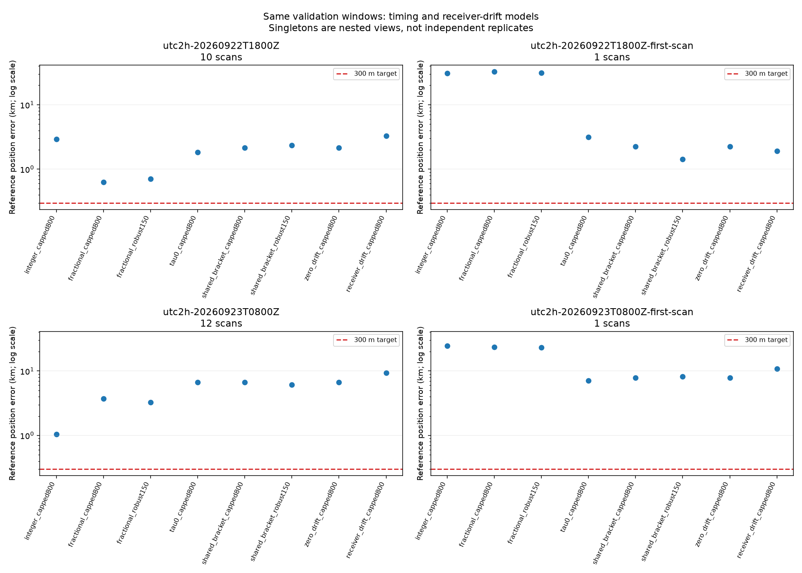

# Position generalization: timing and receiver drift

The receiver-drift experiment does not improve generalization and should not be
promoted as the default position model. Sub-300 m performance remains unproven.
The earlier favorable development example is not replicated by these validation
groups.

| Validation support | Shared-timing control | Receiver drift | Reserved capped RMS, control → drift |
|---|---:|---:|---:|
| Sep 22 18Z, 10 scans | 2.154 km | 3.284 km | 250.61 → 228.78 Hz |
| Nested first scan | 2.241 km | 1.917 km | 184.12 → 185.20 Hz |
| Sep 23 08Z, 12 scans | 6.640 km | 9.291 km | 272.09 → 259.85 Hz |
| Nested first scan | 7.861 km | 10.854 km | 300.80 → 312.69 Hz |

These are the same two randomized validation groups and their correlated singleton
views, not four independent trials. Ridge strength 1,000 s² was chosen using inner
reserved frequency rows from twelve TRAIN scans. The control reproduces the earlier
shared-bracket model. Frequency residual reduction is therefore not evidence of
better geographic accuracy in this experiment.

The figure includes previous integer/fractional per-track timing and shared scan
timing arms. Different nuisance assumptions intentionally yield different fitted
models. The comparison verifies matching inventory/partition hashes, exact session
IDs and starting seeds before plotting. `comparison.json` records coordinates,
errors, common capped reserved metrics and SHA-256 hashes of each source result.
Generate it from saved results with `summarize.py`; it runs no new inference.

The [drift experiment](../2026_09_23_receiver_drift_position/README.md) retains
receiver mappings, training selection, sealed inference and results. An initial
training selection was superseded after correcting objective consistency; that
earlier result is preserved. Validation receiver-mapping metadata had already been
opened, but the corrected strength was sealed before validation frequency fitting
or scoring. The model uses regularized least-squares nuisance fitting followed by
a capped, duration-weighted outer score; it is a two-stage heuristic, not an exact
joint maximum-likelihood estimator. Its slopes are in canonical RF-normalized
frequency units, not calibrated physical LNB drift.

The [training sensitivity audit](../2026_09_23_position_drift_identifiability/README.md)
showed that even one shared slope per scan absorbs about 22% of local position
sensitivity after removing track offsets. That audit does not prove why the
receiver-specific model worsened position: identity, orbital timing, receiver
response and observation bias remain confounded. It does explain why adding drift
is not automatically beneficial.

## Next study

The [long-duration split](../2026_09_23_long_inventory_complete/README.md) freezes
151 training, 124 validation and 64 reserved test recordings in whole eight-hour
groups. Keep test evidence closed. Qualify and cache training inputs through public
adapters, using the causal catalogue and response-free regional visibility bounds.
This avoids inheriting the historically response-conditioned candidate shortlist
and published seeds used by the current experiments.

The [full input qualification](../2026_09_23_long_block_full_qualification/README.md)
has now passed all 152 recordings in one training and one validation block:
7,029 eligible tracks and 216,844 observations, with no preparation failures.
This is an input gate, not a positioning result. A
[compact causal-catalogue cache](../2026_09_23_long_cache_feasibility/README.md)
for the first training recording retains 880 response-free regional candidates
and occupies 12 MiB. Its direct-SGP4 benchmark is approximately 0.02 Hz RMS and
0.323 Hz maximum after a constant offset is removed, on the sampled training
epochs and sites. No geographic error was used to choose that cache.

Use fixed 1/6/16/all-scan duration views. Compare constrained timing and the existing
per-track timing baselines on identical support before adding flexibility. Keep
the failed drift model as a documented negative result; do not retune it against
these validation coordinates. Report failures, acquisition regimes and elapsed
versus captured duration. No production changes or new RF collection were made.
