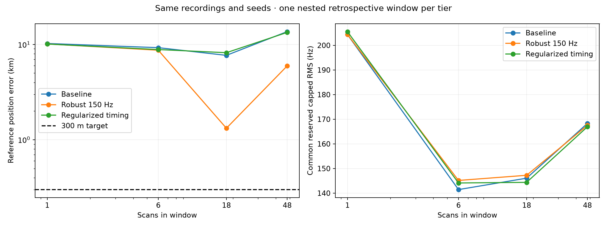
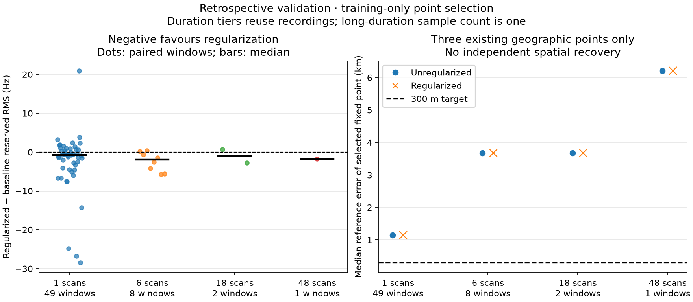

# Position model generalization after the frozen dataset split

We continue the target of sub-300-metre long-duration positioning and useful
short/medium-duration performance. This experiment uses the frozen 64-recording
training and 49-recording retrospective validation split. The prospective test
reserve remains unopened; these experiments do not establish independent test
accuracy. See the [declared comparison protocol](PROTOCOL.md).

**Split-policy update:** concurrent main commit `b32e48e1` now requires seeded
random holdouts of whole correlated groups. The results below retain their
original temporal-split identity; they have not been relabelled as randomized.
The separate [random-group dataset](../2026_09_23_position_random_group_split/README.md)
defines subsequent experiments. Its recordings are also historically exposed,
so its test partition is a retrospective audit rather than untouched evidence.
Seed `20260923` assigns thirteen two-hour groups: 68 training scans, 22 validation
scans and 23 retrospective-test scans. No capture crosses a group boundary.
Two-hour grouping reduces local overlap; it is not proof of statistical independence.

## Continuous position recovery: the 300 m result does not generalize

SOL implemented ordinary and robust spatial fits; Terra implemented regularized
timing and its continuous spatial counterpart. All three use identical recordings,
saved randomized frequency masks and geographic seeds in the comparison below.
The final location is selected using training-frequency rows, with the reference
coordinate introduced only after saving inference.

| Scans | Baseline error | Robust 150 Hz error | Regularized timing error |
|---:|---:|---:|---:|
| 1 | 10.235 km | 10.121 km | 10.097 km |
| 6 | 9.252 km | 8.700 km | 8.839 km |
| 18 | 7.684 km | 1.322 km | 8.194 km |
| 48 | 13.635 km | 5.955 km | 13.384 km |

These are the first predetermined validation window in each duration tier,
nested within the same long window, not four independent trials or population
medians. The robust model helps substantially in the two longer examples, but
**none reaches 300 m**. The historical roughly 300 m development result is not
a reliable generalization claim. Even on the original sixteen recordings,
the new training-only baseline and robust objectives give 412 m and 592 m.

Elapsed spans are 0.083, 0.909, 2.909 and 7.911 hours respectively; summed nominal
capture durations are 0.083, 0.5, 1.5 and 4 hours. This is not continuous eight-hour IQ.

Prediction RMS alone poorly ranks geographic accuracy. At 18 scans, robust fitting
improves position from 7.68 to 1.32 km while common reserved RMS worsens from
146.08 to 147.25 Hz. At 48 scans, regularized timing scores 166.94 Hz versus
robust fitting's 167.54 Hz, yet its position is 13.38 km away versus 5.96 km.
The nuisance parameters and candidate ambiguity can absorb positional differences.

The ordinary/robust experiment took 336 seconds including scoring; regularized
spatial inference took 234 seconds. Per-window cache preloading avoids repeatedly
evicting and reloading a 48-scan working set. These timings exclude initial
catalogue/cache construction. Results remain conditional on previously published
candidate pools and seeds that historically used evaluation rows: they are not
an independent full-catalogue acquisition test.

Reproduce the common figure, exact coordinates, metrics and source bindings with
`python reports/2026_09_23_position_model_generalization/summarize_spatial.py`.
Outputs: [JSON](spatial_comparison.json), [CSV](spatial_comparison.csv).
The [baseline/robust report](../2026_09_23_training_position_search/README.md)
and [regularized search report](../2026_09_23_regularized_position_search/README.md)
describe inference and reproduction.

## Next experiments toward sub-300 m

1. **SOL: grouped robust likelihood.** Model scan-level correlated residuals and
   track-specific uncertainty; compare against the fixed 150 Hz robust control.
   Estimate nuisance hyperparameters on training recordings, then freeze them.
   Use leave-one-scan-out influence to identify dependence on a handful of scans.
2. **Terra: association uncertainty.** Retain multiple candidate identities and a
   null/outlier component instead of letting each short track choose an unrestricted
   best identity. Test uncertainty-weighted joint location inference using
   training-only candidate discovery. The candidate audit below motivates this.
3. **Shared physics audit.** Examine timing-bound hits, clock/CFO stability and
   orbit-error structure before adding flexibility. A 300 m positional perturbation
   leaves only roughly 1–7 Hz after the nuisance projections in the preceding
   information audit; fitting ever more nuisance terms can remove useful signal.

These are next experiments, not completed results or guaranteed accuracy gains.
Keep the prospective test sealed until the model is frozen. A later test must
include the documented array-orientation change and report duration-specific
errors and failures, rather than only its best window.

## Regularized timing: corrected fixed-point validation

The timing model shrinks each track's timing offset toward a scan-level latent
center. That center is a regularizer, not an established receiver UTC clock.
Inner model selection on the training recordings chooses a penalty of
1,000 Hz²/s². The [training receipt](../2026_09_23_regularized_position/inference.json)
was saved before validation replay and remains unchanged.

For each validation window, choose among three old training-derived geographic
points using that window's training frequency rows, then score reserved rows.
This evaluates a fixed inverse estimator on new recordings. It does not freeze
the answer to the old receiver coordinate. Hyperparameters stay frozen; the
new window's position and nuisance parameters are inference outputs.

| Window size | Windows | Baseline mean reserved RMS | Regularized mean reserved RMS | Windows improved |
|---|---:|---:|---:|---:|
| 1 scan | 49 | 156.115 Hz | 153.556 Hz | 33/49 |
| 6 scans | 8 | 164.252 Hz | 161.836 Hz | 6/8 |
| 18 scans | 2 | 160.015 Hz | 158.956 Hz | 1/2 |
| 48 scans | 1 | 169.053 Hz | 167.296 Hz | 1/1 |

These are arithmetic means of window RMS values, not pooled observation RMS.
The different duration tiers reuse recordings and are not independent trials.
For the long window, both models select the same fixed geographic point,
6.215 km from the reference. **The prediction gain is not a demonstrated position
gain.** The three-point comparison cannot establish independent spatial recovery.

Review caught an initial implementation that incorrectly let reserved validation
rows select the geographic point. Those numerical results were rejected before
publication. The published replay uses training-only point selection, preserves
the original training-model choice, and includes an end-to-end reserved-value
poisoning test. The [worker report](../2026_09_23_regularized_position/README.md)
and [machine-readable summary](regularized_summary.json) specify the final method.

## Why robust modelling is worth testing

The [independent training residual audit](../2026_09_23_regularized_position_review/README.md)
finds that the largest 10% of tracks account for 77.6% of training squared error.
Typical track RMS is about 83 Hz, but the maximum exceeds 1,400 Hz. Pooled adjacent
standardized residual correlation is 0.272. A descriptive AR(1) calculation gives
57.2% of the raw row count, but irregular gaps and heterogeneous tracks prevent
using that number as a calibrated global effective sample size.

This motivates a smooth track-level robust objective with a predeclared 150 Hz
scale. It does not establish that downweighting particular observations improves
position, so the ordinary capped-loss control remains in the comparison. The
scale was chosen from training residual statistics, not validation reference error.

## More candidate satellites is not automatically better

The [candidate-support audit](../2026_09_23_candidate_support_audit/README.md)
reuses existing full-catalogue training fits for seven scans in the training
partition. It compares 1,255 track/location cases at five fixed points. These are
repeated geographic comparisons of the same tracks, not 1,255 independent trials.

The full-catalogue winning identity is absent from the conditional cached pool
in 5.58% of cases: 12.53% for 3–9 s tracks, 3.60% for 10–19 s tracks and zero for
20–39 s tracks in this sample. Full-catalogue training RMS improves by 0.223 Hz,
but inner reserved RMS worsens by 1.672 Hz. The extra candidate freedom can fit
short-track noise. This supports retaining ambiguity and null support, rather
than assuming that the lowest training residual identifies the satellite.

Fresh full-catalogue discovery is still required for an independent acquisition
claim. This audit does not certify the cached shortlist or establish true identities.

## Input authority and physical scope

[input_audit.json](input_audit.json) independently binds all 113 training/validation
cache inputs by evidence and numerical-state hashes. The day-cohort observation
and mask digests match the frozen inventory. No prospective-test evidence was
opened. Numerical-state hashes bind the current files; they are not a new exact
propagation comparison. The original sixteen evidence files are hash-bound
separately from the day-inventory comparison.

The 11.2 GHz reference is consistent with the upstream lane CFO normalization;
we did not identify a missing RF scale factor. The array was rotated after the
development-validation window. Prospective testing will therefore also probe
orientation/sky-coverage change; phase or beam calibration must not be carried
across that change implicitly.

This work changes research tools, tests and reports only. It neither deploys a
positioning model nor collects new RF. `summarize.py` regenerates the fixed-point
comparison from the published result; `audit_inputs.py` checks the available
local cache against the frozen inventory. Worker reports contain their commands.

Validation: 60 focused and related regression tests pass, including three new
random-group splitting checks. The input audit binds
113 recordings, and the common-summary generator checks identical window IDs,
observation/mask authority digests, seed lists and training-objective selection
across the continuous-search arms. The new research tools and report helpers pass
Ruff. These software checks do not establish positional accuracy.
