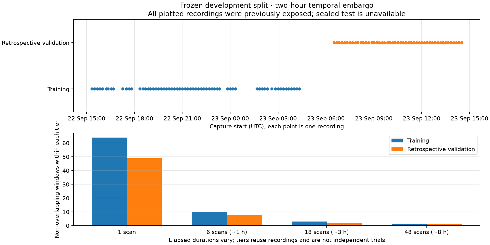
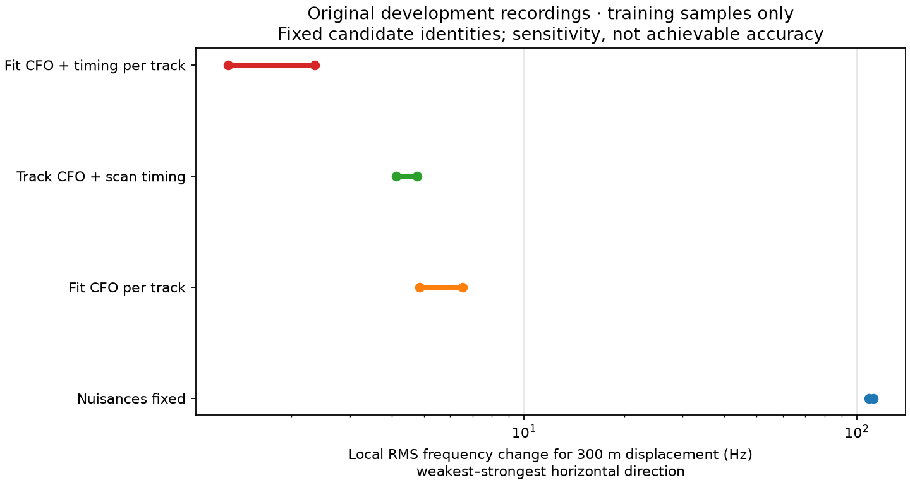
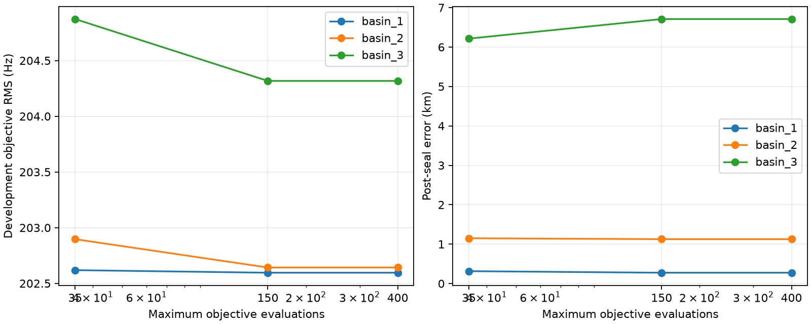
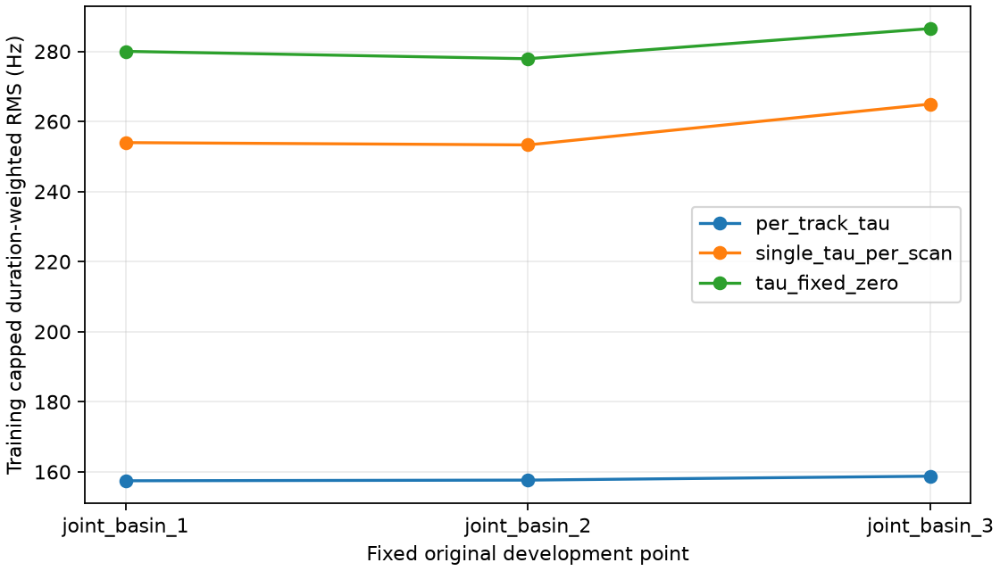

# A development dataset and model programme for sub-300-metre positioning

The objective is sub-300-metre error over longer durations, with one frozen model
also evaluated on short and medium durations. **This report establishes the split
and runs development diagnostics; it does not establish that accuracy.** The
[previous day validation](../2026_09_23_day_position_validation/README.md) found a
4.321 km median error, and its recordings are now exposed development evidence.

## Dataset and evaluation rules

The source of truth for assignments is [the dataset manifest](dataset/manifest.json).
Whole recordings belong to only one partition. The original sixteen recordings
and the 116 already evaluated recordings cannot be relabelled as an untouched test.
Training and retrospective development-validation are separated by a two-hour
embargo measured from the end of the last nominal training capture. This is a
conservative splitting policy, not a proof that satellite visits or systematics
are independent.

The split uses 64 training recordings, 49 retrospective validation recordings and
19 quarantined recordings from the exposed corpus. Choosing these boundaries by
time and duration coverage permits one non-overlapping 48-scan development window
in each of training and validation. It does not provide many independent trials.



The test reserve must start after both the earlier evaluation cutoff,
2026-09-23 15:15 UTC, and a two-hour embargo following the final validation capture.
Only capture metadata may be inventoried before the final protocol is frozen.
No currently inventoried recording meets that test boundary. We do not launch new
collection or wait for a recording campaign to fill it. The prospective test
programme needs additional ordinarily acquired recordings, frozen before their
outcomes are inspected.

Within each recording, preserve the existing randomized observation masks. This
is separate from the recording-level train/validation/test split: a fixed model
may estimate a new test window's location, identities and nuisance parameters from
that window's training rows. Its evaluation rows may only score the frozen result.
They cannot choose a satellite, location, timing correction or frequency offset.

Report one-scan, approximately one-hour, three-hour and eight-hour windows,
including actual elapsed span, nominal captured duration and gaps. Windows are
non-overlapping within a duration tier; different tiers reuse data and therefore
are not independent repetitions. An unavailable duration tier stays unavailable.
We do not extend a window across a partition boundary to manufacture enough data.

Reference coordinates belong only to the evaluation stage. In particular, fitting
a constant site correction, training a model to emit this station's coordinate,
or selecting a seed from the known location is prohibited. Even a successful test
at this station would demonstrate temporal generalization here, not geographic
generalization to a new receiver site.

## First measured bottleneck: nuisance parameters absorb position information



On 8,202 training observations from the original sixteen development scans, we
differentiate the predicted Doppler with respect to east/north position. Candidate
identity and timing are selected using training rows within the previously exposed
conditional candidate pool. The linearized geographic signature is then projected
away from the nuisance tangent space:

| Nuisance freedoms | RMS signature of a 300 m displacement, weakest–strongest direction |
|---|---:|
| All nuisance parameters fixed | 108.96–112.27 Hz |
| Independent frequency offset per track | 4.85–6.54 Hz |
| Track frequency offsets and one timing term per scan | 4.14–4.77 Hz |
| Independent frequency offset and timing per track | 1.29–2.35 Hz |

The calculation is `J_remaining = J_position - N pinv(N) J_position`. It measures
local signal sensitivity, **not** a position covariance, noise floor or achievable
accuracy. It fixes satellite identities, assumes continuous local timing changes,
uses unweighted samples, and does not represent global alternative associations.
At timing boundaries it permits a tangent adjustment in both directions, so it
can overstate the nuisance freedom actually available to the bounded estimator.

This motivates structured timing, but does not justify simply removing nuisance
parameters. Independent timing offsets can compensate orbit error as well as clock
error. A shared clock must earn its place through prediction checks; a more rigid
wrong model could improve apparent information while biasing the position.

## Parallel model work

| Owner | Experiment | Purpose and guardrail |
|---|---|---|
| SOL: dataset | Frozen manifest, provenance and leakage tests | Keep exposed development separate from the unopened test reserve |
| SOL: convergence | Same original basins at 35 / 150 / 400 evaluations | Determine whether the optimizer budget explains the error; seal estimates before reference scoring |
| Terra: timing structure | Per-track timing versus common scan timing versus fixed timing on 48 training scans | Select among the same development-derived geographic points using training scores only; compare reserved prediction afterwards |
| Coordinator | Nuisance-information analysis and common reporting | Measure lost position sensitivity without claiming a calibrated accuracy bound |

The first numerical experiments deliberately use existing cached conditional
candidate pools to remain inexpensive. They are mechanism tests, not a replacement
for fresh training-only full-catalogue discovery in the final generalization test.
The [strategy review](strategy_review.md) describes the larger model comparisons.

### Optimizer convergence

The [convergence diagnostic](convergence/README.md) exactly reproduces the original
35-evaluation results before increasing the budget. All three local searches stop
by 53–67 evaluations; allowing 400 instead of 150 changes nothing.

| Original basin | Error at 35 evaluations | Error after convergence |
|---|---:|---:|
| 1, best objective | 314 m | **275 m** |
| 2 | 1,149 m | 1,127 m |
| 3 | 6,215 m | 6,710 m |



The 275 m outcome is on the original training/development cohort. It is not a new
independent confirmation of accuracy. The best objective changes only from
202.619 to 202.596 Hz. More thorough optimization is a useful baseline correction,
but these local results cannot explain away the previous multi-kilometre validation
errors or establish that the lowest residual gives the closest position.

### Timing-structure result on longer training support

The [clock-structure experiment](clock_structure/results.json) uses the first 48
training scans: 9 hours 5 minutes of elapsed span and 4 hours of nominal captures.
Each model chooses among the same three original development-derived geographic
points using its training objective, then scores its reserved observations.

| Timing model | Training RMS Hz | Reserved-row RMS Hz | Selected development point |
|---|---:|---:|---|
| Independent timing per track | 157.46 | 182.88 | Original basin 1 |
| One timing offset per scan | 253.31 | 274.68 | Original basin 2 |
| Timing fixed at zero | 277.91 | 299.32 | Original basin 2 |



The simple shared-clock constraint worsens prediction here. This does not rule out
a shared receiver-clock component plus bounded orbit/source corrections. It does
rule out presenting the rigid shared-clock variant as an improvement based on
local sensitivity alone. These are shared-point comparisons, not independent
spatial fits; the conditional candidate discovery and geographic points were
already exposed during development. No new validation or test outcomes enter
this experiment.

## Next model sequence

1. Establish spatial convergence and retain competing geographic modes. A smaller
   grid cell does not establish smaller estimation error.
2. Separate receiver clock/timing from source-specific orbit mismatch. Test shared
   scan timing and shrinkage toward it, rather than either unrestricted per-track
   timing or an unjustified zero-timing assumption.
3. Use training-only full-catalogue association, a null option and multiple retained
   identities. Evaluate a predictive mixture instead of selecting whichever
   identity looks best on reserved observations.
4. Estimate correlated residual and outlier behaviour from training data. Weight
   independent information, and measure whether a few tracks or scans dominate.
5. Add shared source-orbit corrections only where repeated-source evidence makes
   them identifiable. Add dual-receiver constraints only with simultaneous support
   and explicit calibration uncertainty.

A useful next timing hypothesis is `tau_track = clock_scan + delta_track`, with a
bounded, regularized `delta_track`. Compare it against both limits already tested:
independent track timing and exactly shared scan timing. Choose the regularization
strength using development prediction, not the known coordinate. The decomposition
needs a gauge constraint (for example, a weighted zero mean for the deltas within a
scan) and cannot establish that an individual delta is physical orbit error. Where
the same source recurs, a source-level correction can be tested in place of the
track-level deviation; without recurrence, calling it a recovered orbit is unjustified.

Before final testing, freeze a single model configuration, source hashes, catalogue
rules, search bounds, stopping rules, nuisance bounds and plotting code. Predeclare
the target as median horizontal error below 300 m for the long-duration tier, with
the 90th percentile, fit failures and shorter-duration errors also reported. A
development best case is not success. With only a few independent long windows,
quantile estimates remain preliminary regardless of their numerical value.

Reproduction uses the research tools `position_dataset_split.py`,
`position_convergence_diagnostic.py`, `position_clock_structure.py` and
`position_nuisance_information.py` under `tools/research`. Source IQ/TLE stores
remain read-only. This work does not deploy a production model.

For example, reproduce the local information diagnostic from the repository root:

```bash
.venv/bin/python -m tools.research.position_nuisance_information \
  --cache reports/2026_09_23_sixteen_scan_comparison/joint/cache \
  --output /tmp/position-nuisance-replay \
  --latitude 37.84936795005425 --longitude -122.48209887260599
```

Use a fresh output directory. This coordinate is the previous development estimate;
it is not supplied as receiver truth to the numerical diagnostic.

The convergence tool requires an explicit evaluation reference and its provenance;
it has no guessed coordinate default:

```bash
.venv/bin/python tools/research/position_convergence_diagnostic.py \
  --cache reports/2026_09_23_sixteen_scan_comparison/joint/cache \
  --source reports/2026_09_23_sixteen_scan_comparison/joint/inference_partial.json \
  --joint-tool tools/research/sixteen_joint_compare.py \
  --output /tmp/position-convergence-replay --budgets 35 150 400 \
  --reference 37.84903264307456 -122.4856541910174 \
  --reference-provenance 'Locked reference used in sixteen-scan and day-validation reports'
```

The optimizer never receives that evaluation reference. Inference is saved and
hashed before errors are appended. The dataset and timing experiment have their
own reproduction commands in [dataset/README.md](dataset/README.md) and
[clock_structure/README.md](clock_structure/README.md).
