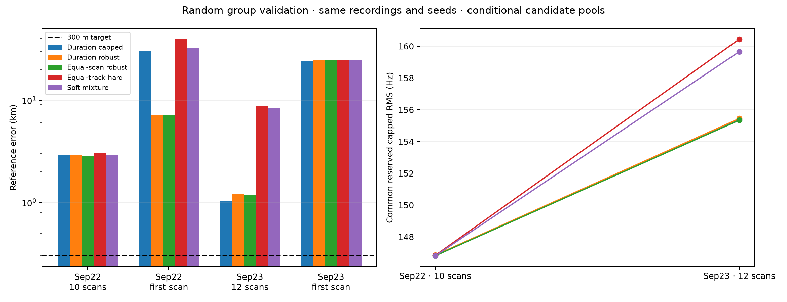

# Random-group positioning: robust weighting and soft associations

**No tested model reaches 300 m.** We implemented and evaluated five objectives
on the same two randomized validation groups and their nested first scans. The
best full-group errors are 2.84 km and 1.04 km. This is progress in diagnosing the
model, not evidence of sub-kilometre generalization.

The [protocol](PROTOCOL.md) was written before these fits. The seed-20260923
manifest assigns 68 training, 22 validation and 23 retrospective-test scans;
this experiment opens only the 22 validation recordings plus training-only
examples for the separate numerical audit. The test partition stays closed in
this experiment. All recordings have historical exposure, and conditional
published candidate pools and seeds remain a limitation. These are the first
new results under the random-group split, not relabelled temporal results.

## Results on identical recordings and seeds

| Objective | Sep22 group: 10 scans | Its first scan | Sep23 group: 12 scans | Its first scan |
|---|---:|---:|---:|---:|
| Duration-weighted capped 800 Hz | 2.920 km | 30.537 km | **1.042 km** | **24.342 km** |
| Duration-weighted robust 150 Hz | 2.916 km | **7.150 km** | 1.199 km | 24.410 km |
| Equal-scan robust 150 Hz | **2.841 km** | **7.150 km** | 1.171 km | 24.410 km |
| Equal-track hard candidate MSE | 3.008 km | 39.472 km | 8.712 km | 24.577 km |
| Normalized soft candidate mixture | 2.895 km | 32.101 km | 8.375 km | 24.709 km |

Bold values identify descriptive minima after evaluation; they do not select a
different deployable model for each window. Two groups are too few to establish
tail error, and nested single scans are not independent trials.

The full groups span 5,749.763 and 7,043.165 seconds, with summed nominal capture
durations of 3,000 and 3,600 seconds. They are not continuous captures. Each single
scan has 300 seconds nominal duration. Exact coordinates, spans, common metrics
and source hashes are in [JSON](comparison.json) and [CSV](comparison.csv).

Equal scan weighting changes the multi-scan result only modestly. Robustification
dramatically helps one singleton but leaves the other about 24 km away. The
soft objective offers small gains over its own equal-track hard control on full
groups, but is substantially worse than duration weighting in the second group.
Therefore candidate mixing alone is not a demonstrated solution to positioning.

Common reserved capped RMS lies around 147 Hz for the first full group and
155–160 Hz for the second. Similar frequency scores still coexist with materially
different geographic errors. All final locations are selected on training
frequency rows; reserved rows and the reference coordinate are scored after a
hash-sealed inference file is written.

## A failure mode exposed by the soft model

The soft model includes a constant-frequency null with a broad 30 kHz scale. Its
training-frozen posterior expected reserved RMS is **1,372 Hz and 1,853 Hz** on
the two full groups, despite mean null probabilities of only 0.55% and 0.28%.
The [post-seal decomposition](../2026_09_23_soft_candidate_position/reserved_decomposition.json)
shows that null components contribute **97.6% and 99.1% of expected squared error**.
This catches failures that a single best-candidate capped score hides.

These statistics answer different questions: the common scorer tests a hard
training-selected identity at each inferred position, whereas the native score
retains all training posterior components. The broad null must not be interpreted
as a useful frequency forecast. Future null handling should separate abstention
from calibrated signal prediction, with explicit coverage and a proper scoring
rule. We did not discard the null contribution or tune it away after seeing
validation outcomes.

The mixture uses a dense-row IID heuristic, profiles CFO/timing, and does not
calibrate identity probabilities. Soft weights alone do not solve correlated
evidence or identifiability. See the [soft model report](../2026_09_23_soft_candidate_position/README.md).

## Orbital interpolation is not the measured bottleneck

An independent SOL audit compared fresh exact SGP4/ECEF predictions with cached
quarter-second interpolation on three training scans, four tracks, three
candidates, three timing offsets and three coordinates per scan. Across the
36 track-coordinate comparisons, raw RMS difference is 0.00466 Hz; after removal
of a track/component constant frequency offset, RMS is **0.00209 Hz** and maximum
absolute difference is 0.00895 Hz. None of the 36 sampled candidate/timing winners
changes. Catalogue bytes, UTC origins and interpolation query bounds were checked.

This numerical error is far below the few-hertz nuisance-projected response to
a 300 m displacement measured in the preceding information audit. It rules out
this interpolation path on the sampled support, not errors in the TLEs or the
physical signal model. [Audit and reproduction](../2026_09_23_position_prediction_precision/README.md).

## What to investigate next

1. **Timing resolution and structure.** The current identity profiles use integer
   timing offsets. Compare bounded fractional timing and physically shared timing
   against this control, without adding a free time warp that removes geographic
   information. Inspect boundary occupancy and training-group stability first.
2. **Receiver-common frequency evolution.** Test a constrained shared drift model
   against independent track offsets. Estimate nuisance scales from training
   groups, keep validation geography out of model selection, and inspect rank.
3. **Association and abstention calibration.** Train candidate/null handling with
   grouped predictive scores and report coverage separately. Fresh training-only
   catalogue/seed discovery is still needed for an independent acquisition claim.

Do not merely increase optimizer precision or cache density: the present evidence
points toward model mismatch, nuisance freedom and ambiguous support. Preserve
the 23-scan audit partition for a genuinely frozen subsequent model. Longer
duration claims also require multiple whole long-duration groups; these two
short groups cannot certify eight-hour accuracy.

## Reproduction and checks

SOL produced the [grouped robust worker/report](../2026_09_23_grouped_robust_position/README.md)
and numerical audit. Terra implemented the pure soft-statistics helper and
synthetic tests; the main task integrated it and ran all four soft/hard windows.
The robust run took 106.4 seconds for inference plus 12.7 seconds for evaluation;
the hard/soft run took 109.8 seconds total. Initial cache construction is excluded.

Ten new focused tests pass, including posterior invariance to reserved-value
mutation, support normalization, partition-overlap rejection and interpolation
range checks. The common summary verifies identical session lists and seeds and
no test overlap. Inference receipts verify. New tools and report helpers pass Ruff.

Run `python reports/2026_09_23_random_group_model_comparison/summarize.py` to
regenerate the common JSON, CSV and PNG. Worker reports provide numerical-run
commands. No production changes or new RF collection are included.
