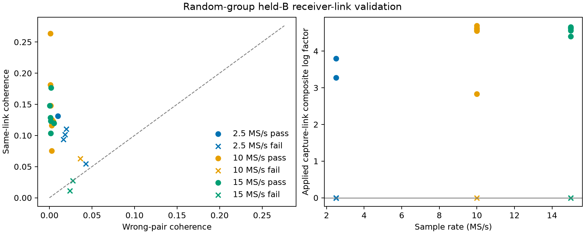

# Phase association with random group validation

This saved-IQ replay replaces chronological validation for the frozen 24-dwell
comparison with seeded random group validation. It tests whether RX0 and RX1
share a coherent waveform component. It does not yet demonstrate improved
named-satellite association or position accuracy.

## Protocol

The selections are unchanged from the [multirate report](2026_09_23_phase_association_and_motion.md):
eight dwells each at 2.5, 10, and 15 MS/s. No failure is replaced. Seed `20260923`
assigns one of each successive pair of 20 ms groups to training and the other
to evaluation. All receivers and windows in a group share its assignment.
FFT blocks span 1.6384 ms at every rate, exclude group boundaries with a
0.2 ms guard, and retain their actual device-relative timestamps.

Carrier seeding, carrier fitting, response normalization, and frequency-bin
selection use training data. Inner model selection also holds out complete
random training groups. Local phase fits have independent group intercepts;
they do not unwrap across gaps. Sparse groups, nonconsecutive training blocks,
and local increments within 10% of pi cause abstention. The latter is a
conservative ambiguity screen, not proof that every cycle slip is detectable.

Within an evaluation block, disjoint frequency set A supplies the instantaneous
phase used to predict set B. This is **held-B prediction conditioned on A**;
it is not prediction of an entirely unseen block. A wrong-pair control uses RX1
from another held group and receives the same A-based phase adjustment.
Controls form a one-to-one cross-group permutation after data-blind equal-count
selection. Complex coherence and phase phasors are averaged with equal group
weight. Omitted evaluation blocks and control assignments are recorded.

The waveform gate requires tracked B coherence above both 0.05 and three times
the wrong-pair coherence, plus residual phase resultant above 0.8. A research
association scorer applies a fixed-concentration conditional composite phase
factor only when this gate passes. Its weights are not calibrated identity
probabilities; abstract hypotheses asserting the same capture link retain
identical relative weights.

## Evidence and interpretation

| Sample rate | Supported / selected | Abstained | Median tracked / wrong-pair coherence |
| --- | ---: | ---: | ---: |
| 2.5 MS/s | 2 / 8 | 2 | 0.10599 / 0.01727 |
| 10 MS/s | 7 / 8 | 0 | 0.12359 / 0.002615 |
| 15 MS/s | 6 / 8 | 0 | 0.12166 / 0.001719 |

Medians include all completed extractions, including unsupported ones. At
2.5 MS/s, visit 1646 abstains for a near-pi local increment and visit 2138 for
missing A-band response-normalization support. Both remain in the denominator.

The [per-dwell table](figures/2026_09_23_random_phase_links/per-dwell.csv),
[summary](figures/2026_09_23_random_phase_links/summary.json), and
[replay instructions](figures/2026_09_23_random_phase_links/README.md) preserve
the outcomes, abstentions, frozen inputs, seed, and numerical source hashes.
The original chronological results remain historical evidence under their
original labels; these new results are a separate experiment.

Sampling rate is confounded with recording time, source mixture, receiver
balance, and RF edge: the selected 2.5 MS/s dwells use upper channel edges,
whereas the high-rate dwells use lower edges. This small selected comparison
cannot establish that increasing sample rate improves location accuracy.

Broadband coherence is capture-level evidence. Several sources can occupy a
dwell, and the strongest GLRT pair can change between probes. Applying this
factor to a specific satellite requires source-bound phase evidence and frozen
candidate membership. The next association experiment should compare the same
candidate set with and without source-specific phase on random held groups,
including different-source controls and every abstention.

Phase plus calibrated geometry can constrain a projected direction and
transverse velocity. The [geometry audit](2026_09_23_phase_geometry_observability_audit.md)
explains the missing electrical baseline/orientation authority and receiver
phase nuisance. Present dwell-specific carrier and response fits can absorb
the geometric phase and slope; these residuals must not be converted directly
to satellite speed. The explicit-truth geometry calculation has velocity rank
two with calibrated phase rate plus Doppler, and rank one when an unconstrained
receiver phase rate is profiled out.

## Verification

The six relevant numerical test modules pass 38 tests, including held-IQ
mutation invariance, known-carrier recovery, group-offset invariance, ambiguity
and sparse-group abstention, and one-to-one cross-group controls. Ruff checks
pass. The random validation path received independent numerical review. This
change adds research tooling and evidence; no production deployment or new RF
collection was performed.
