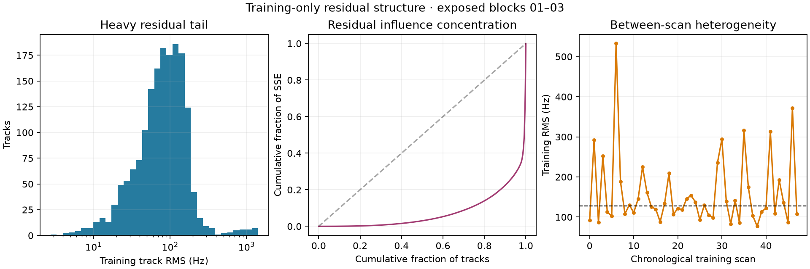

# Independent review of the regularized position direction

The next model needs a grouped, heavy-tail-aware likelihood before it needs more
continuous optimizer precision. On the exposed training cohort, the residual evidence
is correlated and extremely heterogeneous, while nuisance projection leaves only a
few hertz of local signal for a 300 m displacement. Treating frequency samples as IID
would make the position curvature and uncertainty far too confident.

This review uses only randomized training rows from the first 48 exposed development
scans. It evaluates one previously fixed development coordinate and never reads the
retrospective-validation or prospective-test outcomes.

## Measured noise structure

| Diagnostic | Training result |
|---|---:|
| Scans / tracks / frequency rows | 48 / 1,691 / 25,186 |
| One-second track bins | 18,012 (71.5% of rows) |
| Consecutive training-row residual pairs | 13,791 |
| Pooled adjacent standardized residual correlation | 0.272 |
| Descriptive AR(1) effective row count | 14,403 (57.2% of rows) |
| Track RMS, 25th / median / 75th percentile | 50.7 / 83.4 / 127.7 Hz |
| Track RMS maximum | 1,408 Hz |
| Scan RMS, 25th / median / 75th percentile | 106.2 / 127.8 / 177.9 Hz |
| Scan RMS maximum | 532.7 Hz |
| Training SSE contributed by largest 10% of tracks | 77.6% |



The AR(1) effective count is only a descriptive warning because randomized masks
create irregular gaps and correlation varies by track. It should not be inserted as a
single global correction. Fit or predeclare correlation by within-track time gap, and
bootstrap or cross-validate by whole scan. The large SSE concentration calls for a
smooth robust likelihood and an error floor estimated from training evidence. Report
the uncapped control so robustification cannot silently discard difficult scans.

Selected identity recurrence is also weak: 727 identities were selected, 712 appeared
in one scan only, and just 15 appeared in multiple scans. Shared source-orbit
corrections therefore have little repeat support under this conditional association.
Require a minimum recurrence count and information-rank check before enabling them;
otherwise retain nominal orbits.

## What timing regularization can and cannot establish

The existing training-only comparison shows the tradeoff directly. Independent
per-track integer timing attains 157.5 Hz training RMS, one timing value per scan
attains 253.3 Hz, and fixed-zero timing attains 277.9 Hz. Restricting timing removes a
large amount of fit freedom, but it also exposes model error. A continuous timing
optimizer should therefore compare these nested structures and declare its bounds and
boundary counts; a lower training residual alone is not evidence for location.

The local sensitivity diagnostic sharpens that concern. After a CFO per track and one
scan timing direction are projected out, a 300 m displacement produces only about
4.1–4.8 Hz RMS change. With CFO and timing independently profiled per track, the range
falls to 1.3–2.4 Hz, orders of magnitude below typical track residuals. Continuous
spatial refinement can give a numerically precise minimum without supporting a
300-metre physical interval.

The recommended training comparison is:

1. full-catalogue, training-only identity retention with a null hypothesis;
2. per-track CFO plus either fixed timing or one bounded timing term per scan;
3. a smooth robust residual model with a training-frozen floor and gap-dependent
   within-track correlation;
4. equal outer influence by scan, with duration or one-second-bin weighting inside a
   scan;
5. nominal orbits unless repeated identities provide an independently checked,
   full-rank correction problem.

Use predictive frequency score and whole-scan stability on retrospective validation to
choose among these predeclared variants. Geographic reference error can report the
result but must not tune the floor, correlation, timing freedom, seed set or candidate
support.

## Seed and candidate-support audit

The current cached candidate universe is the per-scan union of identities selected by
the published Sacramento and Reno searches. It is not direct truth input, but those
searches used response rows and geographic priors. Likewise, the familiar basins and
near-site coordinate means are already response-conditioned same-station development
seeds. A continuous optimizer starting there remains a conditional refinement, even if
its final objective uses training rows only.

For a generalization claim, create the coarse spatial modes and full-catalogue
candidate retention from that partition's training rows alone. Freeze several
well-separated modes before continuous refinement, preserve their coarse incumbents,
and report every retained basin. Do not initialize validation or test from the known
survey coordinate or from a development basin chosen because its reference error was
small. A conditional shortlist run remains useful as a numerical control and must keep
that label.

## Future-test distribution shift

The array was confirmed rotated 180 degrees at 14:49:09 UTC. Training and retrospective
validation end before that intervention, while any eligible prospective test starts
after 16:35:28 UTC. The future test therefore measures temporal, orientation and sky
coverage generalization together. Receiver labels remain electrical identities, but
world azimuth, rotation axis and cable continuity are not fully measured. Do not carry
phase, beam or differential-geometry calibration assumptions across this boundary
without a new geometry/calibration authority and sensitivity control.

The 11.2 GHz prediction normalization is not an identified defect: saved persistent-hop
CFO trajectories are already scaled from actual RF to the canonical frequency. The
more immediate problems are dependence, heterogeneity, nuisance degeneracy and
conditional candidate support.

## Reproduction and limits

`noise_audit.json` contains per-track and per-scan diagnostics plus source/cache
digests. Reproduce it with:

```bash
OPENBLAS_NUM_THREADS=1 OMP_NUM_THREADS=1 MKL_NUM_THREADS=1 \
  .venv/bin/python tools/research/audit_regularized_position_noise.py \
  --replication-root reports/2026_09_23_day_position_validation/replication \
  --output <fresh-output-directory> \
  --latitude 37.84936795005425 --longitude -122.48209887260599
```

The pooled correlation is not a fitted generative model, the fixed coordinate and
candidate pool are exposed development choices, and source recurrence is based on
selected identities rather than established truth. These limitations make the audit a
model-design diagnostic, not an accuracy or covariance result.
